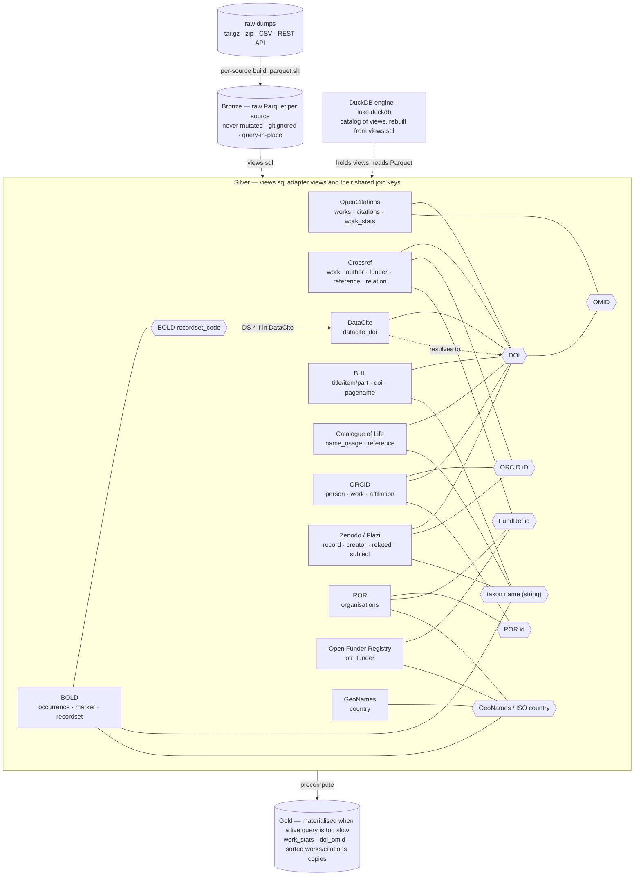

# biodiv-data-lake

Experiments with a local biodiversity & bibliographic **data lake**: keep big
public datasets (OpenCitations, GBIF, Catalogue of Life, BOLD, BHL, …) as
Parquet on local disk and query them — and join across them — with **DuckDB**,
without standing up a server or converting everything to RDF.

The architecture rationale (why DuckDB + Parquet, Hive partitioning, the
medallion/views approach to schema reconciliation) is written up in
[`local-data-lake-notes.md`](local-data-lake-notes.md). This README tracks
**where we are and what's next**.

## Approach in one paragraph

Storage is decoupled from the engine: each dataset is a folder of Parquet files
(schema-on-read, query-in-place). A thin, version-controlled catalog of **views**
([`views.sql`](views.sql)) maps the raw, messy column names into clean canonical
ones — so you query `works.doi`, not a regex over a packed identifier string.
Raw data is never mutated (Bronze); views do lazy per-source reconciliation
(Silver); a small set of curated/precomputed tables can be materialised when a
query is too slow to run live (Gold).

## Repo layout

```
biodiv-data-lake/
├── README.md                  <- you are here
├── local-data-lake-notes.md   <- architecture decisions / design notes
├── views.sql                  <- adapter views (the lake "catalog")
├── lake.duckdb                <- DuckDB catalog file (gitignored; rebuild from views.sql)
├── opencitations/             <- dataset: the open citation graph + works metadata
│   ├── README.md              <- how the Parquet was built + example queries
│   ├── figsharefiles.sh       <- parallel downloader for the 165 Index zips
│   ├── build_parquet.sh       <- Index zips  -> opencitations.parquet
│   └── build_meta_parquet.sh  <- Meta tarball -> opencitations_meta.parquet
├── bhl/                       <- dataset: Biodiversity Heritage Library export
│   ├── README.md              <- tables, model, BHL⋈OpenCitations citations
│   └── build_parquet.sh       <- BHL .txt.gz dumps -> bhl/*.parquet
└── sandbox/                   <- one-off explorations / test cases (not core lake)
    └── bhl-citations/         <- offline BHL citation stats (superseded by bhl/)
```

Large data files (`*.parquet`, `*.tar.gz`, `*.zip`, `lake.duckdb`, logs) are
**gitignored** — they live in the working tree but are too big for GitHub and are
fully reproducible from the scripts above.

## Status

| Dataset | State | Notes |
|---------|-------|-------|
| **OpenCitations Index** (citations) | ✅ ingested | `opencitations/opencitations.parquet` — 2,315,872,191 rows, 38 GB |
| **OpenCitations Meta** (works) | ✅ ingested | `opencitations/opencitations_meta.parquet` — 122,191,271 rows, 11 GB |
| Adapter views | ✅ `works`, `citations`, `citations_resolved` | clean columns incl. first-class `doi`/`omid` |
| Precomputed stats | ✅ `work_stats` (101M), `doi_omid` (108M) | per-work in/out degree + DOI→OMID map; instant counts |
| Sorted works | ✅ `works` (by doi), `works_by_omid` | record lookup by DOI **or** OMID in ~55 ms (was 19 s) |
| Sorted citations | ✅ `citations_by_cited`, `citations_by_citing` | edge-list lookups (`cited_by`/`cites`, CD) prune to ~1–2 s (was ~20 s); see opencitations/build_citations_sorted.sql |
| Query macros | ✅ `citation_count()`, `work_by_doi()`, `work_by_omid()`, `cited_by()`, `cites()`, `related()` | edge-list macros now hit the sorted copies; see opencitations/README.md |
| **BHL** export | ✅ ingested | 13 tables → `bhl/*.parquet` (incl. `pagename` 217M names); views `bhl_*`; see bhl/README.md |
| **BHL ⋈ OpenCitations** | ✅ example | sandbox join `sandbox/bhl-oc-citations/` — BHL parts carry ~2.81M citations via external DOIs |
| **Catalogue of Life** | ✅ ingested | `NameUsage` (7.85M) + `Reference` (2.03M) → `col/*.parquet`; views `col_name_usage`, `col_reference`; see col/README.md |
| **COL ⋈ BHL** | ✅ working | 12,963 COL reference DOIs are in BHL; 94,501 names link to a BHL-held original description |
| **ORCID** | ✅ ingested | summaries → `orcid/*.parquet` — 26.08M persons, 117.46M work-DOI rows, 25.06M affiliations; views `orcid_person/work/name/affiliation`; see orcid/README.md |
| **ORCID ⋈ OpenCitations** | ✅ working | 38.8M distinct ORCID work DOIs (84%) resolve into OpenCitations — author → DOI → citations |
| **ORCID ⋈ ROR** | ✅ working | `orcid_org_ror` — 6.94M researchers resolved to a ROR org (ROR-direct + GRID/FundRef crosswalk) |
| **Zenodo** | ✅ ingested (biosyslit/bionomia) | 5 tables → `zenodo/*.parquet` — 2.14M records (697k treatments, 800k figures, 492k articles); views `zenodo_*`; see zenodo/README.md |
| **Zenodo ⋈ lake** | ✅ working | 21,188 creator ORCIDs resolve to `orcid_person`; 43,914 treatment-source article DOIs are in OpenCitations |
| **ROR** | ✅ ingested | 127,138 organisations → `ror/ror.parquet`; view `ror` (ror_id + grid/isni/wikidata crosswalks); org backbone; see ror/README.md |
| **Open Funder Registry** | ✅ ingested | 45,700 funders → `ofr/ofr_funder.parquet`; view `ofr_funder`; `fundref_id` ⋈ `ror.fundref_id` (9,556); see ofr/README.md |
| **Crossref** | ✅ on-demand | per-DOI REST fetch + cache → views `crossref_work/author/funder/reference`; enriches lake DOIs with funders/ORCIDs/refs; see crossref/README.md |
| **DataCite** | ✅ DOI index | 115.7M DOIs (doi/state/client_id) → `datacite/datacite_doi.parquet`; view `datacite_doi`; CSV-only (no 615 GB JSONL); see datacite/README.md |
| **GeoNames** | ✅ country dim | 252 countries → `geonames_country`; crosswalk geonameid ⋈ iso2 ⋈ iso3 ties OFR funder country to ROR/ORCID; see geonames/README.md |
| **BOLD** | ✅ ingested | BCDM snapshot → `bold/*.parquet` (occurrence 22.12M, marker 22.48M, recordset 64.5M edges); views `bold_*`; DwC term names; recordset→DOI resolved via DataCite (never constructed); see bold/rdmp_mapping.md |
| **BOLD ⋈ citation layer** | ✅ working | `bold_recordset_doi` validates 2,604 real `DS-*` dataset DOIs; 1,509/1,513 cited datasets resolve → 2.84M specimens reach the citation graph |
| GBIF | ⬜ planned | predicate/SQL download, then re-partition Hive-style |

## Data sources & keys

How the sources connect. Rather than table-level foreign keys, the lake hangs off a
few shared **join keys** (hubs) — each source carries one or more. **DOI** is the main
bibliographic spine; **ORCID iD**, **ROR / FundRef id**, and **GeoNames / ISO country**
are the people / organisation / geography spines; `taxon name` is a *soft* (string)
join that the Catalogue of Life backbone is meant to harden. ROR is itself a crosswalk
(ROR ⋈ GRID ⋈ FundRef ⋈ Wikidata ⋈ ISO country), collapsed here to single edges.

The outer frame shows the storage/engine **layering** (medallion): raw dumps →
**Bronze** Parquet per source (never mutated, gitignored) → **Silver** adapter views
(`views.sql`, where the shared-key joins live) → **Gold** precomputed tables when a
live query is too slow — all queried in place by **DuckDB** through `lake.duckdb`.



It shows *what connects to what* (not cardinality); details can follow later if useful.

## Querying the lake

Always run DuckDB **from the repo root** (view paths are relative). The catalog
view definitions live in `views.sql`; (re)load them into `lake.duckdb` with:

```sh
cd /Volumes/Acer/biodiv-data-lake
duckdb lake.duckdb -c ".read views.sql"   # rebuild views any time
duckdb lake.duckdb                         # interactive session
```

Example — the headline OpenCitations query, *how many times has a DOI been
cited*, expressed naturally against the adapter views:

```sql
SELECT w.doi, count(*) AS times_cited
FROM works w
JOIN citations c ON c.cited_omid = w.omid
WHERE w.doi = '10.1016/j.ajog.2011.08.004'   -- DOIs stored lowercase
GROUP BY w.doi;
```

More examples (reference list / citers with titles, per-year trends,
most-cited works) are in [`opencitations/README.md`](opencitations/README.md).

## Where we're going (next)

1. **Faster DOI queries for OpenCitations.** ✅ Mostly done.
   - Counts: `work_stats` → `citation_count(doi)` and BHL batch joins in ~1–3 s.
   - Record lookup: `works`/`works_by_omid` are sorted Parquet copies, so lookup by
     DOI or OMID prunes to ~55 ms (was 19 s).
   - Edge-LIST queries (`cited_by()`, `cites()`, co-citation, disruption): ✅ done.
     Two sorted copies (`citations_by_cited`, `citations_by_citing`, built by
     `opencitations/build_citations_sorted.sql`) let those lookups prune to ~1–2 s
     instead of ~20 s scans. (Broad co-citation over a highly-cited work still
     touches many row groups, so `related()` on such works stays ~20 s.)
2. **Bring in a taxonomic backbone** (GBIF taxonKey or COL IDs) as the reconciliation
   spine, then add occurrence/taxonomic datasets and map their columns onto
   **Darwin Core** via adapter views.
3. **Cross-dataset joins** — e.g. link literature (DOI) to taxa/occurrences.

## Sources

- **OpenCitations Meta** — https://download.opencitations.net/#meta
  (dump DOI: https://doi.org/10.5281/zenodo.18324537)
- **OpenCitations Index** — https://download.opencitations.net/#index
  (https://doi.org/10.6084/m9.figshare.24356626). Bulk download doesn't work; it's
  165 individual files. The `https://figshare.com/ndownloader/files/(\d+)` URLs fail
  with curl, but `https://api.figshare.com/v2/file/download/\d+` works
  (HT https://stackoverflow.com/a/75511393). See `opencitations/figsharefiles.sh`.
- **Catalogue of Life** — https://www.catalogueoflife.org/data/download
  (`curl -L 'https://api.checklistbank.org/dataset/315192/export.zip?extended=true&format=ColDP' > export.zip`)
