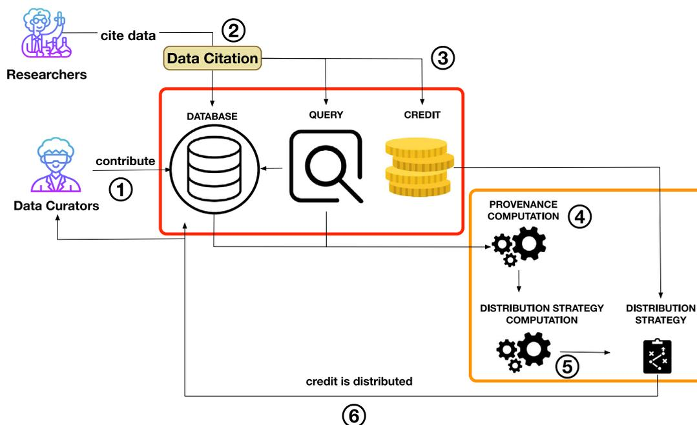
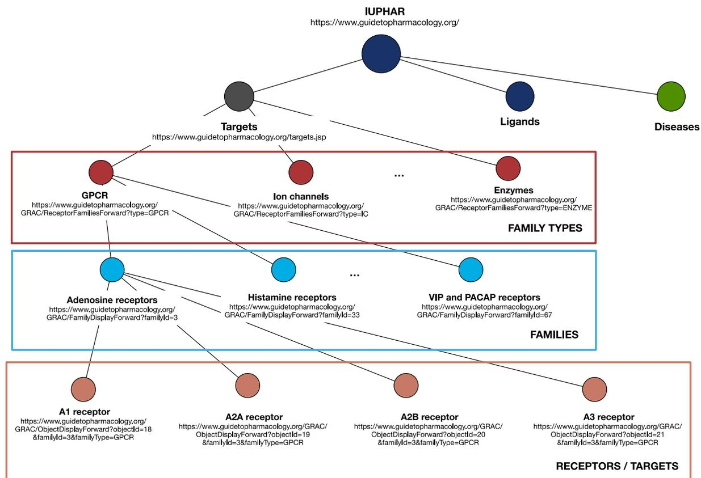
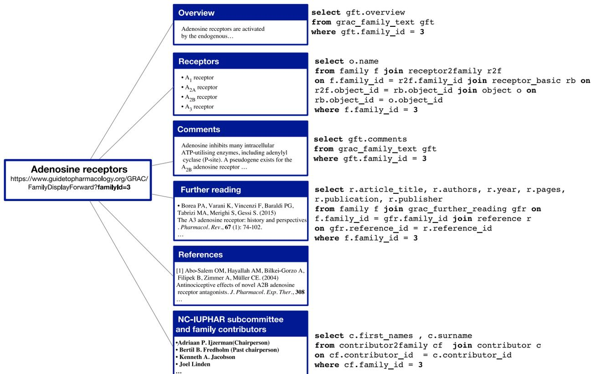
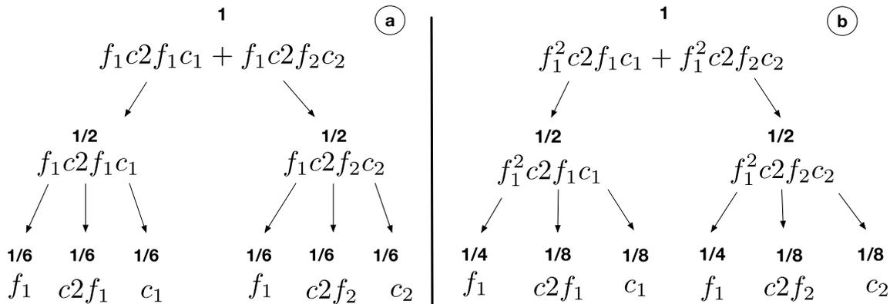
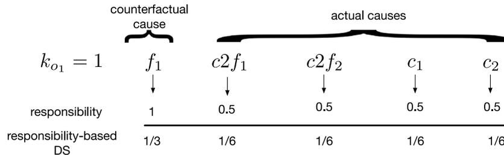
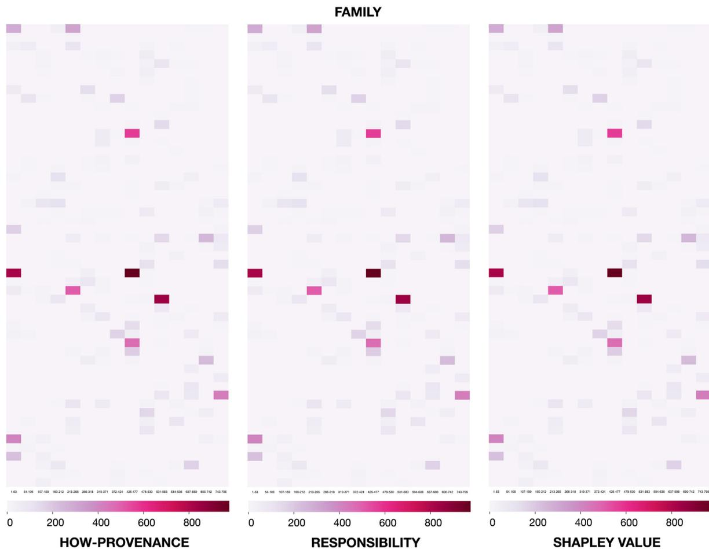
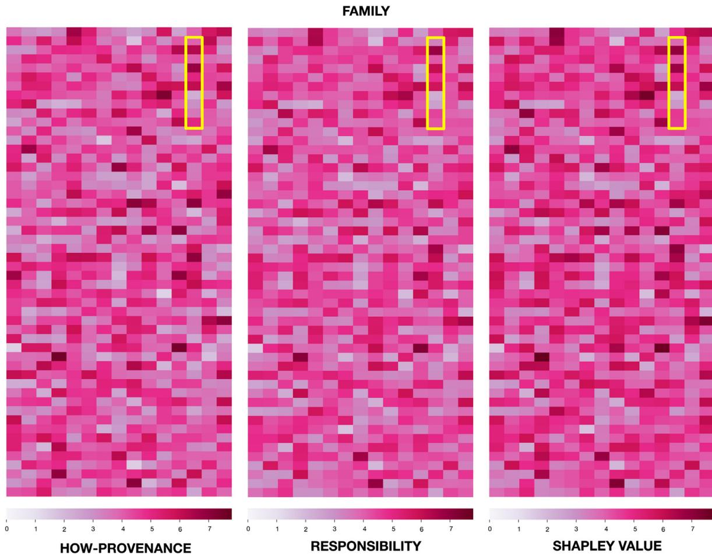
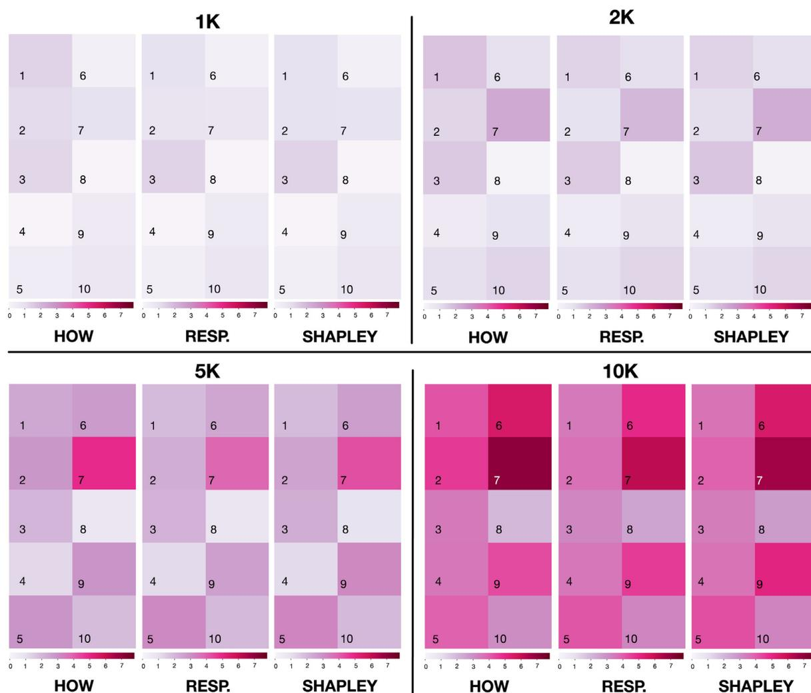
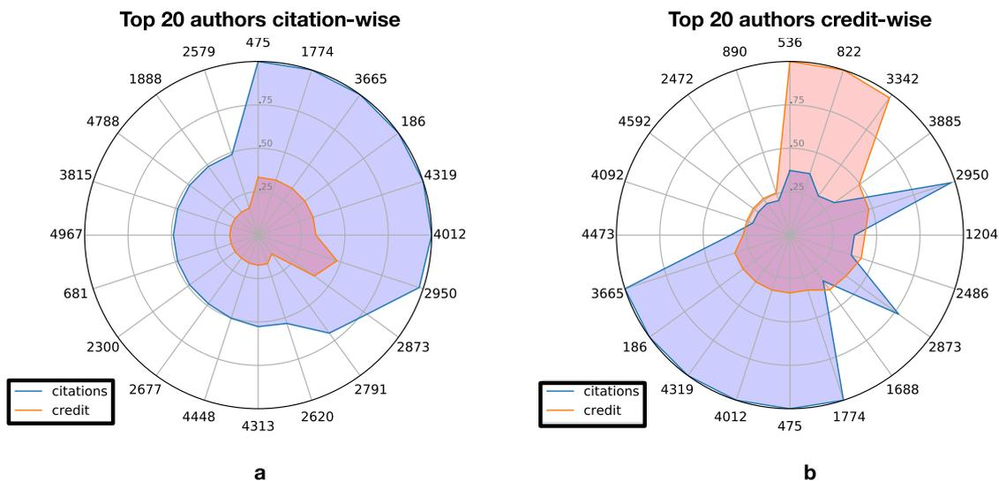
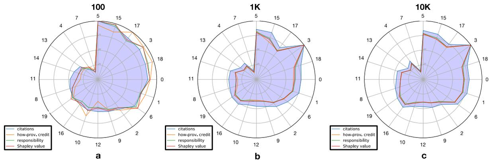

# Credit distribution in relational scientific databases

Dennis Dosso<sup>a</sup>, Susan B. Davidson<sup>b</sup>, Gianmaria Silvello<sup>a,\*</sup>

<sup>a</sup> Department of Information Engineering, University of Padua, Italy

<sup>b</sup> Department of Computer and Information Science, University of Pennsylvania, USA


## ARTICLE INFO

### Article history:

Received 11 January 2021

Received in revised form 26 April 2022

Accepted 27 April 2022

Available online 10 May 2022

Recommended by Matthias Weidlich

### Keywords:

Data citation

Data credit

Provenance

Causality and responsibility

Shapley value

## ABSTRACT

Digital data is a basic form of research product for which citation, and the generation of credit or recognition for authors, are still not well understood. The notion of *data credit* has therefore recently emerged as a new measure, defined and based on data citation groundwork.

Data credit is a real value representing the importance of data cited by a research entity. We can use credit to annotate data contained in a curated scientific database and then as a proxy of the significance and impact of that data in the research world. It is a method that, together with citations, helps recognize the value of data and its creators.

In this paper, we explore the problem of Data Credit Distribution, the process by which credit is distributed to the database parts responsible for producing data being cited by a research entity.

We adopt as use case the IUPHAR/BPS Guide to Pharmacology (GtoPdb), a widely-used curated scientific relational database. We focus on Select-Project-Join (SPJ) queries under bag semantics, and we define three distribution strategies based on how-provenance, responsibility, and the Shapley value.

Using these distribution strategies, we show how credit can highlight frequently used database areas and how it can be used as a new bibliometric measure for data and their curators. In particular, credit rewards data and authors based on their research impact, not only on the citation count. We also show how these distribution strategies vary in their sensitivity to the role of an input tuple in the generation of the output data and reward input tuples differently.

© 2022 The Author(s). Published by Elsevier Ltd. This is an open access article under the CC BY-NC-ND license (<http://creativecommons.org/licenses/by-nc-nd/4.0/>).

## 1. Introduction

Citations are an essential component of scientific research that allow us to find research products and create and understand their relationships. They form a basis to give credit to authors, papers, and venues [1–3]. Citations are used, among other things, to decide on tenure, promotion, hiring, and funding of grants for researchers [4–7].

Science and research are increasingly digital, and numerous curated databases are at the core of scientific research efforts [8]. It is therefore generally accepted that data must be cited and citable [9,10], and that data citations should contribute to the scientific reputation of researchers, scientists, data curators, and creators [11,12]. It is also accepted that data citations should be counted alongside traditional citations and contribute to bibliometrics indicators [13,14].

A central problem with data citation is how to attribute credit to data creators and curators [15]. How to handle and count the credit generated by data citation and how it contributes to traditional and new bibliometrics are long-standing research

issues [16,17]. However, data citations and their related bibliometrics do not always fully reward the creators of data used in a database, even when correctly applied. Data is often cited at the “database level” or the “webpage level”. In the first case, even though only a data subset was used, the whole database ends up being cited, and therefore all credit goes only to the key personnel of the database. In the second case, the database has a website with webpages that can be individually cited. The webpages are built using data extracted from the database, which is aggregated by topic and layout to resemble a traditional research paper. Often the creators and curators of the webpage’s data are not credited or only marginally credited for their work [18].

Recently, the idea of *Data Credit Distribution* (DCD) [19–21] has emerged, built on top of methodologies for data citation. Data credit is a value that is computed based on the importance of the data being cited in a research entity (typically a paper), and is a proxy for the impact of the data on the citing entity. The DCD problem consists of distributing this credit to elements in the databases that are responsible for the generation of the data being cited. The goal of DCD is to improve and expand the reach of data citation, rather than being an alternative to it.

In this paper, we consider data credit as a measure of value for data in a (curated) scientific database. Credit is a real value that can be assigned to data of any kind and at any level of

\* Corresponding author.

E-mail address: [gianmaria.silvello@unipd.it](mailto:gianmaria.silvello@unipd.it) (G. Silvello).

granularity. Therefore, the concept of “data” is left intentionally vague, although we focus on relational databases in this paper. Credit acts as a proxy for the value of data based on the measure of citations, accesses, clicks, downloads, or other surrogates for data use.

We define DCD as the process, method, or algorithm used to assign credit to a given datum or dataset. It differs from the traditional citation setting since:

1. When a paper  $p_1$  cites another paper  $p_2$ , a +1 citation “credit” is given to  $p_2$ , and to all its authors. It does not matter why or how  $p_1$  cites  $p_2$ ,<sup>1</sup> the result is always +1 to the citation count of  $p_2$  and of its authors. A different credit distribution strategy can assign a quantity of credit to  $p_2$  and its authors that is *proportional* to the role played by  $p_2$  in  $p_1$ . Hence, we can weight the importance of the cited entities and assign credit according to their role.
2. Traditional citations are *atomic*: a citation from  $p_1$  to  $p_2$  can never be broken into pieces and assigned in part to  $p_2$  and in part to other papers or data that contributed to  $p_2$ . In contrast, with data credit, we use a *non-atomic* real value, which can be divided and distributed to multiple components of a database.
3. Credit can be *transitive*, that is, it can be propagated through one cited entity to other entities cited by it that contributed to its content. Citations, traditionally, are not.

We study the DCD problem in the context of relational databases (RDBs) since they are widely used<sup>2</sup> and are the main focus of current work in data citation methods [8,23,24]. RDBs are also frequently a test-bed for new methods that can be adapted to other databases, e.g., graphs or document databases. The “portions” of data in an RDB that can be credited can be defined at different levels of granularity, in particular: (i) the whole database, (ii) tables, (iii) tuples, and (iv) attributes. The ability to specify different levels of granularity in a relational database allows us to define the DCD problem at a particular level of granularity. In this paper, we focus on DCD at the tuple level.

The DCD process that we use is summarized in Fig. 1:

- Step 1** Scientists and experts create and curate the information contained in a scientific database. These are called the “Data Curators”.
- Step 2** Other researchers use the data in their research, and when possible, cite them.
- Step 3** The citation to the data generates credit, that can be used as a proxy for the impact of the data on the citing paper. This credit is represented as a real value  $k \in \mathbb{R}_{>0}$ .
- Step 4** Given the database instance  $I$  and the query  $Q$ , the *data provenance* of  $Q(I)$  is computed as a form of metadata that captures how  $Q$  used  $I$  to generate the output [25].
- Step 5** Provenance is input to the *Credit Distribution Strategy* (CDS, also referred only as Distribution Strategy, DS). CDS is a function  $f$  that takes as input the credit  $k$ , distributes it to the data in the input database  $I$ , and is defined on the basis of citation policies decided at the database administration level or at the domain community level.

- Step 6** Once the CDS is computed, it is used to distribute the credit  $k$  to the parts of the database that are responsible for the generation of  $Q(I)$ . Transitively, this credit is also divided and given to the corresponding authors of those data.

This paper expands the work in [26] where we first defined the problem of DCD in relational databases, and proposed a viable Distribution Strategy (DS) based on *lineage* – the simplest form of *data provenance*. The lineage of a tuple  $t$  in the output  $Q(I)$  is defined as the set of all and only the tuples in the database instance  $I$  that are “relevant” to the production of  $t$  and indicated as  $L_t$ . The corresponding strategy equally redistributes the credit  $k$  to the tuples in the lineage set, thus each tuple receives credit  $k/|L_t|$ .

One may argue that this DS is too simplistic, since lineage does not convey any information about the role or importance of input tuples in the query. Therefore, one may desire to give more credit to the tuples that are more *important* to the production of the output, i.e. those tuples that, if removed, would prevent the output tuple from appearing in the final result, or those tuples used more than once by the query.

Therefore, in this paper, we expand the ideas in [26] by proposing new DSs based on another form of data provenance: how-provenance [27]. We also propose other two DS based on the concepts of responsibility [28] and the Shapley value [29,30]. We focus on SQL queries under the bag semantics assumption.

We discuss why one provenance form may be preferred to another depending on the application and its goals. We show that the DS based on responsibility gives more credit to tuples that are essential to the production of the result set. In contrast, the how-provenance-based DS considers the different ways in which a tuple is used. Finally, we present an alternative take on the problem with the Shapley-based DS that models the distribution process as a competitive game in which tuples that contribute more to the generation of the output are correspondingly rewarded more.

We use a well-known curated database called the IUPHAR/BPS<sup>3</sup> Guide to Pharmacology [31] – GtoPdb<sup>4</sup> – to evaluate the DSs. GtoPdb contains expertly curated information about diseases, drugs, cellular drug targets, and their mechanisms of action. We chose GtoPdb for two main reasons: (i) it is a widely-used and valuable curated relational database, (ii) many papers in the literature use, and cite, its data (i.e., families, ligands, and receptors). Real queries used in papers can therefore be seen as data citations that can be used to assign data credit.

We perform four sets of experiments. In the first, real queries are extracted from papers published in the British Journal of Pharmacology (BJP), that represent data citations to GtoPdb, and are used to distribute credit in the database using the three different provenance-based DSs. In the second and third experiment we analyze the behavior of the different DS when complex citation queries are employed. In the fourth set of experiments we use both real and synthetic queries to assess the difference between traditional citation and the notion of credit distribution in terms of rewarding those responsible for the data, e.g. data curators.

**Contributions** of this work include:

- Three Distribution Strategies based on how-provenance, responsibility and the Shapley value.
- An in-depth analysis of the effects of credit distribution on real-world curated data and of the differences between the three proposed Distribution Strategies.
- A comparison between the behavior of traditional citations and data credit in rewarding data curators.

<sup>1</sup> Note that there is vast research on this topic and many alternative proposals, but none of them currently work at a large scale.

<sup>2</sup> The “relational database market alone has revenue upwards of \$50B” [22].

<sup>3</sup> International Union of Basic and Clinical Pharmacology/British Pharmacology Society.

<sup>4</sup> <https://www.guidetopharmacology.org/>.



Fig. 1. Overview of the credit distribution pipeline.

**Outline.** The rest of the paper is organized as follows: Section 2 presents background material and related work. Section 3 describes the GtoPdb use case. Section 4 presents the forms of provenance used in the paper. Section 5 describes the credit distribution problem and the proposed distribution strategies. In Section 6 we present the experimental evaluation, followed by a discussion of our design decisions in Section 7. Section 8 draws some conclusions and outlines future work.

## 2. Background

**Data in research.** Research transitioned to the *fourth paradigm of science* [32], that is, data-intensive scientific discovery, where data are essential for scientific advances as well as for traditional publications [33].

The scientific community is promoting an *open research culture* [34], founded on methods and tools to share, discover, and access experimental data. A striking example is the FAIR principles (Findable, Accessible, Interoperable, and Reusable) [35], which every database should enforce. In particular, data should be accessible from the articles, journals, and papers that cite or use them [2]. The need for *reproducibility* of experiments through the used data; the *availability* of scientific data; and, the *connections* between data and the scientific results are all needed aspects to operationalize the fourth paradigm, and relevant for *data citation* [36].

**Data citation: Principles and motivations.** Data Citation principles were proposed in [37], and later summarized and endorsed by the Joint Declaration of Data Citation Principles (JDDCP) [38]. The principles are divided into two groups [39]. The first group is about the role of data citation in scholarly and research activities such as the (i) *importance* of data (why data citation is important and why data should be considered as first-class citizens); (ii) *credit* and *attribution* to the creators and curators of the data; (iii) *evidence*; (iv) *verifiability*; and *interoperability*, with these last three requiring data citation methods to be flexible enough to operate through different communities. The second group defines the main guidelines to establish a data citation systems, and contains principles such as the (i) *unique identification* of the data

being cited; (ii) (*open*) *access* to data; (iii) guarantee of *persistence* and *availability* of citations even after the lifespan of the cited entity; the (iv) *specificity* of a citation, i.e. it must lead to the data set originally cited.

The main motivations for data citation are outlined in [39] and range from data attribution and connection to data sharing, impact and reproducibility.

### 2.1. Data citation in relational databases

Relational databases have been the target of data citation methods since the surge of the data-centric research paradigm. The RDA “Working Group on Data Citation: Making Dynamic Data Citable”<sup>5</sup> [40] (hereafter, RDA-WGDC) has developed guidelines for citing large, dynamic, and changing datasets which have now moved on into adoption phase. The datasets considered by the Working Group are often relational.

The RDA-WGDC [41] reported that there are various implementations of its guidelines for Data Citation on MySQL/Postgres relational databases. Some of these databases are: DEXHELPP<sup>6</sup> (Social Security Records); NERC (ARGO Global Array); EODC (Earth Observation Data Centre) [42]; LNEC (River dam monitoring); MDS (Million Song Database) [43]; CBMI<sup>7</sup> (Center for Biomedical Informatics); VMC (Vermont Monitoring Cooperative); CCA.<sup>8</sup> (Climate Change Center Austria); VAMDC (Virtual Atomic and Molecular Data Center) [44,45]

More examples of work on data citation in relational databases are [8,46–48]. The website <https://fairsharing.org/> keeps an updated list of curated and scientific databases (many of which are relational or graph-based) following FAIR guidelines. These databases are citable since they are compliant with the most recent guidelines, and they are in the vast majority of cases accessible via dynamically created webpages. In all these databases

<sup>5</sup> <https://www.rd-alliance.org/groups/data-citation-wg.html>.

<sup>6</sup> <http://www.dexhelp.at/>.

<sup>7</sup> <https://medicine.missouri.edu/centers-institutes-labs/center-for-biomedical-informatics>.

<sup>8</sup> <https://ccca.ac.at/startseite>.

it is, therefore, possible to implement DCD on top of the existing infrastructures for citing data.

Data citation techniques are primarily applied to relational databases because of their pervasiveness as well as the “identifiability” of the portions of data that are to be cited: the whole database, a relation, a tuple, or even an attribute. Many papers [8, 47, 49] consider more complex citable units, recognizing that often the *views* of a database are the ones to be cited. Generally, a *view* is a query on the database. To this end, [46] suggested decomposing the database into a set of views, where each view is associated with its citation.

At present, the most common practices to cite databases include:

1. A database cited as a whole, even though only parts of the databases are used in the papers or datasets. Alternatively, the so-called “data papers” are cited, being traditional papers that describe a database [50].  
In this case, all the credit from the citations goes to the database administrators or to the authors of the data papers.
2. Subsets of data, obtained by issuing queries to a database, are individually cited. This is the solution adopted by the RDA-WGDC [40]. In this case, the credit generated from citations is distributed among the contributors of the portions of data being cited, and/or to the database administrators.
3. The database is accessible via a series of webpages that arrange the content of the database by topic or theme. Examples in the life science domain include the Reactome Pathway database [51], the GtOPdb [31], and the VAMDC [45]. Every single Webpage is unequivocally identifiable and can be individually cited.

### 2.2. Data credit

Data credit is related to data citation: they both aim to recognize the work of data creators and curators. Data credit can be seen as a by-product of data citation, since credit attribution is impossible without the presence of data citations.

In this framework, Katz [20] suggests the need for a *modified citation system* that includes the idea of *transient* and *fractional credit*, to be used by developers of research products as software and data. Two considerations are made: (i) research objects such as data and software are currently not formally rewarded or recognized by the community; (ii) even in traditional papers, the contribution of each author to the work is hard to understand, unless explicitly specified in the paper. This is even more true for data, where different groups of people work on the same database.

In [20] credit is defined as a “quantity” that describes the importance of a research entity, such as papers, software, or data, mentioned in a citation. It also proposed the idea of a *distribution* of credit from research entities, such as papers or data, to other research entities through citations. Therefore, when discussing data credit, we need to consider *credit computation* – i.e., the process to compute the quantity of credit generated by the citation – and *credit distribution* – i.e., the process to distribute credit and to assign it to the entities that contributed to the creation/curation of the cited data. In this paper we focus on the latter.

These two processes are done by exploiting the structure of the *citation graph*, a directed graph whose nodes are publications and edges are citations. This graph is the model at the core of systems such as Google Scholar and the Web of Science. We add to this that the concept of credit can be built on top of the existing infrastructure handling traditional and data citations.

Katz [20] further explores the idea of a *distribution* of credit from research entities (i.e., papers and data) to other research entities through citations that connect them. Thanks to the idea of “credit distribution”, some problems related to traditional citations can be addressed:

1. Credit rewards research entities that to date are not (formally) recognized (a goal shared with data citation).
2. Credit can reward authors *proportionally* to their role in generating the entity. The more an author contributes to a paper, the more credit is given to him. Zou and Peterson [1] work on something similar with their zp-index, which includes in its formulation the position (and thus the role) of a publication author to represent its impact in the work itself.
3. Credit can be *transitively* channeled through a chain of papers citing each other, thus enabling the rewarding of older papers that are no more cited, since other papers summarize or report their content but are nevertheless crucial in a research area for the influence of their content.

Fang [19] presents a framework to distribute the credit generated by a paper to its authors and to the papers in its reference list in a transitive way. Let us consider the *citation graph* as the graph where the nodes are papers and the links are the citations among them. In this graph, every paper is a source of credit, which is then transferred to the neighboring nodes. The quantity of credit received by each cited paper depends on its impact/role in the citing paper. So far, this theoretical framework is limited to papers, but it can be easily extended to a citation graph including both papers and data.

Zeng et al. [21] proposes the first method to compute credit within a network of papers citing data. Adopting a network flow algorithm, they simulate a random walk to estimate a score for each dataset, leveraging real-world usage data to compute the credit. This is the first step towards an automatic credit computation procedure. This proposal is, however, limited to assigning credit to whole datasets, and it does not deal with the granularity of data. It does not work to assign credit to a single research entity within a dataset. Differently from Zeng et al. [21], we do not treat the credit computation process, but we focus on the distribution process.

### 2.3. Data provenance

To distribute credit, we base our methods on the *data provenance* bodywork. Data provenance is information that describes the origin and the process of creation of data. It can also be seen as metadata pertaining to the derivation history of the data. It is particularly useful to help users to understand where data are coming from, and the process they went through. Data citation and data provenance are closely linked [18] since both are forms of annotations on data retrieved through queries. Data provenance has been widely studied in different areas of data management. In this paper, we focus on provenance for database management systems (DBMS). For further details on data provenance, please refer to surveys like [25, 52].

Cheney et al. [25] presents four main types of data citation for DBMS: *lineage* [53], *why-provenance* [54], *how-provenance* [27] and *where-provenance* [54].

Let us start with the first three provenances. Given a database instance  $I$ , a query  $Q$ , and the result  $Q(I)$ , consider one tuple  $t$  of the output. Its provenance is information about its generation through the tuples of the input that are used by  $Q$ . Different types of provenance convey different levels of information. Since these three provenances are computed for each tuple of the output, they are also referred to as *tuple-based*.

Where-provenance, differently from the other three, is *attribute-based*, so we do not take it into account in this work since we consider the tuple as the finest citable unit.

Green et al. [27] defined the semiring model which captures all of the above provenance models – lineage, why-provenance, how-provenance and where-provenance – and expresses set semantics, bag semantics and some extensions of the relational model. For data credit distribution, the results achieved with lineage and why-provenance are subsumed by those obtained using how-provenance, which we focus on in this work.

### 2.4. Causality and responsibility

We also consider the notions of causality and responsibility, as defined in [28]. Causality is an enrichment of lineage, and it is the attribution of a certain degree of importance to the tuples of the lineage based on their role in the generation of the output. Responsibility is a value given to the tuples of the lineage to rank them based on their degree of causality (the more important the role of a tuple in generating the output, the higher its responsibility).

While computing responsibility for general queries is hard [55], Meliou et al. [28] proved a dichotomy result for conjunctive queries: for each query without self-joins, either its responsibility can be computed in PTIME in the size of the database or checking if it has a responsibility below a given value is NP-hard.

### 2.5. Shapley value

The Shapley value was introduced in 1952 [56], framed as a *cooperative game* played by a set  $A$  of players, and defined by a *wealth function*  $v$  that assigns to each coalition set  $B \subseteq A$  the wealth  $v(B)$ . The question behind the Shapley Value is how to quantify the contribution of each player to the overall wealth. Informally, the Shapley value is defined as follows [29]: assume that we select players randomly one by one and without replacement, starting with the empty set. Every time a player  $a$  is selected, its addition to the coalition  $B$  produces a change in the wealth of the coalition from  $v(B)$  to  $v(B \cup \{a\})$ . The Shapley value of  $a$  is the expectation of change that  $a$  causes in this probabilistic process.

The Shapley value has been widely used, e.g. in economics, law, environmental science, and network analysis, and has strong theoretical justifications. However, its use in databases as a metric for quantifying the influence of a tuple on the output of a query (thereby presenting an alternative to responsibility) has only recently been considered [29]. The initial theoretical analysis in [29] showed lower bounds on the complexity of the problem, but did not suggest a feasible implementation. However, very recently, an efficient implementation for Boolean queries has been provided [30], both in terms of an exact computation (it works well for most queries) and in inexact one (it is extremely fast and provides the same ranking of tuples as the exact computation, but not necessarily the same values).

## 3. Use case: GtoPdb

The IUPHAR/BPS Guide to Pharmacology [31] (GtoPdb<sup>9</sup>) is a well-known scientific relational database that contains expertly curated information about diseases, drugs in clinical use, their cellular targets, and the mechanisms of action on the human body. It is curated and maintained by the GtoPdb Committee and 96 subcommittees, comprising 512 scientists collaborating

with in-house curators who draw the information contained in the database from high-quality pharmacological and medicinal chemistry literature. Roughly 1000 researchers from all over the world have contributed to the database, and the curators wanted to give recognition to these contributors. This led to some early work on data citation [49].

GtoPdb is relational, but its logical structure is hierarchical as shown in Fig. 2. The information contained in the database is also organized into webpages focused on specific diseases, targets or ligands, and families for easier access by users. As depicted in Fig. 2, the database can be thought of as a tree where the root is the database; the first level consists of all targets, ligands, and diseases; and the lower levels consists of specific targets, ligands and diseases. In this paper, we focus on targets; thus the figure at the third level shows examples of family types, at the fourth level of specific families of targets (a finer level of granularity), and finally, at the last level, the single targets (also known as receptors).

GtoPdb provides access to the webpages corresponding to all these nodes through URLs. The webpages corresponding to target families all present a similar structure, as shown in Fig. 3 for the “Adenosine receptors” family. Each page has an *Overview*, a brief text describing the content of the page; a list of *Receptors* comprising the family; a section of *comments* about the family; the *References*, a list of the papers consulted by the curators of the page, similar to a reference list of a paper; the *further reading* list, reporting papers that an interested reader may want to consult to obtain more insight on the family; and a final section called *How to cite this family page*, containing text snippets useful to cite the specific page or the whole database. Fig. 3 shows the SQL query to build the corresponding sections (apart from the References section). Therefore, each family page can be considered a full-fledged traditional publication, consisting of title, authors, abstract (the overview), content, and references.

In practice, many papers in the literature only reference GtoPdb (the root) without including a reference to the specific page being cited. That is, they only cite a paper describing GtoPdb as a whole (e.g., [31]) and refer to targets, ligands, diseases, etc. only by name. Thus, citations to specific families are *de-facto* “hidden” to citation systems such as Google Scholar, and useless for the computation of bibliometrics.

In certain “lucky” cases, as with papers available in PDF and published in the British Journal of Clinical Pharmacology<sup>10</sup> (BJCP), when a family, ligand, receptor name, etc. are used, they have a hyperlink pointing to the corresponding webpage in GtoPdb. Therefore, the citations to the families can be detected and counted using the URLs reported in the papers. However, these citations to GtoPdb webpages are not counted as such by citation systems, so they are not converted into credit for curators and collaborators.

For our running example, consider Table 1. This simplified version of GtoPdb contains three tables: *family*, *contributor* and *contributor2family*. The first table, *family*, has tuples representing families with three attributes: the id of the family, its name, and type. Table *contributor* contains people who have helped generate the data in the database. The third table, *contributor2family*, serves as a link between the families and the people who contributed to them. For instance, “John Smith” ( $c_1$ ) contributed to “Dopamine Receptors” ( $f_1$ ) as well as to the “YANK Family” ( $f_4$ ). Throughout the rest of the paper, we will use the id attribute of these tables as the *provenance token* of its corresponding tuples, that is, as a symbol that serves to identify a tuple when talking about provenance.

<sup>9</sup> <https://www.guidetopharmacology.org/>.

<sup>10</sup> <https://bpspubs.onlinelibrary.wiley.com/journal/13652125>.



Fig. 2. Partial map of the GtoPdb hierarchical structure grouping the targets into families and family types.



Fig. 3. Basic web-page structure of "Adenosine receptors" family (ID 3), with queries used to retrieve the information contained in every section, except references.

**Table 1**

Example of a database consisting of three tables. *family* contains receptor families; *contributor* contains the name and country of contributors; *contributor2family* connects contributors to the families they contributed to.

| family |                    |        |
|--------|--------------------|--------|
| id     | Name               | Type   |
| $f_1$  | Dopamine Receptors | gpcr   |
| $f_2$  | Bile Acid Receptor | gpcr   |
| $f_3$  | FAK Family         | enzyme |
| $f_4$  | YANK Family        | enzyme |

  

| contributor2family |           |                |
|--------------------|-----------|----------------|
| id                 | family_id | contributor_id |
| $c2f_1$            | $f_1$     | $c_1$          |
| $c2f_2$            | $f_1$     | $c_2$          |
| $c2f_3$            | $f_2$     | $c_3$          |
| $c2f_4$            | $f_4$     | $c_1$          |

  

| contributor |                |         |
|-------------|----------------|---------|
| id          | Name           | Country |
| $c_1$       | John Smith     | UK      |
| $c_2$       | Jim Doe        | UK      |
| $c_3$       | Hans Zimmerman | Germany |
| $c_4$       | Roberta Rossi  | Italy   |

## 4. Provenance, responsibility, and shapley value

We now introduce how-provenance, causality, responsibility, and the Shapley value function. In the following we use the notion of the *lineage* of an output tuple [25,53]. The *lineage set*  $L$  of a tuple  $o \in Q(I)$  is the set of *all and only* the tuples in the database instance  $I$  that are used by query  $Q$  to produce the output tuple  $o$ .

### 4.1. How-provenance

How-provenance was first defined in [27] to capture the information about how the source tuples are used exploiting a *semiring* algebraic structure. It takes the form of a polynomial, called *provenance polynomial*, where the variables are taken from the set  $X$  of identifiers of the tuples (provided that each tuple in  $I$  has an identifier) and the coefficients are drawn from the set of natural numbers  $\mathbb{N}$ .<sup>11</sup>

In the following, we rely on the commonly-adopted notation of [25]. Let  $\mathbf{D}$  be a finite domain of data values  $\{d_1, \dots, d_n\}$  and  $\mathcal{U}$  a collection of *field names* (also attribute names). We use  $U, V$  to denote finite subset of  $\mathcal{U}$ .

A tuple  $t$  is a function  $U \mapsto \mathbf{D}$ , from the attributes  $\{A_1, \dots, A_n\} \in U$  to the data values in  $\mathbf{D}$ , written as  $(A_1 : d_1, \dots, A_n : d_n)$ . A tuple assigning values to each field name in  $U$  is called *U-tuple*. We write *Tuple* for the set of all tuples, *U-Tuple* for the set of all *U*-tuples. We write  $t.A$  or  $t \bullet A$  for the value of the *A*-field of  $t$  and  $t[U]$  for the restriction of tuple  $t$  over  $U \subseteq V$  to field names in  $U$ . We write  $t[A \mapsto B]$  for the result of renaming field  $A$  to  $B$  in  $t$  (assuming  $B$  is not already present in  $t$ ).

A *relation* or table  $r : U$  is a finite set of tuples over  $U$ . We call  $\mathcal{R}$  a finite collection of *relation names*. A *schema*  $\mathbf{R}$  is a mapping  $(R_1 : U_1, \dots, R_n : U_n)$  from  $\mathcal{R}$  to a finite subsets of  $\mathcal{U}$  (assigning to a every relation name a set of attributes). A *database* or *instance*  $I$  is a function  $I : (R_1 : U_1, \dots, R_n : U_n)$  mapping each  $R_i : U_i \in \mathbf{R}$  to a relation  $r_i$  over  $U_i$ .

A *tuple location* is defined as a tuple in one relation of the database tagged with its name. A tuple location is indicated with  $(R, t)$ , where  $R$  is the relation in the database, and  $t$  is the tuple in

$R$ . With reference to the running example of Table 1,  $(\text{family}, (f_1, \text{Dopamine Receptors}, \text{gpcr}))$  is the tuple location of the first tuple in the *family* relation. The set of all the tuple locations in  $I$  is called *TupleLoc*.

A semiring  $K$  is a set equipped with two operations, typically denoted with the symbols  $+$  and  $\cdot$ , satisfying the following axioms [57, pg. 26]:

1. The set  $K$  is a *commutative monoid* for the operator  $+$  with a neutral element  $0$ . Therefore, it has these properties:

- (a)  $(a + b) + c = a + (b + c)$  (associative property)
- (b)  $0 + a = a + 0 = a$
- (c)  $a + b = b + a$  (commutative property)

2. The set  $K$  is a *monoid* with identity element  $1$ . Therefore, it has these properties:

- (a)  $(a \cdot b) \cdot c = a \cdot (b \cdot c)$  (associative property)
- (b)  $1 \cdot a = a \cdot 1 = a$  ( $1$  is the neutral element)

3. Multiplication is distributive on addition, i.e.:

- (a)  $a \cdot (b + c) = (a \cdot b) + (a \cdot c)$
- (b)  $(a + b) \cdot c = (a \cdot c) + (b \cdot c)$

4. Multiplication by  $0$  annihilates  $K$ , i.e.  $\forall x \in K, 0 \cdot x = x \cdot 0 = 0$ .

The key idea in Green et al. [27] is to use the two operators  $+$  and  $\cdot$  to represent two basic transformations that source tuples undergo as a result of applying a relational query to a database [25]. Two tuples may either be joined together (a join is represented with the  $\cdot$  operator) or merged via union or projection (represented with the  $+$  operator).

Now we formally introduce the mathematical framework behind how-provenance [27]. Let  $K$  be a set containing an element  $0$ ,  $U$  a set of attributes and  $U - \text{Tuples}$  the set of tuples with attributes in the set  $U$  (each such tuple is called, for brevity, *U-tuple*). A  $K$ -*relation* is a function  $R : U - \text{Tuples} \mapsto K$  which maps every *U-tuple* in an element in  $K$  such that its support, defined as  $\text{supp}(R) = \{t \mid R(t) \neq 0\}$ , is finite. Thus, it is possible to see the  $K$ -relation as a finite function that models a relation  $R$ , tagging each tuple in  $R$  with an element of  $K$  and each tuple that is not in  $R$  with  $0$ .

**Definition 4.1** (*Operations on the Algebraic Structure*  $(K, 0, 1, +, \cdot)$  [27]).

Let  $(K, 0, 1, +, \cdot)$  be an algebraic structure with two binary operations  $+$  and  $\cdot$  and two distinguished elements  $0$  and  $1$ . The operations of the positive  $K$ -relational algebra are defined as follows:

1. Empty relation. For any set of attributes  $U$ ,  $\exists \emptyset : U - \text{Tuples} \mapsto K \mid \emptyset(t) = 0$ .
2. Selection Let  $R : U - \text{Tuples} \mapsto K$  and  $\sigma$  be a selection predicate that maps each *U-Tuple* to either  $0$  or  $1$ . Then  $\sigma_\theta(R) : U - \text{Tuples} \mapsto K$  is defined by  $(\sigma_\theta(R))(t) = R(t) \cdot \sigma(t)$ .
3. Projection Let  $R : U - \text{Tuples} \mapsto K$  and  $V \subseteq U$ . Then  $\pi_V(R) : V - \text{Tuples} \mapsto K$  is defined by  $(\pi_V(R))(t) = \sum_{t'=\{t[V] \vee R(t') \neq 0\}} R(t')$ .
4. Union Let  $R_1, R_2 : U - \text{Tuples} \mapsto K$ . Then  $R_1 \cup R_2 : U - \text{Tuples} \mapsto K$  is defined by  $(R_1 \cup R_2)(t) = R_1(t) + R_2(t)$ .
5. Natural join Let  $R_1 : U_1 - \text{Tuples} \mapsto K$  and  $R_2 : U_2 - \text{Tuples} \mapsto K$ . Then  $R_1 \bowtie R_2 : U_1 \cup U_2 - \text{Tuples} \mapsto K$  is defined by  $(R_1 \bowtie R_2)(t) = R_1(t_1) \cdot R_2(t_2)$ , where  $t_1 = t[U_1]$  and  $t_2 = t[U_2]$ .

It is observed in [27] that if the  $K$ -relational semantics satisfies the same equivalence laws as positive relational algebra operators over bags, i.e. union ( $+$ ) is associative, commutative and has

<sup>11</sup> This semiring is commonly referred as  $\mathbb{N}[X]$  in the literature.

**Table 2**

Notations used in this paper.

|                            |                                                                          |
|----------------------------|--------------------------------------------------------------------------|
| $I$                        | Database instance                                                        |
| $L, L_t$                   | Lineage set of an output tuple $t$                                       |
| $\Gamma$                   | Contingency set                                                          |
| $\rho_t$                   | Responsibility of tuple $t$                                              |
| $Q$                        | A query                                                                  |
| $\tilde{Q}_o$              | Boolean query such that $\tilde{Q}_o(I) = 1$ if $o$ is present in $Q(I)$ |
| $\mathcal{H}$              | Provenance polynomial                                                    |
| $M_i$                      | A monomial in $\mathcal{H}$                                              |
| $t_j$                      | A tuple in $M_i$                                                         |
| $c(\mathcal{H})$           | Sum of $\mathcal{H}$ 's coefficients                                     |
| $e(M_i)$                   | Sum of $M_i$ 's exponents                                                |
| $mc(M_i)$                  | $M_i$ 's coefficient                                                     |
| $te(t_j, M_i)$             | Exponent of $t_j$ in $M_i$                                               |
| $\gamma(t_j, \mathcal{H})$ | Set of monomials in $\mathcal{H}$ containing $t_j$                       |

**Table 3**

Result of Q1 over the database instance in Table 1 with the how-provenance polynomial of each output tuple.

| id             | Name                                                    |
|----------------|---------------------------------------------------------|
| $o_1$          | Dopamine Receptors                                      |
| $o_2$          | YANK Family                                             |
| how-provenance |                                                         |
| $o_1$ :        | $f_1 \cdot c2f_1 \cdot c_1 + f_1 \cdot c2f_2 \cdot c_2$ |
| $o_2$ :        | $f_4 \cdot c2f_4 \cdot c_1$                             |

identity  $\emptyset$  and join  $(\cdot)$  is associative, commutative and distributive over union, and projection and selection commute with each other, as well as with union and join, then  $(K, 0, 1, +, \cdot)$  must be a commutative semiring.

Let us consider the algebraic structure  $(\mathbb{N}(\text{TupleLoc}), 0, 1, +, \cdot)$ , where  $\mathbb{N}(\text{TupleLoc})$  is the set of polynomials whose coefficients are the natural numbers and the variable are from the set  $\text{TupleLoc}$ . The how-provenance of an output tuple is a function  $\mathcal{H} = \text{How}(Q, I, o)$  that returns a polynomial in  $\mathbb{N}(\text{TupleLoc})$  called *provenance polynomial*. The following definition is adapted from [25] by considering the case applying to our work, i.e.,  $Q^K(I)$  with  $K = 1$ .

**Definition 4.2 (How-Provenance).** Let  $Q$  be an SPJRU query. Let  $I$  be a database instance, and  $t$  be a tuple in  $Q(I)$ . Then, the *how-provenance* of  $t$  according to  $Q$  and  $I$ , denoted as  $\text{How}(Q, I, t)$ , is an element of the set  $\mathbb{N}(\text{TupleLoc})$  defined as follows:

$$\begin{aligned}
 \text{How}(\{u\}, I, t) &= \begin{cases} 1, & \text{if } t = u, \\ 0 & \text{otherwise.} \end{cases} \\
 \text{How}(R, I, t) &= \begin{cases} (R, t), & \text{if } t \in R, \\ 0 & \text{otherwise.} \end{cases} \\
 \text{How}(\sigma_\theta(Q), I, t) &= \theta(t) \cdot \text{How}(Q, I, t) \\
 \text{How}(\rho_{A \rightarrow B}(Q), I, t) &= \text{How}(Q, I, t[B \mapsto A]) \\
 \text{How}(\pi_V(Q), I, t) &= \sum_{u \in \text{supp}(Q), u[V]=t} \text{How}(Q, I, u) \\
 \text{How}(Q_1 \bowtie Q_2, I, t) &= \text{How}(Q_1, I, t[U_1]) \cdot \text{How}(Q_2, I, t[U_2]) \\
 \text{How}(Q_1 \cup Q_2, I, t) &= \text{How}(Q_1, I, t) + \text{How}(Q_2, I, t)
 \end{aligned}$$

Here  $\{u\}$  is a query expression describing a constant, singleton relation, not a relation value per se. These constants correspond to  $K$ -relations that assign 1 to  $u$  and 0 to all other tuples. The summation in the projection case is finite since the support of a  $K$ -relation is assumed to be finite. In the selection rule,  $\theta$  is seen as a function  $\theta : U\text{-Tuples} \mapsto \{0, 1\}$ .

**Example.** Let us consider the following SQL query Q1, applied to the database described in Table 1, asking for the names of families curated by researchers based in the United Kingdom (UK):

```

Q1: SELECT DISTINCT f.name
FROM family AS f JOIN contributor2family AS c2f
ON f.id = c2f.family_id

```

```

JOIN contributor AS c ON c2f.contributor_id = c.id
WHERE c.country = 'UK'

```

Table 3 shows the two output tuples of query Q1 annotated with their respective how-provenances. Tuple  $o_2$  was produced by a join of the input tuples  $f_4$ ,  $c2f_4$ , and  $c_1$ . The three provenance tokens are therefore “multiplied” together. The case of  $o_1$  is slightly more complex. It can be obtained by the joins of two different sets of tuples, so there are two monomials combined by  $+$  representing these alternative derivations.

Provenance polynomials may also have monomials whose exponents and/or coefficients are greater than one, for example,  $3f_1 \cdot c2f_1 \cdot c_1 + f_1 \cdot c2f_2^3 \cdot c_2^3$ . This is a polynomial of a tuple produced by a query where the result of the join between the tuples  $f_1$ ,  $c2f_1$ , and  $c_1$  is produced three times and then merged (e.g. as the result of a union), and the tuples  $c2f_2$  and  $c_2$  are used three times in the operation described by the second monomial (e.g., with nested queries).

### 4.2. Causality and responsibility

A formal study of causality was introduced in [55,58] and later expanded by Meliou et al. [28] to explain the causes of answers and non-answers to queries. In the following, we refer to the definition of causality and responsibility provided in [28]. In particular, we only focus on answers to a query since non-answers are not relevant in our context.

There are two types of “cause” tuples: counterfactual and actual. Let  $o$  be a tuple in the result of query  $Q$  on the database instance  $I$ , and  $t$  a tuple in its lineage. We call  $t$  a *counterfactual cause* if, by removing  $t$  from  $I$ ,  $o$  is also removed from the output (i.e.,  $t$  is essential for the generation of  $o$ ).

We call  $t$  an *actual cause* if there is a set of tuples  $\Gamma \subseteq I$  called a *contingency set*, such that  $t$  is a counterfactual cause in  $I - \Gamma$ . In other words,  $t$  is an actual cause if, even when removed from  $I$ , there is another set of tuples of the lineage that guarantees the presence of  $o$ .

Computing the causality of tuples is NP-complete for general queries [59], but for conjunctive queries it can be computed in PTIME, as showed by Meliou et al. [28].

The notion of *responsibility* measures the degree of causality as a function of the size of the smallest contingency set [55]. This allows us to rank lineage tuples based on their degree of causality in generating the output.

**Definition 4.3 (Responsibility [28]).** Let  $o$  be an output tuple in the result of query  $Q$  on  $I$ , and let  $t$  be a cause for  $o$ . The *responsibility* of  $t$  for the answer  $o$  is:

$$\rho_t = \frac{1}{1 + \min_{\Gamma} |\Gamma|}$$

where  $\Gamma$  ranges over all contingency sets for  $t$ .

Note that a counterfactual cause will have the maximum responsibility of 1, and that the larger the minimum contingency of an actual cause is, the smaller its responsibility will be since there are alternatives to guarantee the presence of the answer  $o$ .

**Example.** Let us consider Table 4, where we reported the result set of Q1 and the tuples of the lineages with their responsibility values. Focusing on  $o_1$ : the lineage tuple  $f_1$  is a counterfactual cause, since its contingency set is empty (when removed from the database,  $o_1$  disappears from the result set). Consequently, its responsibility is 1. All the other tuples of the lineage are actual causes.  $c_1$ , for example, has as minimal contingency set  $\{c2f_2\}$ , thus its responsibility is 0.5. For the output tuple  $o_2$ , all the tuples of the lineage are counterfactual causes, thus their responsibility is 1.

**Table 4**

Result of Q1 over the database instance in Table 1 with the responsibilities of lineage tuples.

| id                                                        | Name               |
|-----------------------------------------------------------|--------------------|
| $o_1$                                                     | Dopamine Receptors |
| $o_2$                                                     | YANK Family        |
| Responsibility                                            |                    |
| $f_1 = 1, c2f_1 = 0.5, c2f_2 = 0.5, c_1 = 0.5, c_2 = 0.5$ |                    |
| $f_4 = 1, c2f_4 = 1, c_1 = 1$                             |                    |

**Table 5**

Result of Q1 over the database instance in Table 1 with the Shapley values of the tuples of the lineage. In this case  $D^n$  corresponds to the lineage.

| id                                                                                                       | Name               |
|----------------------------------------------------------------------------------------------------------|--------------------|
| $o_1$                                                                                                    | Dopamine Receptors |
| $o_2$                                                                                                    | YANK Family        |
| Shapley value                                                                                            |                    |
| $f_1 = \frac{7}{15}, c2f_1 = \frac{2}{15}, c2f_2 = \frac{2}{15}, c_1 = \frac{2}{15}, c_2 = \frac{2}{15}$ |                    |
| $f_4 = \frac{1}{3}, c2f_4 = \frac{1}{3}, c_1 = \frac{1}{3}$                                              |                    |

### 4.3. Shapley value

We rely on the definition provided in [30]. Let  $Q$  be a Boolean query and  $f \in D$  be a fact, the Shapley value of  $f$  in  $D$  intuitively represents the contribution of  $f$  to the query result.<sup>12</sup> The higher the value, the more  $f$  helps in satisfying  $Q$ . Formally, the Shapley value is defined as follows:

$$Shapley(Q, D, f) = \sum_{E \subseteq D \setminus \{f\}} \frac{|E|!(|D| - |E| - 1)!}{|D|!} (Q(E \cup \{f\}) - Q(E))$$

The sum is performed on all possible subsets of  $D$  that do not contain  $f$ . The value  $(Q(E \cup \{f\}) - Q(E))$  is the “wealth” brought by  $f$  when added to  $E$ . Thus, the Boolean query is used as a wealth function  $v$ : its value is 1 only when the set  $E \cup \{f\}$  makes the query true, and the set  $E$  makes it false, i.e., when the addition of the fact  $f$  is determinant to making the Boolean query true. The value  $|E|!(|D| - |E| - 1)!$  is the number of all the possible permutations over  $D$  where the facts in  $E$  come first, then  $f$  is added, and then all the remaining facts. Thus, the value  $\frac{|E|!(|D| - |E| - 1)!}{|D|!}$  can be thought as a weight for the wealth brought by  $f$  when added to  $E$ .

To extend this definition to non-Boolean queries, we adopt the approach in Deutch et al. [30]: the Shapley value of the fact  $f$  for the answer  $\bar{t}$  to  $Q(\bar{x})$  is the value  $Shapley(Q[\bar{x}/\bar{t}], D, f)$ , where  $Q[\bar{x}/\bar{t}]$  is the Boolean query defined by  $Q[\bar{x}/\bar{t}](D) = 1$  if and only if  $\bar{t}$  is in the output of  $Q(\bar{x})$  on  $D$ , and 0 otherwise. In other words, the definition of  $Shapley(q, D, f)$  is extended to queries  $Q(\bar{x})$  with free variables by considering the Boolean query  $Q[\bar{x}/\bar{t}]$  as a value function. This query can be seen as a function that takes as input a set of facts and returns 1 if this set is a witness for  $\bar{t}$ , and 0 otherwise.

**Example.** Let us consider Table 5, that shows the Shapley values for the lineage’s tuples of  $o_1$  and  $o_2$ , results of query Q1. We note that, to compute the Shapley value of an input tuple  $f$  it is sufficient to compute and sum the values  $\frac{|E|!(|D| - |E| - 1)!}{|D|!}$  for all the possible sets  $E$  such that  $E \cup \{f\}$  is a witness and  $E$  is not. Thus, suppose we want to compute the Shapley value of the tuple  $f_1$ . Let us call  $\bar{Q}_{1,o_1}$  the Boolean query such that  $\bar{Q}_{1,o_1}(D) = 1$  if and only if  $o_1$  is in the output of Q1 on  $D$ , and  $L_{o_1}$  is the lineage of  $o_1$ . Then the Shapley value of  $f_1$  with respect of  $o_1$  is given by:

$$Shapley(\bar{Q}_{1,o_1}, L_{o_1}, f_1) = \frac{2!2!}{7!} + \frac{2!2!}{5!} + \frac{3!}{5!} + \frac{3!}{5!} + \frac{3!}{5!} + \frac{3!}{5!} + \frac{4!}{5!} = \frac{7}{15}$$

where for the first element of the sum the corresponding  $E$  is  $\{c2f_1, c_1\}$ , for the second element it is  $\{c2f_2, c_2\}$ , for the third  $\{c2f_1, c2f_2, c_1\}$ , for the fourth  $\{c2f_1, c_1, c_2\}$ , for the fifth  $\{c2f_2, c_2, c_1\}$ , for the sixth  $\{c2f_1, c2f_2, c_2\}$ , and for the seventh  $\{c2f_1, c2f_2, c_1, c_2\}$ . Every other possible subset  $E$  would make the factor equal to 0. Note that in this case we consider  $D = L_{o_1}$ , the lineage of  $o_1$ , since these are the only facts in all the database that contribute to the generation of  $o_1$ .

Similarly, for tuple  $c_1$  (and the other tuples of the lineage), the computation is:

$$Shapley(\bar{Q}_{1,o_1}, L_{o_1}, c_1) = \frac{2!2!}{5!} + \frac{3!}{5!} + \frac{3!}{5!} = \frac{2}{15}$$

We can see that for all the tuples of  $o_2$ ’s lineage the corresponding Shapley values are equal to  $1/3$ , since they are all equally responsible for the generation of the output. Thus the sum of the Shapley values of all the tuples in an output tuple’s lineage is always equal to 1 when using a Boolean query as wealth function.

## 5. Credit distribution and distribution strategies

We now give formal definitions of data credit and Data Credit Distribution (DCD), and present the three different Distribution Strategies (DSs) base on how-provenance, responsibility, and Shapley value. We also show how these strategies distribute credit in the IUPHAR example presented above.

### 5.1. Data credit and data credit distribution

Given a database instance  $I$ , a *recipient of credit* is a unit of information within  $I$ ; in this work, we focus on tuples as recipients. *Data credit* is a value  $k \in \mathbb{R}_{>0}$ . Every recipient in a database is annotated with a quantity of credit as a proxy for its importance.

Given a DS, DCD takes a database instance  $I$ , a quantity of credit  $k$ , query  $Q(I)$ , and it divides  $k$  among the tuples in  $I$ .

**Definition 5.1** (Tuple Level Data Credit Distribution (DCD)). [26]

Given a query  $Q$  over  $I$  and  $k \in \mathbb{R}_{>0}$ , the tuple level DCD is defined by the function  $f_{I,Q} : \text{TupleLoc} \times \mathbb{R}_{>0} \rightarrow \mathbb{R}_{>0}$  such that  $f_{I,Q}(t, k) = h$  where  $0 \leq h \leq k$  and  $\sum_{t \in \text{TupleLoc}} f_{I,Q}(t, k) = k$ . The function  $f_{I,Q}$  is the distribution strategy (DS).

As we can see, the DS is a function that annotates each tuple in the database with a real value, which is a fraction of the given quantity  $k$ . The only constraint is that the sum of the credit annotations on tuples is  $k$ .

In the following, we use information provided by data provenance to define distribution functions. For simplicity, we assume that the credit  $k$  is distributed equally across the set of output tuples, and discuss how the credit  $k_o$  of one output tuple  $o$ , is distributed across the instance  $I$ .

### 5.2. A how-provenance based distribution strategy

The how-provenance-based DS first distributes the credit to the monomials of the polynomial accordingly to the weight represented by their coefficients, then to the tuples of each monomial accordingly to the weights represented by their exponents.

To define the DS more formally, we introduce some notation and illustrate it using the provenance polynomial  $\mathcal{H}$  shown in Fig. 4. This notation is also summarized in Table 2 for reference.

<sup>12</sup> We ignore the distinction between endogenous and exogenous facts, since in our setting they are all assumed to be endogenous.

$$\begin{aligned}
\mathcal{H} &= \underbrace{3f_1 \cdot c_2 f_1 \cdot c_1}_{M_1} + \underbrace{f_1 \cdot c_2 f_2^3 \cdot c_2^3}_{M_2} \\
c(\mathcal{H}) &= 4 & e(M_2) &= 7 \\
mc(M_1) &= 3 & mc(M_2) &= 1 \\
te(c_2, M_2) &= 3 & \gamma(c_1, \mathcal{H}) &= \{M_1\} \\
\gamma(f_1, \mathcal{H}) &= \{M_1, M_2\}
\end{aligned}$$

Fig. 4. Illustration of notation used to define the how-provenance based DS.

We call  $c$  the function that, given a polynomial, returns the sum of its coefficients; e.g.,  $c(\mathcal{H}) = 3 + 1 = 4$ . We call  $e$  the function that, given a monomial, returns the sum of its exponents, e.g.,  $e(M_2) = 1 + 3 + 3 = 7$ .  $mc$  is the function that takes a monomial as input and returns its coefficient; e.g.,  $mc(M_1) = 3$ .  $te$  is a function that takes as input a tuple and a monomial, and returns the exponent of the tuple in the monomial, if present; e.g.,  $te(c_2, M_2) = 3$ . Finally,  $\gamma$  takes as input a tuple and the whole polynomial, and returns a set of monomials containing that tuple; e.g.,  $\gamma(f_1, \mathcal{H}) = \{M_1, M_2\}$ ,  $\gamma(c_2, \mathcal{H}) = \{M_2\}$ .

#### Definition 5.2. How-Provenance-Based Distribution Strategy

Let  $I$  be a database instance,  $Q$  a query over  $I$ ,  $o \in Q(I)$  an output tuple,  $\mathcal{H}$  be the provenance polynomial for  $o$ , and  $k_o$  the credit given to  $o$ . The credit given to tuple  $t$  in  $I$  is:

$$f_{I,Q}(t, k_o) = \frac{k_o}{c(\mathcal{H})} \sum_{M \in \gamma(t, \mathcal{H})} mc(M) \frac{te(t, M)}{e(M)}$$

Going back to the example of Table 3, consider  $o_1$  with provenance polynomial  $f_1 c_2 f_1 c_1 + f_1 c_2 f_2^3 c_2$ . The how-provenance-based DS firstly divides the credit between the two monomials. Since the coefficients of each monomial are 1, the credit is split in half. If they were, for example, 1 and 2 respectively,  $1/3$  of the credit would go to the first monomial, and  $2/3$  to the second. Since in our example each variable has exponent 1, the credit is further divided equally among the three variables. Thus, at the end of the computation,  $f_1$  receives  $1/3$ , and the other tuples receive  $1/6$ .

As a further example, let us consider a query Q2 over GtoPdb, asking for the families of type gpccr that have researchers located in the UK as contributors.

```

Q2: SELECT DISTINCT F.name
FROM family AS F JOIN
(SELECT DISTINCT f.name AS name
FROM family AS f JOIN contributor2family AS c2f ON f.id = c2f.family_id
JOIN contributor AS c ON c2f.contributor_id = c.id
WHERE c.country = "UK") AS R ON F.name = R.name
WHERE F.type = "gpccr"

```

The result of Q2 is shown in Fig. 5, and consists of one tuple,  $oxs_1$ , annotated with its how-provenance. As we can see, the how-provenance shows that  $f_1$  is used twice: first in the join of the inner query, and second in the join of the outer query.

Fig. 6 shows how the DS based on how-provenance behaves on the polynomial from query Q1 (Fig. 6.a) and that from query Q2 (Fig. 6.b).

In Fig. 6.a, tuple  $f_1$  receives credit  $1/3$  and the other tuples receive  $1/6$ , while in Fig. 6.b tuple  $f_1$  receives credit  $1/2$  and the others receive  $1/8$ . This is reasonable since Q2 relies on  $f_1$  more than Q1, and it shows how how-provenance is sensitive to the tuples' role in a query.

### 5.3. Responsibility-based distribution strategy

As described in Section 4.2, causality and responsibility is new information that is added to lineage. One option for a responsibility-based DS is to assign the responsibility of each tuple in the lineage of an output tuple as its credit. In this way, responsibility is both a way to compute credit and to distribute it. Referring to the example of Table 4, in the case of output tuple  $o_1$ ,  $f_1$  receives credit 1 and the other tuples receive credit 0.5.

However, we want a DS that is also a function of the input credit value  $k$ . So, we define a new DS that is a function of the quantity of credit  $k_o$  that assigns to each tuple of the lineage a portion of this credit weighted by its normalized quantity of responsibility. This function gives a bigger portion of credit to tuples that are higher in the responsibility ranking.

**Definition 5.3 (Responsibility-based Distribution Strategy).** Let  $Q$  a query over the database instance  $I$ ,  $o \in Q(I)$  an output tuple,  $L$  the lineage of  $o$ ,  $k_o$  the credit given to  $o$  and  $\rho_t$  is the responsibility of a tuple  $t \in L$ . The credit distributed to tuple  $t$  is:

$$f_{I,Q}(t, k_o) = k_o \frac{\rho_t}{\sum_{t' \in L} \rho_{t'}}$$

Fig. 7 shows the responsibility and credit assigned to the tuples of the lineage of the output tuple  $o_1$  of Table 4. Assuming that  $k_{o_1} = 1$ ,  $f_1$  receives credit  $1/3$ , while the others receive credit  $1/6$ .

### 5.4. Shapley value-based distribution strategy

As with responsibility, the Shapley value can be seen both as a method to generate and distribute credit. Moreover, it can be seen that, using the definition of Shapley value for Boolean queries given in Section 4.3, the sum of the Shapley values of all the tuples of the lineage  $L$  of an output tuple  $o$  is 1.

#### Definition 5.4. Shapley Value-Based Distribution Strategy

Let  $Q$  be a query over a database instance  $I$ ,  $o \in Q(I)$  an output tuple, and  $k_o$  the credit given to  $o$ . The credit distributed to a tuple  $t$  in  $I$  is:

$$f_{I,Q}(t, k_o) = k_o \cdot \text{Shapley}(\bar{Q}_o, I, t)$$

where  $\bar{Q}_o$  is the Boolean query such that, given the set of facts  $D$ ,  $\bar{Q}_o(D) = 1$  if and only if  $o$  is in the output of  $Q$  on  $D$ .

As shown in Table 5, tuple  $f_1$  in  $o_1$ 's lineage takes credit  $7/15$  when  $k_{o_1} = 1$ , while the other tuples of the lineage take credit  $2/15$ . This DS still rewards  $f_1$  more than the other tuples, since it is more important than the other tuples of the lineage. However, this DS behaves differently from the other two previous strategies. In particular,  $f_1$  is rewarded more with this DS than with the others.

In the case of  $o_2$  there is only one monomial in the provenance polynomial and all the three tuples appearing in it are counterfactual causes. The consequence, in this type of cases, is that the three distributions behave in the same way. Here, all three tuples of  $o_2$ 's lineage receive credit  $1/3$ .

## 6. Experimental evaluation

To understand the trade-offs between these Distribution Strategies (DSs), we perform five sets of experiments using queries over target families presented on the GtoPdb website. The first set of experiments uses real queries extracted from citations to GtoPdb published in the British Journal of Pharmacology. The second set uses synthetically produced provenance polynomials, corresponding to more complex queries, in order to better highlight

| id                      | name               |
|-------------------------|--------------------|
| <i>oxs</i> <sub>1</sub> | Dopamine Receptors |

$$\text{how-provenance} \\ f_1^2 c_2 f_1 c_1 + f_1^2 c_2 f_2 c_2$$

Fig. 5. Result of query Q2 applied on the database of Table 1 and its different provenances. The reported numbers are the credit distributed through the process.



Fig. 6. Comparison of different distributions obtained with the how-provenance-based DS with queries Q1 and Q2.



Fig. 7. Example of distribution of credit using the responsibility-based DS, assuming  $k_0 = 1$ .

the differences between the DSs. The third set of experiments considers the accrual of credit over time by the three strategies, again using synthetic queries. The fourth set of experiments shows how the DSs compare to traditional citations in giving credit to data curators using both real and synthetic queries. In the last set of experiments we report the execution time required to compute how-provenance, responsibility and Shapley values of the output tuples.

The source code for the experiments is written in Java and supported by a PostgreSQL database. For purposes of reproducibility, the source code and all queries are available at [https://bitbucket.org/dennis\\_dosso/credit\\_distribution\\_project](https://bitbucket.org/dennis_dosso/credit_distribution_project).

### 6.1. Real-world queries

Examples of real queries are drawn from papers published in the British Journal of Pharmacology (BJP).<sup>13</sup> Each time a paper in this journal cites a webpage from GtoPdb, it reports the URL of the page. From this URL, the query used to obtain the webpage data can be determined. We considered all 889 papers in BJCP citing the IUPHAR/BPS Guide to pharmacology [31] as of October 2020, and extracted all webpage URLs to GtoPdb contained within the paper.<sup>14</sup>

The queries that we inferred are those used to build target family webpages within GtoPdb. An example was given in Fig. 3,

where we show how the structure of the “Adenosine receptors” family can be mapped into queries over the underlying database. In GtoPdb, all target family pages share a similar structure; the only difference is that individual sections, such as “contributors” or “further readings”, may be missing. Therefore, the same queries can be used to build all of the target family pages by changing the family id used in the query (for example, in Fig. 3, it is 3). Note that the queries are fairly simple SPJ SQL queries. A total of more than 12K different queries were built in this way. Without loss of generality, we give each tuple in the output of a query a credit of 1.

**Results.** Fig. 8 shows the heat-maps obtained by the distribution of credit according to the three DS on one of the tables in the underlying database, *family*, which is often joined with other tables in the database to build the webpages. Each cell in a heat-map represents a tuple of the *family* table and the color indicates the amount of credit attributed to such tuple. It can be seen that the result of credit distribution over *family* is the same for all three strategies. The same result is also obtained with the other tables of the database used by the queries shown in Fig. 3.

The reason why credit distribution is the same for all strategies is that the queries are all simple SPJ queries, which use one tuple from each table only once and do joins on key attributes (these are always 1-to-1 joins). Under these conditions, each output tuple presents: (i) a how-provenance that is a single monomial with coefficient one and exponent one in each variable; (ii) all tuples are counterfactual causes when considering responsibility, thus they have responsibility 1, and (iii) all tuples have the same importance in the production of the output tuples according to

<sup>13</sup> <https://bpspubs.onlinelibrary.wiley.com>.

<sup>14</sup> The IUPHAR/BPS Guide is a journal that describes the structure and evolution of GtoPdb. At the time of writing, it had received more than 1200 citations on Google Scholar.



**Fig. 8.** Comparison of four DS on the same table family using the distribution given by the queries retrieved from papers. Each cell is a tuple. (For interpretation of the references to color in this figure legend, the reader is referred to the web version of this article.)

their Shapley value. Hence, for these queries, the DSs behave in the same way: credit is uniformly distributed among the tuples of the lineage.

To illustrate this, consider one of the queries in Fig. 3 which is used to build the output webpage:

```
Q3: SELECT c.first_names, c.surname
FROM contributor2family AS cf JOIN contributor AS c ON
cf.contributor_id = c.contributor_id
WHERE f.family_id = 3
```

Q3 returned 10 tuples from the version of GtoPdb used. The first tuple, <Bertil B., Fredholm>, has  $c_{939} \cdot c2f_{496}$  as its provenance polynomial.  $c_{939}$  represents the provenance token of a tuple in contributor, and  $c2f_{496}$  the provenance token of a tuple in table contributor2family. Also, both these tuples are counterfactual causes and have a responsibility of one. Therefore, the credit assigned to these tuples is 1/2 using all five DS. This happens for all the tuples in the output of each query of GtoPdb, thus making the distributions equivalent over all outputs.

However, this is not the case with more complex queries. As we showed in the previous section, when two or more tuples are merged as a result of a projection or union, the credit distributions will differ between the strategies.

### 6.2. Synthetic queries

To see what happens with more complex queries, we synthetically generated provenance polynomials in which the coefficients

and exponents could be greater than one, and picked them at random from a uniform distribution. The queries involve three GtoPdb tables: family, contributor2family, and contributor. The polynomials were generated as follows: first, the number of monomials was decided by randomly choosing a number between one and six. Then, we randomly chose a tuple from the family table, one from the contributor2family table and one from the contributor table; these are the variables of the monomial. We then chose a coefficient for the monomial (between one and three) and an exponent for each tuple (between one and four). For the next monomial, we decided if we wanted to keep the same tuple from the table family as first tuple of the new monomial. To do so, we generated a random float number between zero and one. If the number was above 0.2, we changed the family tuple. This number was chosen arbitrarily to obtain polynomials that presented a certain “variation” in their monomials, i.e., to make sure that not all monomials started with the same tuple.

An example can be seen in Fig. 9, which shows a sample synthetic provenance polynomial (the how-provenance), the causality of the tuples of the lineage, together with their responsibility, and, finally, the Shapley values of the lineage tuples. The resulting credit distribution for each DS is also shown.

As an example of how the distribution strategies behave with these synthetic queries, consider tuple  $f_5$  in Fig. 9. This tuple receives the highest quantity of credit using responsibility-based distribution and less credit using, in order, the Shapley value and how-provenance. On the other hand, tuple  $f_1$  is rewarded more by

**How-provenance:**  $3f_1^3c_2f_1^2c_1^2 + 2f_1c_2f_2^3c_2^3 + 4f_5c_2f_{17}^4c_{18}^3$

**Credit distribution:**

$$f_1 = \frac{59}{315}, f_5 = \frac{1}{18}, c_2f_1 = \frac{2}{21}, c_2f_2 = \frac{2}{15}, c_2f_{17} = \frac{2}{9}, c_1 = \frac{2}{21}, c_2 = \frac{2}{15}, c_{18} = \frac{1}{6}$$

**Causality:** counterfactual causes:  $\emptyset$ ,

actual causes:  $\{f_1, f_5, c_2f_1, c_2f_2, c_2f_{17}, c_1, c_2, c_{18}\}$

**Responsibility:**

$$f_1 = \frac{1}{2}, f_5 = \frac{1}{2}, c_2f_1 = \frac{1}{3}, c_2f_2 = \frac{1}{3}, c_2f_{17} = \frac{1}{2}, c_1 = \frac{1}{3}, c_2 = \frac{1}{3}, c_{18} = \frac{1}{2}$$

**Credit distribution:**

$$f_1 = \frac{3}{20}, f_5 = \frac{3}{20}, c_2f_1 = \frac{1}{10}, c_2f_2 = \frac{1}{10}, c_2f_{17} = \frac{3}{20}, c_1 = \frac{1}{10}, c_2 = \frac{1}{10}, c_{18} = \frac{3}{20}$$

**Shapley value:**

$$f_1 = 0.258\bar{3}, f_5 = \frac{1}{8}, c_2f_1 = 0.091\bar{6}, c_2f_2 = 0.091\bar{6}, c_2f_{17} = \frac{1}{8}, c_1 = 0.091\bar{6}, c_2 = 0.091\bar{6}, c_{18} = \frac{1}{8}$$

**Fig. 9.** Sample synthetic provenance polynomial (how-provenance) and corresponding responsibility and Shapley values, together with the corresponding credit distributions. The sum of Shapley values is equivalent to the quantity of credit being distributed (assuming that the input credit is equal to 1).

the Shapley value, then, in order, how-provenance and responsibility. This difference is explained considering the different role of the tuples in the generation of the output and the characteristics of the distributions.

Responsibility creates a ranking among lineage's tuples describing the importance of their role in generating the output. As such, the responsibility-based DS gives more credit to  $f_1, f_5, c_2f_{17}$  and  $c_{18}$  due to their higher responsibility values. "Importance" is connected to their corresponding minimal contingency sets. For example,  $f_1$  has a minimal contingency set (one of the many)  $\{f_5\}$ , with cardinality 1. On the other hand,  $c_1$  has, as minimal contingency set (one of the many)  $\{f_5, c_2\}$ , with cardinality two. This means that  $c_1$  is the "least important" amongst the tuples with minimal contingency sets of lower cardinality, and this is reflected in the different quantities of credit being distributed.

The Shapley value behaves similarly, but it rewards tuple  $f_1$  the most and then  $f_5, c_2f_{17}, c_{18}$ , and last all the other tuples of the lineage. Although both Responsibility and the Shapley value create a ranking of the tuples based on their role in the generation of the output, the corresponding functions behave differently due to the syntax of the query. For this reason each different distribution strategy highlights a slightly different aspect that can be considered as "important" when distributing the credit.

Despite being synthetic, these provenance polynomials are realistic: they can be obtained by any nested query with join and union operations that use the same tuple multiple times (in which case the exponents are larger than one), and the same combination of operations more than once (in which case the coefficients of monomials are larger than one).

**Results.** The results of credit distribution on the family table using 10 K randomly generated synthetic provenance polynomials are shown in Fig. 10. We set the maximum value in the heat maps to the highest value reached by a tuple in all five distributions (i.e., 7.7, with the Shapley value-based DS).

There is consistency between the strategies in that tuples which are highly rewarded by one strategy are also highly rewarded by the others. This shows that the four DSs consistently reward certain tuples more than others.

**Table 6**

Results of the pairwise Kendall Tau confidence value on all the DSs on the family table (the p-values are all below 0.05).

|         | how  | resp. | Shapley |
|---------|------|-------|---------|
| how     | 1.0  | 0.74  | 0.74    |
| resp.   | 0.74 | 1.0   | 0.89    |
| Shapley | 0.74 | 0.89  | 1.0     |

Table 6 reports the pairwise Kendall  $\tau$  correlation values<sup>15</sup> for the three DSs computed on the family table. As we see, the distribution based on how-provenance is the one that correlates less with the other two strategies, while it seems that the DSs based on responsibility and the Shapley value are more correlated one with the other. This may be explained because, while how-provenance captures how the tuples are used, the other two strategies are concerned with the importance of the tuples in the lineage of the query (responsibility) and the role that the tuples have in the query seen as a coalition game (Shapley value). Hence, the three DSs represent different viewpoints about the "importance" of a tuple, and this reflects on their distributions. Moreover, we have to consider that how-provenance is a *provenance*, and our approach uses its information to obtain a metric, while Responsibility and Shapley value are metrics. The main difference between the three resides in the definition of the metric itself. The definition of Shapley value resides on the concept of coalition and in the different possible combinations in which a coalition is built. Responsibility, on the other hand, is based on the concept of minimal contingency. The metric that we derived in this paper from how-provenance, instead, exploits the information in the polynomial to obtain a value metric that is not based on the concept of a set (respectively, coalition and contingency). This may be a further explanation of why how-provenance correlates the least with the other twos.

<sup>15</sup> The Kendall's  $\tau$  coefficient is a statistic used to measure the ordinal association between two measured quantities [60]. Intuitively, it is high between two variables when observation have a similar rank.



**Fig. 10.** Comparison of three DS on the same table family after the distribution computed using 10 K synthetic and randomly generated provenance polynomials. The tuples in the blue rectangles are used as example in the discussion connected to Fig. 11.

Considering the three heat-maps reported in Fig. 10, it is evident that there are many similarities. However, upon closer inspection, it is possible to see that they are behaving differently, with certain tuples rewarded more with one strategy than with the others.

The heat-map reporting the distribution produced by the Shapley value is the one that, at a closer inspection, shows more evident differences. Although the tuples that receive the biggest quantities of credit are the same, the hue of these tuple is different.

We note that the how-provenance-based DS gives an average credit of 4.18 to each tuple in the table, while the responsibility-based 4.13, and the Shapley-based 4.40. Moreover, how-provenance distributed a total of about 3331 units of credit to the family table, while responsibility assigned 3290, and the Shapley value 3505 (the difference of credit is due to the fact that, depending on the DS, other tables used in the joins are rewarded more).

To better understand the differences between DSs, in the next subsection we consider the accrual of credit over time. In doing so, we will focus on the ten tuples shown within the large yellow rectangles in Fig. 11. Each small rectangle within a large yellow rectangle is a tuple, and we number them from 1 (top) to 10 (bottom). These ten tuples were cherry-picked because they allow us to see the evolution of the distribution of credit through time. There are other tuple sets that could have been selected driving us to the same considerations.

### 6.3. Credit accrual over time

Since credit accrues over time, we simulate the passage of time by varying the number of queries executed, and look at the “snapshots” of credit for each of the strategies using synthetic queries. The results are shown in Fig. 11.

In this figure, four groups of heat-maps are shown. Each group represents a “snapshot” taken after 1 K, 2 K, 5 K and 10 K provenance polynomials have been considered for credit distribution. The ten tuples in each heat-map are those highlighted in the yellow boxes of Fig. 10 from the family table.

The polynomials used are the same as the experiment of the previous section. The range of credit in each map goes from 0 (no credit) to 7 (the maximum quantity of credit reached – using how-provenance – on one of the tuples of the considered window at the “snapshot” with 10 K queries). The color hue of the legend, as can be seen, still ranges from 0 to 7.7.

By the end of 1 K queries, credit differentials between tuples as well as between strategies can be seen. For example, tuple 3 is usually rewarded the most credit by all three strategies. Moreover, it can be seen that tuple 1 receives a higher quantity of credit when how-provenance is adopted, showing how this form of provenance behaves differently from the others in this context. Moving to 2K queries, it is possible to see that tuples 3 and 7 are still the most rewarded by the strategies.

By the end of 5 K queries, tuple 7 emerges with the highest value of credit with all three DSs, a position which is strengthened



**Fig. 11.** Comparison of the distribution of credit performed by the five DSs on a subset of 10 tuples taken from the family table, simulating the passing of time. The number at the top of each group of heat-maps represents the number of polynomials whose credit has been distributed. (For interpretation of the references to color in this figure legend, the reader is referred to the web version of this article.)

with 10 K queries. Moreover, with the passing of time, tuple 3 ceases to be amongst the most rewarded ones and new tuples, such as 6 and 9, emerge as being particularly rewarded at 5 K, while at 10 K tuples 6 and 7 are the most rewarded. The DS that rewards the more tuple 7 is the one based on how-provenance (credit 7.03), followed by the Shapley value (credit 6.64). This is due to the fact that tuple 7 had, among some of the polynomials being used for the experiments, a high responsibility but it did not appear in all the monomials of the provenance polynomials. This changed slightly the distribution.

To sum up, the DS based on how-provenance highlights which tuples in the database are used by a query. It distributes credit to the tuples based on their role in the queries. In particular, tuples that were used more frequently and in many different ways receive more credit. The distributions based on responsibility and the Shapley value are more concerned with the importance of individual tuples in generating the output. Responsibility, in particular, is concerned in the role of the tuple as an actual or counterfactual cause, and will reward tuples that are more “fundamental” for the output. On the other hand, the Shapley value sees tuples as players in a coalition game where all the tuples of the lineage “work” toward the production of the output. The tuples whose role is more important in the game defined by the query are rewarded with higher quantities of credit.

These three DSs may be useful for finding “hotspots” in the database based on the role of tuples. The preference of one over the others depends on the type of sensitivity to the role of a tuple in queries that is required by the context as dictated by the preferences of the users or the peculiarities of the application at hand.

### 6.4. Credit vs citations

In the last set of experiments, we compare traditional citations to the proposed credit distribution strategies to see the difference in reward for data authors and curators. Using both real-world and synthetic queries, we distribute credit to the authors responsible for the data under the different strategies. Our results show that credit rewards authors of data that is cited fewer times, but that has a higher impact on the query results.

To do so, we need to identify a set of authors and queries that cite data curated by them. Considering GtoPdb, each target family page has a list of curators, representing the people who are co-creators and curators of the data comprising the page. This list can be obtained using the last query shown in Fig. 3. Each time a target family page is cited, we assign one *citation* to each author associated with the page. The authors also receive *credit* in the



**Fig. 12.** Radars presenting the top 20 authors citation-wise and credit wise, together with their (normalized between 0 and 1) values of citations and credit. (For interpretation of the references to color in this figure legend, the reader is referred to the web version of this article.)

amount assigned to the data used by the query to construct the webpage, equally divided between the authors of the webpage.

**Results: Real-world queries.** As described in Section 6.1, we consider real-world queries taken from papers published in the BJP which reference webpages in GtoPdb. Since for these queries there is no difference in the distribution of credit between the DSs, only one value for credit is used.

The results are shown in the radar plots of Fig. 12, in which each number on the outer circle (e.g. 475, 1774 and 3665) represents an author (id) and the blue (red) line represents the normalized value of credit generated by citations (credit), respectively. The first radar plot, Fig. 12.a, shows the top 20 authors in terms of *citations*, ordered in a clockwise direction, whereas Fig. 12.b orders the authors based on *credit*. Comparing the author ids used in the outer circles of these two plots, it can immediately be seen that the “top authors” are very different using these two metrics, although there is some overlap (for example, authors 1774, 475, and 4012).

Diving a bit deeper to focus on the red and blue areas in each of the plots reveals that there is a significant difference between citations and credit: The top 20 authors in terms of citations do not have the highest values of credit (Fig. 12.a). Conversely, the authors with the highest values of credit do not necessarily have a large number of citations (Fig. 12.b). For example, author 536 has the highest value of credit, but is not even in the top 20 authors in terms of citations. This means that authors like 536, 822, and 3342 in Fig. 12.b receive much more credit from their relatively few citations than authors like 475, who receives the largest number of citations. That is, the data underlying certain webpages is more “valuable” in terms of credit than a citation to the webpage.

The reason for the difference between citations and credit is partly due to the experimental setup: each output tuple carries a credit of 1, and there can be many tuples used to generate a webpage. Thus a webpage that is created from more tuples will have a higher credit value than one created from fewer tuples. Furthermore, authors who collaborated with fewer people will receive a biggest share of the equally divided credit. However, all authors will receive a citation of one.

Credit distribution therefore rewards authors differently than traditional citations: an author who has curated larger quantities of cited data and collaborated with fewer co-authors, will receive

larger quantities of credit. Thus, credit rewards them for their larger contribution to the database.

**Results: Synthetic queries.** We used the same synthetic polynomials described in Section 6.2, and we distributed credit with the first 100, 1K, and 10K of them. Since these polynomials are created by randomly selecting tuples from three tables, they usually correspond to a set of data curated by authors who, in reality, did not collaborate. To make the size of the author set more realistic, we therefore created 20 synthetic authors, and randomly assigned one author to blocks of consecutive tuples in the database, with the size of each block varying between 10 and 40, to simulate different quantities of work performed by an author. Every time an author appears as curator of one or more tuples used in a polynomial, we assign them one citation. They also receive three kinds of credit, each one using a different DS.

Fig. 13 shows three radar plots, one for the results obtained with 100 polynomials, one with 1K polynomials, one with 10K polynomials. Each plot shows the top 20 authors in terms of citations (hence the authors and clockwise ordering is the same in each of the plots), and additionally shows the normalized values of citation (blue line), how-provenance-based credit (yellow line), responsibility-based credit (green line), and the Shapley value-based credit (red line).

As can be seen, given the synthetic nature of the queries, the correlation between the number of citations and the quantity of credit assigned to the authors appears to be a much stronger than with the real-world queries of Fig. 12. In fact, for Fig. 13.a the linear correlation between the citation number and all three types of credit is always above 0.94 with  $p$ -values in the order of  $3e-8$ .

What these figures show is that, in certain cases, authors who do not have a large number of citations receive more credit than others, as for example authors 17, 18 and 10 in Fig. 13.a, and especially when credit is distributed using how-provenance. This again shows how credit gives a different perspective on the role of data and authors by going beyond the limitations of traditional citations.

It is worth noting that, when scaling up to 1K and 10K polynomials, the credit distributions become almost identical (the linear correlation for the values of Fig. 13.c is more than 0.99 with a  $p$ -value of  $1.32e-32$ ). This is consistent with what we observed in Fig. 10.



**Fig. 13.** Radars presenting the 20 synthetic authors with corresponding citation and quantities of credit distributed through the 3 DSs (all values normalized between 0 and 1) through different numbers of polynomials (respectively, 100, 1K and 10K). The order is the one defined by figure a, i.e. descending order of citations obtained from 100 polynomials. (For interpretation of the references to color in this figure legend, the reader is referred to the web version of this article.)

**Table 7**

Average execution time (ms) to compute how-provenance, responsibility and Shapley values of one output tuple. The accompanying z-values were computed with confidence of 95% and  $\alpha = 5$ .

|                   | how-provenance   | Responsibility   | Shapley          |
|-------------------|------------------|------------------|------------------|
| Real queries      | 57.29 $\pm$ 0.25 | 58.16 $\pm$ 0.02 | 85.18 $\pm$ 0.24 |
| Synthetic queries | –                | 1.48 $\pm$ 0.05  | 39.79 $\pm$ 2.87 |

### 6.5. Execution time

We studied the time required to compute the how-provenance, responsibility and Shapley value of the output tuples used in the previous experiments on GtoPdb, for both real and synthetic queries. All experiments were carried out on a MacBook Pro with a 2.4 GHz processor Intel Core i5 quad-core and 8 GB of memory at 2133 MHz.

Recall that we first compute the how-provenance of real queries, obtaining a total of 58,037 polynomials. For synthetic queries, we directly produce the polynomials so it was not necessary to compute the how-provenance, whereas responsibility and Shapley values of the output tuples were computed starting from these polynomials.

Table 7 reports the average time required to compute how-provenance, responsibility, and Shapley values of one output tuple, both in the case of real and synthetic queries (here, we consider all 10,000 produced synthetic polynomials when computing the average). All times are reported in milliseconds. The time reported in the table to compute how-provenance is obtained using the code provided in [61], while the responsibility and Shapley value times are the result of the sum of this time with the time required to compute them starting from how-provenance.

From this table, we can see that the overhead required to compute responsibility is small, while the overhead for the Shapley value is larger, primarily due to the need to compute the power set of the lineage. We also note that the execution times for a single tuple are relatively small, but become sizeable when the queries present a large result set and, in particular, for tuples with big lineage sets.

What we can see from these results is that how-provenance is efficient and gives an informative distribution of credit for SPJ queries. Responsibility is still efficient, and gives a slightly different perspective on credit distribution. The Shapley value adds significant computational overhead, but is still feasible for small/medium databases and SPJ queries. Moreover, recent work

is investigating new efficient and approximated ways to compute the Shapley value.

In the following Sections we provide a bigger picture of computing how-provenance, responsibility and Shapley value for queries beyond SPJ, based on the latest findings in the literature.

## 7. Discussion

Before concluding, we discuss some design decisions: the focus on Credit Distribution (as opposed to Credit Generation), the choice of Distribution Strategies and, finally, how the concept of Game Provenance can open up new possibilities for Credit Distribution in new contexts and for new classes of queries.

### 7.1. Credit generation

Credit Generation is the task of generating the credit to be distributed by a DS. Credit Generation presents a series of issues shared by traditional citation practices. For instance, defining the quantity of credit generated for a given citation is still an open problem. Different types of citations may generate different amounts of credit. Data cited as previous work or as useful for previous work may generate less credit than other data extensively used to produce the results presented in a paper. The computation of credit could be done manually (although we must consider the complexity of the task, human biases, and the resources required to carry it out) or automatically, but it must be based on a shared definition of impact, which is still not agreed upon for data or traditional citation. For this reason, we used a uniform credit assignment function.

There is also the problem of *transitive credit distribution*, i.e., how to transitively propagate credit from one cited unit to another unit that was used to produce the one being cited. For this, a graph of cited units that propagate credit between the units depending on influence could be used. How to propagate credit is an open and non-trivial problem that needs to consider the importance and impact of a citation in a work, be it a paper or data, and how to eventually compute the quantity of credit to be propagated.

Finally, in our experiments we assumed that the credit carried by an output tuple is one. Thus, each tuple in the output has equal importance. As described above, this assumption may be revised and different credit to different output tuples could be assigned. Note that from the distribution model viewpoint no change is required since the DCD is defined for a generic value  $k$ .

### 7.2. Choice of distribution strategies

In this paper we presented three different DSs, so the natural question is which one to use. This depends on the task at hand. When we want to highlight the tuples being used in the database by a workload, the lineage-based DS proposed in [26] may be sufficient. When we also want to know the relative impact of tuples in the context of the query, the other DSs should be used since they give a better understanding of the importance of data.

In the real-world-based experiments presented in the paper, the three DSs behaved the same, which was due to the specific nature of the data and the queries being used. However, the how-provenance of a query will differ from the lineage of the same query whenever the output tuples can be computed in more than one way by the query. This is usually true when join and projection operators are used in the query. This means that how-provenance DS may be preferred to the simple lineage-based one when more complex provenance polynomials may be expected.

To address the question of what types of queries are likely to extract cited data, we turn to the results of published studies on the characteristics of query workloads and the complexity of their queries [62–64]. These studies show that operations such as inner-/outer-joins and projections occur in many queries. Therefore how-provenances may become quite complex in some instances and provide a distribution of credit that is significantly different from the one obtained with lineage.

From the perspective of computational complexity, all three DSs are similar since we focused on SPJ queries, although there is a slightly larger overhead with the Shapley value (see Section 6.5). However, the tests were conducted on a relatively small database using a rather naïve algorithm to compute responsibility and the Shapley values. Hence, on a big database, the Shapley value might become prohibitively expensive to use. On the other hand, faster algorithms to calculate the Shapley value are being investigated and might speed up the process at least for a specific class of queries (e.g., SPJ) [30].

Going beyond SPJ queries, Green et al. [27] proposed the provenance semiring framework for SPJRU (Select, Project, Join, Rename, and Union queries), and Amsterdamer et al. [65] showed how to extend the framework to aggregate queries. This makes the DS based on how-provenance also suited for these important types of queries.

Responsibility is harder to compute for *general queries* (NP-complete). Meliou et al. [28] proved a dichotomy result for conjunctive queries: for each query without self-joins, either its responsibility can be computed in PTIME in the size of the database, or checking if it has a responsibility below a given value is NP-hard. Queries with self-joins are NP-hard in general. This makes responsibility harder to be utilized for credit distribution in a real-world application, since for this problem it is necessary to actually know the responsibility value, not simply the ranking amongst tuples.

The Shapley Value has (at least) four properties that are widely believed to be important:

1. *Efficiency*: The sum of the Shapley values of all agents equals the value of the *grand coalition*, so that all the gain is distributed among the agents.
2. *Symmetry*: If  $i$  and  $j$  are two actors who are equivalent in the sense that  $v(S \cup \{i\}) = v(S \cup \{j\})$  for every subset  $S \subseteq N$  that contained neither  $i$  nor  $j$ , then their Shapley values are the same.
3. *Null player*: The Shapley value of a *null player*  $i$  in a game  $v$  is zero. A player  $i$  is null if  $v(S \cup \{i\}) = v(S)$  for all coalitions  $S$  such that  $i \notin S$ .

4. *Linearity*: If two coalition games described by gain functions  $v$  and  $w$  are combined, then the distributed gains should correspond to the gains derived from  $v$  and the gains derived from  $w$ , that is:  $Shap_i(v + w) = Shap_i(v) + Shap_i(w)$  for every  $i \in N$ . Also, for any real number  $a$ ,  $Shap_i(a \cdot v) = a \cdot Shap_i(v)$ .

Livshits et al. [29] studied the computational complexity of calculating the Shapley values in query answering. They showed lower bounds on the complexity of the problem, with the exception of the sub-class of self-join free SPJ queries called *hierarchical queries*, where they gave a polynomial-time algorithm (which, however, do not appear to be useful for real world scenarios [30]). Very recently, Deutch et al. [30] proved that the Shapley value can be efficiently (polynomial-time) reduced to probabilistic query answering. This not only applies to hierarchical queries, but to general SPJ queries. This means that one can compute Shapley values using a query engine for probabilistic databases, for example, the practically effective *Knowledge Compilation* [66]. More precisely, the approach in [30] shows that their approach can exactly compute the Shapley value quickly in most cases while, in other cases, the relative order given by the Shapley value may be obtained. This new work makes the Shapley value a viable solution for Credit Distribution for many queries.

We can conclude that, given the current state-of-the-art in computing provenances, the how-provenance-based DS is, at the moment, one of the most informative and cost-efficient type of provenance that can be used. The other forms of information such as responsibility and Shapley may still be used in the majority of cases, that may incur in computational problems, in particular with large databases and query logs.

### 7.3. The case of game provenance and query evaluation games

*Game provenance*. Köhler et al. [67] described the notion of *game provenance*, i.e. a form of provenance in the context of games.

A generic game is modeled as a graph  $G = (V, M)$ , where the set of nodes  $V$  represents the possible *positions* in the game, while the set  $M \subseteq V \times V$  represents the possible moves from one position to another. A *play*  $\pi$  is a sequence (finite or infinite) of edges  $M$  that describes the subsequent moves performed by two players, I and II, that play one after the other. The player that finds themselves in a position where no move is possible loses ( $\pi$  is lost by that player), at which point the other player wins ( $\pi$  is won by that player).

Since any First-Order (FO) query  $\varphi(\bar{x})$  on an input database instance  $D$  can be expressed as a non-recursive Datalog<sup>−</sup> (Datalog with negation) program  $Q_\varphi$ , Köhler et al. [67] observe that the evaluation of  $Q(D)$  can be seen as a game between players I and II who argue whether an atom  $A \in Q(D)$ .

[67] also shows that game provenance coincides with semiring provenance (i.e., how provenance) for positive queries but that, unlike semiring provenance, it naturally extends to full FO queries with negation. This provenance can be represented as a particular type of tree, called *operator tree*.

Therefore, game provenance opens up new possibilities for credit distribution. First of all, new DSs based on the information provided by the operator trees of queries can be devised. These new DSs can be based on the operator tree topology, propagating the credit as a flux through its nodes and edges, devising new methods and dynamic for the distribution. Second, new DSs for the class of FO queries with negation may be devised. In particular, as shown in [68], these operator trees can also be used for *why-not provenance*, i.e., to explain the *absence* of a fact from the query output. In this case, new strategies may produce credit corresponding to “missing” facts in the query output. This, in

turn, may allow to assign credit to “missing” facts in the database instance whose absence is critical for the missing output fact. This information can be useful for the database administrators to understand if some valuable information is missing, and help them decide whether and where to allocate the necessary resources to create/add those data if possible/sensible.

## 8. Conclusions and future work

This paper expanded on our previous work on data credit and data credit distribution based on the notion of lineage in [26] by defining three new distribution strategies based on how-provenance, responsibility, and the Shapley Value. The how-provenance-based DS considers the frequency with which a tuple or combination of tuples is used in the query through the information contained in a provenance polynomial. In this case, the how-provenance-based DS is more sensitive than the lineage-based DS to the role and importance of tuples. The second DS exploits the notion of responsibility, a real value that ranks the lineage tuples based on their degree of causality in generating the output. The third DS is based on the Shapley value function, used to rank the facts of the database, seen as players, in producing the required result. To do so, the wealth function in the Shapley value's definition was adapted for general free-variable queries on the database.

To show the differences between the three new DSs, we performed extensive experiments based on GtoPdb, a curated scientific relational database, using both real and synthetic queries. In the first set of experiments, we used select-project-join (SPJ) queries extracted from citations to webpages in GtoPdb found in papers published in the British Journal of Pharmacology. Using these “real” queries, we distributed credit to tuples in different tables of the database, highlighting tuples that were more frequently used. We showed that, with these queries, the three strategies produce the same distribution. This is because the SPJ queries were fairly simple, and did not use self-joins. Therefore the formulas underlying the different DSs had the same output.

In the second set of experiments, we synthetically produced more complex provenance polynomials, corresponding to more complex queries, that resulted in exponents and coefficients in the provenance polynomials that were greater than (or equal to) 1. These experiments highlighted the differences between the three DSs. While the DS based on lineage presented in [26] rewards all the tuples used by a query equally, the strategy based on responsibility gives more credit to tuples that are more critical to the query. Responsibility considers the relative importance of a tuple in the generation of the output. The DS based on the Shapley value similarly rewards the tuples based on their participation. The more impactful the role of a tuple, the higher its reward in credit. This distribution proved to be different from the previous two and to reward even more tuples that are used in more than one monomial. How-provenance is even more sensitive to the tuple's role: it also considers the frequency with which a tuple or a set of tuples is used.

In the third set of experiments, we showed how the differences between the DS are compounded over time, i.e. when more and more queries are processed by the system.

In the fourth set of experiments we compared traditional citations to authors to the credit accrued to them via the DSs. We showed how, in both real-world and synthetic scenarios, credit rewards authors who contribute/curate data that has the highest impact, and therefore receives the biggest quantity of credit, and not necessarily the data with the highest citation count. In this sense, credit appears to be an useful new measure to discover data and their corresponding curators that have a high impact in the research world, even when they are cited few times or do not

appear at all in the data that are cited (i.e., the case of data used to build the output of a query but that is not visualized in the output itself).

In the last set of experiments we showed how, on GtoPdb, all the approaches present reasonable execution times, but we noted how the computation of Shapley value may become unfeasible on bigger databases and with bigger queries. Very recent works such as [30] showed that it is still possible to compute the Shapley value in polynomial time in many cases.

In future work, we plan to explore different strategies to generate and distribute credit. In this paper we assumed that each output tuple carries credit 1. In more sophisticated scenarios we can employ different strategies to compute credit, that reflect the importance of cited data. Other, more sophisticated, strategies could also be used to decide how credit is distributed between the authors, beyond the uniform distribution used here, in a way to reflect the work performed by them on the cited data. There are also a number of other intriguing applications for credit over relational databases. One such application is *data pricing*, which gives a price to a query submitted by a user who wants to buy the produced information. Currently, a common strategy used for data pricing is based on query rewriting: A database stores a set of views with their price. When a new query arrives, the system rewrites it using the stored views to obtain a query price, a process that can be computationally expensive. We plan to distribute credit through carefully planned and representative queries, and use credit information to define a new, faster, and potentially more flexible pricing function.

Another application is *data reduction* [69], which addresses the problem of reducing the vast – and rapidly expanding – amount of data that is being produced. Data credit can help address this problem by identifying “hotspots” and “coldspots” of data. A hot spot is data in a database (e.g. a tuple) with a high quantity of credit, which is therefore valuable for the set of queries that execute frequently over the data and distribute the credit. A cold spot is data with a low quantity of credit which can therefore be considered as less important, and could be deleted, summarized, or moved to cheaper and/or less efficient memory.

## Declaration of competing interest

The authors declare that they have no known competing financial interests or personal relationships that could have appeared to influence the work reported in this paper.

## Acknowledgments

The work was partially supported by the ExaMode project, as part of the European Union H2020 program under Grant Agreement no. 825292.

## References

- [1] C. Zou, J.B. Peterson, Quantifying the scientific output of new researchers using the zp-index, *Scientometrics* 106 (3) (2016) 901–916.
- [2] H. Cousijn, P. Feeney, D. Lowenberg, E. Presani, N. Simons, Bringing citations and usage metrics together to make data count, *Data Sci. J.* 18 (1) (2019).
- [3] B. Cronin, *The Citation Process. The Role and Significance of Citations in Scientific Communication*, Taylor Graham, London, 1984.
- [4] L.I. Meho, K. Yang, Impact of data sources on citation counts and rankings of LIS faculty: Web of science versus scopus and google scholar, *J. Am. Soc. Inf. Sci. Technol.* 58 (13) (2007) 2105–2125.
- [5] B. Cronin, Hyperauthorship: A postmodern perversion or evidence of a structural shift in scholarly communication practices? *JASIST* 52 (7) (2001) 558–569.
- [6] J. Hartley, Authors and their citations: a point of view, *Scientometrics* 110 (2) (2017) 1081–1084.

- [7] J. Kosten, A classification of the use of research indicators, *Scientometrics* 108 (1) (2016) 457–464.
- [8] P. Buneman, S.B. Davidson, J. Frew, Why data citation is a computational problem, *Commun. ACM* 59 (9) (2016) 50–57.
- [9] B. Lawrence, C. Jones, B. Matthews, S. Pepler, S. Callaghan, Citation and peer review of data: Moving towards formal data publication, *Int. J. Digital Curation* 6 (2) (2011) 4–37.
- [10] S. Callaghan, S. Donegan, S. Pepler, M. Thorley, N. Cunningham, P. Kirsch, L. Ault, P. Bell, R. Bowie, A.M. Leadbetter, R.K. Lowry, G. Moncoiffé, K. Harrison, B. Smith-Haddon, a. Weatherby, D. Wright, Making data a first class scientific output: Data citation and publication by nerc's environmental data centres, *Int. J. Digital Curation* 7 (1) (2012) 107–113.
- [11] M. Altman, C.L. Borgman, M. Crosas, M. Martone, An introduction to the joint principles for data citation, *Bull. Assoc. Inform. Sci. Technol.* 41 (3) (2015) 43–45.
- [12] S. Spengler, Data citation and attribution: A funder's perspective, in: National Academy of Sciences' Board on Research Data and Information (Ed.), Report from Developing Data Attribution and Citation Practices and Standards: An International Symposium and Workshop, National Academies Press: Washington DC, 2012, pp. 177–178.
- [13] C.W. Belter, Measuring the value of research data: A citation analysis of oceanographic data sets, *PLoS One* 9 (3) (2014) e92590.
- [14] I. Peters, P. Kraker, E. Lex, C. Gumpenberger, J. Gorraiz, Research data explored: An extended analysis of citations and altmetrics, *Scientometrics* 107 (2) (2016) 723–744.
- [15] P. Buneman, G. Christie, J.A. Davies, R. Dimitrellou, S.D. Harding, A.J. Pawson, J.L. Sharman, Y. Wu, Why data citation isn't working, and what to do about it, *Database J. Biol. Databases Curation* 2020 (2020).
- [16] E. Garfield,
- [17] C.L. Borgman, Data citation as a bibliometric oxymoron, in: C.R. Sugimoto (Ed.), Theories of Informetrics and Scholarly Communication, De Gruyter Mouton, 2016, pp. 93–116.
- [18] A. Alawini, S.B. Davidson, G. Silvello, V. Tannen, Y. Wu, Data citation: A new provenance challenge, *IEEE Data Eng. Bull.* 41 (1) (2018) 27–38.
- [19] H. Fang, A discussion of citations from the perspective of the contribution of the cited paper to the citing paper, *JASIST* 69 (12) (2018) 1513–1520.
- [20] D. Katz, Transitive credit as a means to address social and technological concerns stemming from citation and attribution of digital products, *J. Open Res. Softw.* 2 (1) (2014).
- [21] T. Zeng, L. Wu, S. Bratt, D.E. Acuna, Assigning credit to scientific datasets using article citation networks, *J. Informetr.* 14 (2) (2020).
- [22] D. Abadi, A. Ailamaki, D. Andersen, P. Bailis, M. Balazinska, P. Bernstein, P. Boncz, S. Chaudhuri, A. Cheung, A. Doan, L. Dong, M.J. Franklin, J. Freire, A. Halevy, J.M. Hellerstein, S. Idreos, D. Kossmann, T. Kraska, S. Krishnamurthy, V. Markl, S. Melnik, T. Milo, C. Mohan, T. Neumann, B. Chin Ooi, F. Özcan, J. Patel, A. Pavlo, R. Popa, R. Ramakrishnan, C. Ré, M. Stonebraker, D. Suciu, The seattle report on database research, *SIGMOD Rec.* 48 (4) (2020) 44–53.
- [23] P. Buneman, G. Silvello, A rule-based citation system for structured and evolving datasets, *IEEE Data Eng. Bull.* 33 (3) (2010) 33–41.
- [24] S. Pröll, A. Rauber, Scalable data citation in dynamic, large databases: Model and reference implementation, in: Proceedings of the 2013 IEEE International Conference on Big Data, 6–9 October 2013, Santa Clara, CA, USA, 2013, pp. 307–312.
- [25] J. Cheney, L. Chiticariu, W. Tan, Provenance in databases: Why, how, and where, *Found. Trends Databases* 1 (4) (2009) 379–474.
- [26] D. Dosso, G. Silvello, Data credit distribution: A new method to estimate databases impact, *J. Informetr.* 14 (4) (2020) 101080.
- [27] T.J. Green, G. Karvounarakis, V. Tannen, Provenance semirings, in: Proceedings of the Twenty-Sixth ACM SIGMOD-SIGACT-SIGART Symposium on Principles of Database Systems, ACM, 2007, pp. 31–40.
- [28] A. Meliou, W. Gatterbauer, K.F. Moore, D. Suciu, The complexity of causality and responsibility for query answers and non-answers, *Proc. VLDB Endow.* 4 (1) (2010) 34–45.
- [29] E. Livshits, L.E. Bertossi, B. Kimelfeld, M. Sebag, The Shapley value of tuples in query answering, in: C. Lutz, J.C. Jung (Eds.), 23rd International Conference on Database Theory, ICDT 2020, March 30–April 2, 2020, Copenhagen, Denmark, in: LIPIcs, vol. 155, Schloss Dagstuhl - Leibniz-Zentrum für Informatik, 2020, pp. 20:1–20:19.
- [30] D. Deutch, N. Frost, B. Kimelfeld, M. Monet, Computing the Shapley Value of Facts in Query Answering, 2021.
- [31] S.D. Harding, J.L. Sharman, E. Faccenda, C. Southan, A.J. Pawson, S. Ireland, A.J.G. Gray, L. Bruce, S.P.H. Alexander, S. Anderton, C. Bryant, A.P. Davenport, C. Doerig, D. Fabbro, F. Levi-Schaffer, M. Spedding, J.A. Davies, Nc-luphar, The IUPHAR/BPS guide to PHARMACOLOGY in 2018: updates and expansion to encompass the new guide to IMMUNOPHARMACOLOGY, *Nucleic Acids Res.* 46 (Database-Issue) (2018) D1091–D1106.
- [32] T. Hey, S. Tansley, K.M. Tolle, Jim Gray on eScience: A Transformed Scientific Method, 2009.
- [33] S. Bechhofer, I.E. Buchan, D. De Roure, P. Missier, J.D. Ainsworth, J. Bhagat, P.A. Couch, D. Cruickshank, M. Delderfield, I. Dunlop, M. Gamble, D.T. Michaelides, S. Owen, D.R. Newman, S. Sufi, C.A. Goble, Why linked data is not enough for scientists, *Future Gener. Comput. Syst.* 29 (2) (2013) 599–611.
- [34] B.A. Nosek, G. Alter, G.C. Banks, D. Borsboom, S.D. Bowman, S.J. Breckler, S. Buck, C.D. Chambers, G. Chin, G. Christensen, M. Contestabile, A. Dafoe, E. Eich, J. Freese, R. Glennerster, D. Goroff, D.P. Green, B. Hesse, M. Humphreys, J. Ishiyama, D. Karlan, A. Kraut, A. Lupia, P. Mabry, T. Madon, N. Malhotra, E. Mayo-Wilson, M. McNutt, M. Miguel, E.L. Paluck, U. Simonsohn, C. Soderberg, B.A. Spellman, J. Turitto, G. VandenBos, S. Vazire, E.J. Wagenmakers, R. Wilson, T. Yarkoni, Promoting an open research culture, *Science* 348 (6242) (2015) 1422–1425.
- [35] M.D. Wilkinson, M. Dumontier, I.J. Aalbersberg, G. Appleton, M. Axton, A. Baak, N. Blomberg, J. Boiten, L.B. da Silva Santos, P.E. Bourne, et al., The FAIR guiding principles for scientific data management and stewardship, *Sci. Data* 3 (2016).
- [36] L.B. Honor, C. Haselgrove, J.A. Frazier, D.N. Kennedy, Data citation in neuroimaging: proposed best practices for data identification and attribution, *Front. Neuroinform.* 10 (2016) 34.
- [37] CODATA-ICSTI Task Group on Data Citation Standards and Practices, Out of cite, out of mind: The current state of practice, policy, and technology for the citation of data, vol. 12, 2013, pp. 1–67.
- [38] M. Martone, Joint declaration of data citation principles, FORCE11. San Diego CA. Data Citation Synthesis Group (2014) <https://www.force11.org/datacitationprinciples>, online September 2020.
- [39] G. Silvello, Theory and practice of data citation, *J. Assoc. Inf. Sci. Technol.* 69 (1) (2018) 6–20.
- [40] A. Rauber, A. Ari, D. van Uytvanck, S. Pröll, Identification of reproducible subsets for data citation, sharing and re-use, *Bull. IEEE Tech. Committee Digital Libraries, Special Issue on Data Citation* 12 (1) (2016) 6–15.
- [41] A. Rauber, A. Asmi, D. van Uytvanck, S. Proell, Data citation of evolving data: Recommendations of the working group on data citation (WGDC), Result RDA Data Citation WG 20 (2015).
- [42] B. Gößwein, T. Miksa, A. Rauber, W. Wagner, Data identification and process monitoring for reproducible earth observation research, in: 2019 15th International Conference on eScience, eScience, IEEE, 2019, pp. 28–38.
- [43] T. Bertin-Mahieux, D. Ellis, B. Whitman, P. Lamere, The million song dataset, in: Proceedings of the 12th International Conference on Music Information Retrieval, ISMIR 2011, 2011, pp. 591–596.
- [44] M.L. Dubernet, B.K. Antony, Y.A. Ba, et al., The virtual atomic and molecular data centre (VAMDC) consortium, *J. Phys. B: At. Mol. Opt. Phys.* 49 (7) (2016) 074003.
- [45] C.M. Zwölf, N. Moreau, M.-L. Dubernet, New model for datasets citation and extraction reproducibility in VAMDC, *Journal of Molecular Spectroscopy* 327 (2016) 122–137.
- [46] Y. Wu, A. Alawini, S.B. Davidson, G. Silvello, Data citation: Giving credit where credit is due, in: Proceedings of the 2018 International Conference on Management of Data, SIGMOD, 2018, pp. 99–114.
- [47] A. Alawini, S.B. Davidson, W. Hu, Y. Wu, Automating data citation in CiteDB, *PVLDB* 10 (12) (2017) 1881–1884.
- [48] S.B. Davidson, D. Deutch, T. Milo, G. Silvello, A model for fine-grained data citation, in: CIDR 2017, 8th Biennial Conference on Innovative Data Systems Research, [www.cidrdb.org](http://www.cidrdb.org), 2017.
- [49] P. Buneman, How to cite curated databases and how to make them citable, in: 18th International Conference on Scientific and Statistical Database Management, SSDBM, IEEE Computer Society, 2006, pp. 195–203.
- [50] L. Candela, D. Castelli, P. Manghi, A. Tani, Data journals: A survey, *J. Assoc. Inform. Sci. Technol.* 66 (9) (2015) 1747–1762.
- [51] G. Joshi-Tope, M. Gillespie, I. Vastrik, P. D'Eustachio, E. Schmidt, B. de Bono, B. Jassal, G.R. Gopinath, G.R. Wu, L. Matthews, S. Lewis, E. Birney, L. Stein, Reactome: a knowledgebase of biological pathways, *Nucleic Acids Res.* 33 (Database-Issue) (2005) 428–432.
- [52] Y. Simmhan, B. Plale, D. Gannon, A survey of data provenance in e-science, *SIGMOD Record* 34 (3) (2005) 31–36.
- [53] Y. Cui, J. Widom, J.L. Wiener, Tracing the lineage of view data in a warehousing environment, *ACM Trans. Database Syst.* 25 (2) (2000) 179–227.
- [54] P. Buneman, S. Khanna, W.C. Tan, Why and where: A characterization of data provenance, in: Database Theory - ICDT 2001, 8th International Conference, 2001, pp. 316–330.
- [55] H. Chockler, J.Y. Halpern, Responsibility and blame: A structural-model approach, *J. Artif. Intell. Res.* 22 (2004) 93–115, <https://doi.org/10.1613/jair.1391>.
- [56] L.S. Shapley, A value for n-person games, in: H.W. Kuhn, A.W. Tucker (Eds.), Contributions to the Theory of Games II, Princeton University Press, Princeton, 1954, pp. 307–317.
- [57] J. Berstel, D. Perrin, Theory of codes, Academic Press, 1985.
- [58] J.Y. Halpern, J. Pearl, Causes and explanations: A structural-model approach – part 1: causes, *CoRR abs/1301.2275* (2013).

- [59] T. Eiter, T. Lukasiewicz, Complexity results for structure-based causality, *Artif. Intell.* 142 (1) (2002) 53–89.
- [60] M.G. Kendall, A new measure of rank correlation, *Biometrika* 30 (1/2) (1938) 81–93.
- [61] Y. Wu, A. Alawini, D. Deutch, T. Milo, S.B. Davidson, Provcite: provenance-based data citation, *Proc. VLDB Endow.* 12 (7) (2019) 738–751.
- [62] A. Vogelsgesang, M. Haubenschild, J. Finis, A. Kemper, V. Leis, T. Mühlbauer, T. Neumann, M. Then, Get real: How benchmarks fail to represent the real world, in: *Proceedings of the Workshop on Testing Database Systems*, 2018, pp. 1–6.
- [63] Y. Remil, A. Bendimerad, R. Mathonat, P. Chaleat, M. Kaytoue, “What makes my queries slow?”: Subgroup discovery for SQL workload analysis, 2021, ArXiv preprint [arXiv:2108.03906](https://arxiv.org/abs/2108.03906).
- [64] S. Jain, D. Moritz, D. Halperin, B. Howe, E. Lazowska, Sqlshare: Results from a multi-year sql-as-a-service experiment, in: *Proceedings of the 2016 International Conference on Management of Data*, 2016, pp. 281–293.
- [65] Y. Amsterdamer, D. Deutch, V. Tannen, Provenance for aggregate queries, in: M. Lenzerini, T. Schwentick (Eds.), *Proceedings of the 30th ACM SIGMOD-SIGACT-SIGART Symposium on Principles of Database Systems*, PODS 2011, ACM, 2011, pp. 153–164.
- [66] A.K. Jha, D. Suciu, Knowledge compilation meets database theory: compiling queries to decision diagrams, *Theory Comput. Syst.* 52 (3) (2013) 403–440.
- [67] S. Köhler, B. Ludäscher, D. Zinn, First-order provenance games, in: *In Search of Elegance in the Theory and Practice of Computation – Essays Dedicated To Peter Buneman*, in: *Lecture Notes in Computer Science*, vol. 8000, Springer, 2013, pp. 382–399.
- [68] S. Lee, B. Ludäscher, B. Glavic, PUG: a framework and practical implementation for why & why-not provenance (extended version), *CoRR* abs/1808.05752 (2018).
- [69] T. Milo, Getting rid of data, *J. Data Inform. Quality* 12 (1) (2019) 1–7.