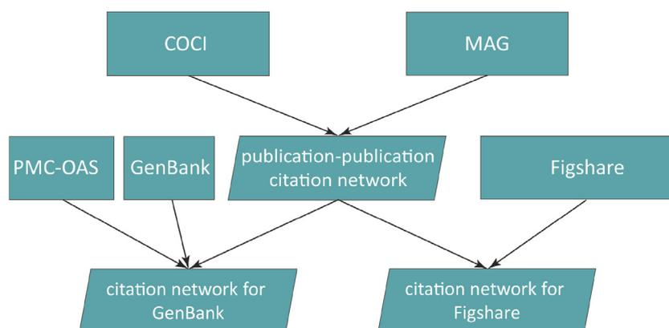
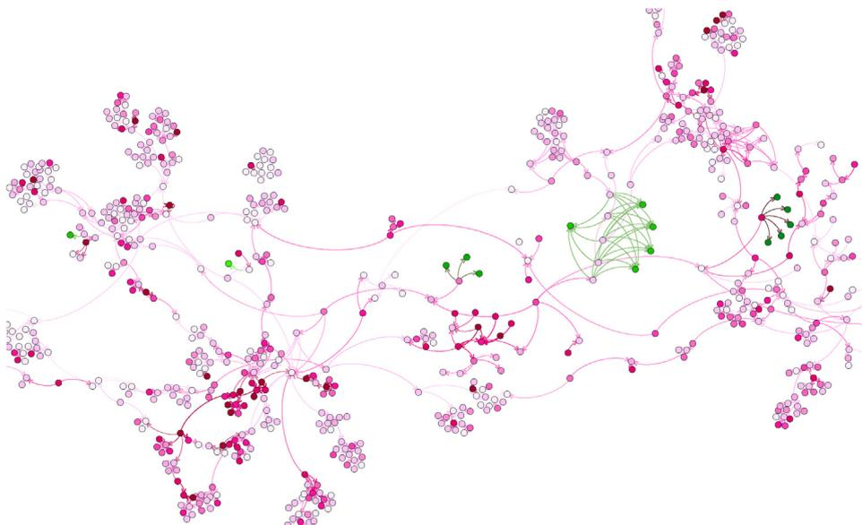
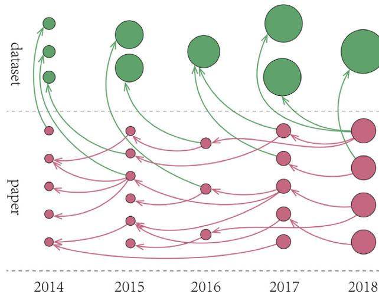
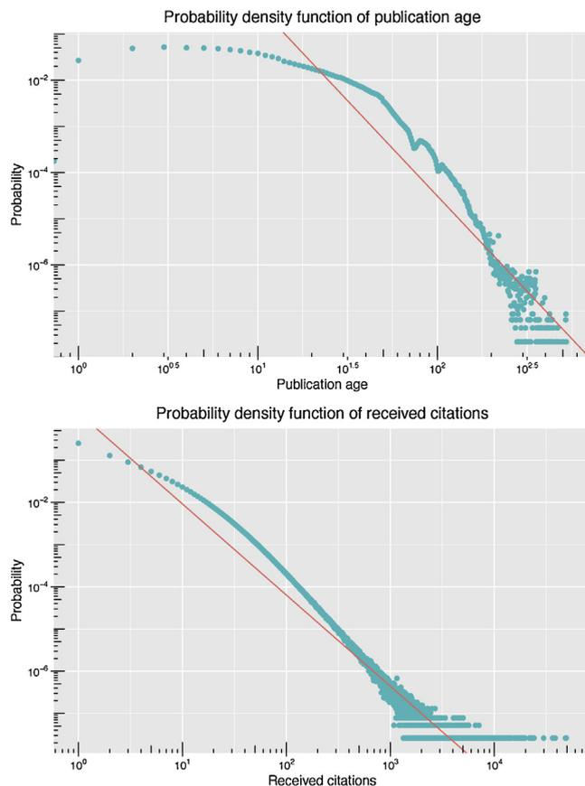
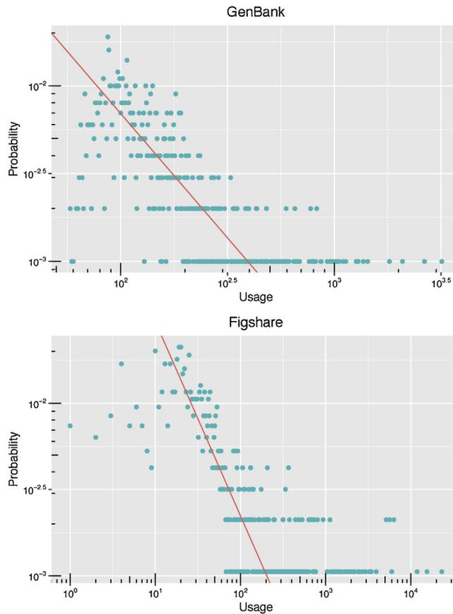
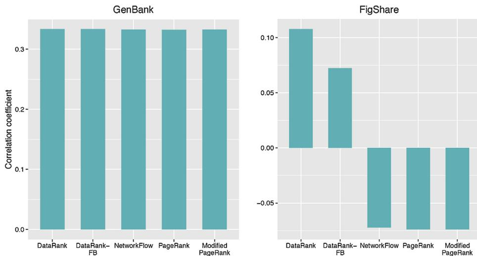
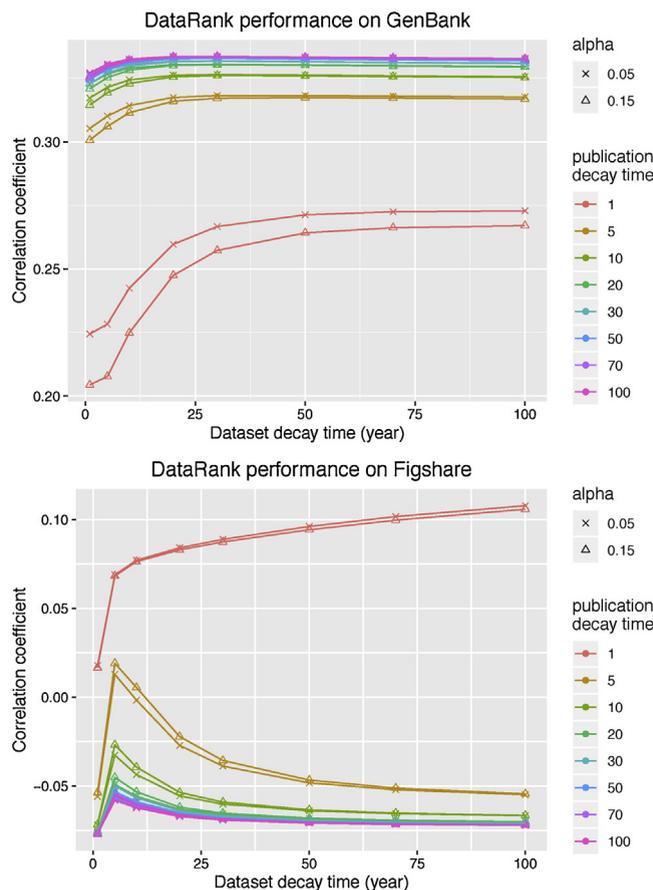

# Regular article

# Assigning credit to scientific datasets using article citation networks

Tong Zeng<sup>a,b,1</sup>, Longfeng Wu<sup>a,b,1,2</sup>, Sarah Bratt<sup>b</sup>, Daniel E. Acuna<sup>b,\*</sup><sup>a</sup> School of Information Management, Nanjing University, Nanjing 210023, China<sup>b</sup> School of Information Studies, Syracuse University, Syracuse, NY 13244, USA

## ARTICLE INFO

### Article history:

Received 30 May 2019

Received in revised form 14 January 2020

Accepted 15 January 2020

### Keywords:

DataRank

Scientific dataset

Dataset impact

Citation network

## ABSTRACT

A citation is a well-established mechanism for connecting scientific artifacts. Citation networks are used by citation analysis for a variety of reasons, prominently to give credit to scientists' work. However, because of current citation practices, scientists tend to cite only publications, leaving out other types of artifacts such as datasets. Datasets then do not get appropriate credit even though they are increasingly reused and experimented with. We develop a network flow measure, called DATA RANK, aimed at solving this gap. DATA RANK assigns a relative value to each node in the network based on how citations flow through the graph, differentiating publication and dataset flow rates. We evaluate the quality of DATA RANK by estimating its accuracy at predicting the usage of real datasets: web visits to GenBank and downloads of Figshare datasets. We show that DATA RANK is better at predicting this usage compared to alternatives while offering additional interpretable outcomes. We discuss improvements to citation behavior and algorithms to properly track and assign credit to datasets.

© 2020 Elsevier Ltd. All rights reserved.

# 1. Introduction

A citation network is an important source of analysis in science. Citations serve multiple purposes such as crediting an idea, signaling knowledge of the literature, or critiquing others' work (Martyn, 1975). When citations are thought of as impact, they inform tenure, promotion, and hiring decisions (Meho & Yang, 2007). Furthermore, scientists themselves make decisions based on citations, such as which papers to read and which articles to cite. Citation practices and infrastructures are well-developed for journal articles and conference proceedings. However, there is much less development for dataset citation. This gap affects the increasingly important role that datasets play in scientific reproducibility (Belter, 2014; On Data Citation Standards & Practices, 2013; Park, You, & Wolfram, 2018; Robinson-García, Jiménez-Contreras, & Torres-Salinas, 2016), where studies use them to confirm or extend the results of other research (Darby et al., 2012; Sieber & Trumbo, 1995). One historical cause of this gap is the difficulty in archiving datasets. While less problematic today, the citation practices for datasets take time to develop. Better algorithmic approaches to track dataset usage could improve this state. In this work, we hypothesize that a network flow algorithm could track usage more effectively if it propagates publication and dataset

\* Corresponding author.

E-mail address: [deacuna@syr.edu](mailto:deacuna@syr.edu) (D.E. Acuna).<sup>1</sup> Both authors contributed equally to this work.<sup>2</sup> The author performed this work while visiting the Science of Science and Computational Discovery Lab in the School of Information Studies at Syracuse University.

citations differently. With the implementation of this algorithm, then, it will be possible to correct differences in citation behavior between these two types of artifacts, increasing the importance of datasets as first class citizens of science.

Different researchers use citation networks to evaluate the importance of authors (Ding, 2011; Ding, Yan, Frazho, & Caverlee, 2009; West, Jensen, Dandrea, Gordon, & Bergstrom, 2013), papers (Chen, Xie, Maslov, & Redner, 2007; Ma, Guan, & Zhao, 2008), journals (Bergstrom, 2007; Bollen, Rodriguez, & Van de Sompel, 2006), institutions (Fiala, 2013) and even countries (Fiala, 2012a). The PAGERANK algorithm (Page, Brin, Motwani, & Winograd, 1999) has served as a base for much of these citation network-based evaluations. For example, Bollen et al. (2006) proposed a weighted PAGERANK to assess the prestige of journals, while Ding et al. (2009) and Ding (2011) proposed a weighted PAGERANK to measure the prestige of authors. Fiala (2012b) defined a time-aware PAGERANK method for accurately ranking the most prominent computer scientists. Franceschet and Colavizza (2017) introduced an approach called TIMERANK for rating scholars at different time points. TIMERANK updates the rating of scholars based on the relative rating of the citing and cited scholars at the time of the citation. Citation networks are thus an important source of information for ranking homogeneous types of nodes.

Historically, ranking datasets using citation networks is significantly more challenging. These challenges have technical and social issues alike. First, datasets cost time and labor to prepare and to share, resulting in some articles failing to provide datasets (Alsheikh-Ali, Qureshi, Al-Mallah, & Ioannidis, 2011). Second, archiving and searching massive datasets is prohibitively expensive and difficult. Third, scholars are not used to citing datasets. Survey research shows that scholars value citing dataset (Kratz & Strasser, 2015) yet they tend to cite the *article* rather than the dataset or they merely mention the dataset without explicit reference (Force & Robinson, 2014). Therefore, these reasons have prevented the proper assignment of credit to dataset usage.

Several initiatives attempt to improve citation practices for datasets. In 2014, the Joint Declaration Of Data Citation Principles was officially released. These principles, however, mainly focus on normalizing dataset references rather than normalizing storage and some other technical issues (Altman, Borgman, Crosas, & Matone, 2015; Callaghan, 2014; Mooney & Newton, 2012). For instance, some researchers have suggested assigning specific DOIs to datasets to mitigate differences between datasets and articles (Callaghan et al., 2012). Others have proposed to automatically identify uncited or unreferenced datasets used in articles (Boland, Ritze, Eckert, & Mathiak, 2012; Ghavimi, Mayr, Vahdati, & Lange, 2016; Kafkas, Kim, & McEntyre, 2013). All these solutions try to make citation dataset behavior more standard or attempt to fix the citation network by estimating which data nodes are missing. Therefore, these solutions necessarily modify the source that algorithms use to estimate impact.

In this article, we develop a method for assigning credit to datasets from citation networks of publications, assuming that dataset citations have biases. Importantly, our method does not modify the source data for the algorithms. The method does not rely on scientists explicitly citing datasets but infers their usage. We adapt the network flow algorithm of Walker, Xie, Yan, and Maslov (2007) by including two types of nodes: datasets and publications. Our method simulates a random walker that takes into account the differences between obsolescence rates of publications and datasets, and estimates the score of each dataset—the DATARANK. We use the metadata from the National Center for Bioinformatics (NCBI) GenBank nucleic acid sequence and Figshare datasets to validate our method. We estimate the relative rank of the datasets with the DATARANK algorithm and cross-validate it by predicting the actual usage of them—number of visits to the NCBI dataset web pages and downloads of Figshare datasets. We show that our method is better at predicting both types of usages compared to citations and has other qualitative advantages compared to alternatives. We discuss interpretations of our results and implications for data citation infrastructures and future work.

# 2. Why measure dataset impact?

Scientists may be incentivized to adopt better and broader data sharing behaviors if they, their peers, and institutions are able to measure the impact of datasets (e.g., see Kidwell et al., 2016; Silvello, 2018). In this context, we review impact assessment conceptual frameworks and studies of usage statistics and crediting of scientific works more specifically. These areas of study aim to develop methods for scientific indicators of the usage and impact of scholarly outputs. Impact assessment research also derives empirical insights from research products by assessing the dynamics and structures of connections between the outputs. These connections can inform better policy-making for research data management, cyberinfrastructure implementation, and funding allocation.

Methods for measuring usage and impact include a variety of different dimensions of impact, from social media to code use and institutional metrics. Several of these approaches recognize the artificial distinction between the scientific process and product (Priem, 2013). For example, altmetrics is one way to measure engagement with diverse research products and to estimate the impact of non-traditional outputs (Priem, 2014). Researchers predict that it will soon become a part of the citation infrastructure to routinely track and value “citations to an online lab notebook, contributions to a software library, bookmarks to datasets from content-sharing sites such as Pinterest and Delicious” (from Priem, 2014). In short, if science has made a difference, it will show up in a multiplicity of places. As such, a correspondingly wider range of metrics are needed to attribute credit to the many locations where research works reflect their value. For example, datasets contribute to thousands of papers in NCBI’s Gene Expression Omnibus and these attributions will continue to accumulate, just like paper accumulate citations, for a number of years after the datasets are publicly released (Piwowar, 2013; Piwowar, Vision, & Whitlock, 2011). Efforts to track these other sources of impact include ImpactStory, statistics from FigShare, and Altmeteric.com (Robinson-Garcia, Mongeon, Jeng, & Costas, 2017).

Credit attribution efforts include those by federal agencies to expand the definition of scientific works that are not publications. For example, in 2013 the National Science Foundation (NSF) recognized the importance of measuring scientific artifacts other than publications by asking researchers for “products” rather than just publications. This represents a significant change in how scientists are evaluated (Piwowar, 2013). Datasets, software, and other non-traditional scientific works are now considered by the NSF as legitimate contributions to the publication record. Furthermore, real-time science is presented in several online mediums; algorithms filter, rank, and disseminate scholarship as it happens. In sum, the traditional journal article is increasingly being complemented by other scientific products (Priem, 2013).

Yet despite the crucial role of data in scientific discovery and innovation, datasets do not get enough credit (Silvello, 2018). If credit was properly accrued, researchers and funding agencies would use this credit to track and justify work and funding to support datasets—consider the recent Rich Context Competition which aimed at to filling this gap by detecting dataset mentions in full-text papers (Zeng & Acuna, 2020). Because these dataset mentions are not tracked by current citation networks, this leads to biases in dataset citations (Robinson-García et al., 2016). The FAIR (findable, accessible, interoperable, reproducible) principles of open research data are one major initiative that is spearheading better practices with tracking digital assets such as datasets (Wilkinson et al., 2016). However, the initiative is theoretical, and lacks technical implementation for data usage and impact assessment. There remains a need to establish methods to better estimate dataset usage.

# 3. Materials and methods

### 3.1. Datasets

### 3.1.1. OpenCitations Index (COCI)

The OpenCitations index (COCI) is an index of Crossref's open DOI-to-DOI citation data. We obtained a snapshot of COCI (November 2018 version), which contains approximately 450 million DOI-to-DOI citations. Specifically, COCI contains information including citing DOI, cited DOI, the publication date of citing DOI. The algorithm we proposed in the paper requires the publication year. However, not all the DOIs in COCI have a publication date. We will introduce Microsoft Academic Graph to fill this gap.

### 3.1.2. Microsoft Academic Graph (MAG)

The Microsoft Academic Graph is a large heterogeneous graph consisting of six types of entities: paper, author, institution, venue, event, and field of study (Sinha et al., 2015). Concretely, the description of a paper consists of DOI, title, abstract, published year, among other fields. We downloaded a copy of MAG in November 2019, which contains 208,915,369 papers. As a supplement to COCI, we extract the DOI and published year from MAG to extend those DOIs in COCI without a publication date.

#### 3.1.3. PMC Open Access Subset (PMC-OAS)

The PubMed Central Open Access Subset is a collection of full-text open access journal articles in biomedical and life sciences. We obtained a snapshot of PMC-OAS in August 2019. It consists of about 2.5 million full-text articles organized in well-structured XML files. The articles are identified by a unique id called PMID. We also obtained a mapping between PMIDs and DOIs from NCBI, which enabled us to integrate PMC-OAS into the citation network.

#### 3.1.4. GenBank

GenBank is a genetic sequence database that contains an annotated collection of all publicly available nucleotide sequences for almost 420,000 formally described species (Sayers et al., 2019). The information about a nucleotide sequence in GenBank is organized as a record consisting of many data elements (fields) and stored in a flat-file (see Fig. 1). The ACCESSION field contains the unique identifier of the dataset. The last citation in the REFERENCE field contains the information about the submitter, including the author list and the date in which the dataset was introduced (e.g., “16-JAN-1992” in Fig. 1). We obtained a snapshot of the GenBank database (version 230) with 212,260,377 gene sequences. We remove those sequences without submission date. This left us with 77,149,105 sequences.

The National Institutes of Health (NIH) provided us with number of visits to a sequence's landing page for the top 1000 Nucleotide sequences during the month of September 2012. We use these visits as a measure of real usage.

#### 3.1.5. Figshare

Figshare is a multidisciplinary, open access research repository where researchers can deposit and share their research output. Figshare allows users to upload various formats of research output, including figures, datasets, and other media (Thelwall & Kousha, 2016). In order to encourage data sharing, all research data made publicly available has unlimited storage space and is allocated a DOI. This DOI is used by scientists to cite Figshare resources using traditional citation methods. Figshare makes the research data publicly and permanently available which mitigates the resource decay problem and improves research reproducibility (Zeng, Shema, & Acuna, 2019). A Figshare DOI contains the string ‘figshare’ (e.g., ‘10.6084/m9.figshare.6741260’). We can leverage this feature to determine whether a publication cites Figshare resources by detecting Figshare-generated DOIs.

```

LOCUS      X64205                      100 bp    mRNA    linear   VRT 27-JUN-2018
DEFINITION X.laevis mRNA fragment (5-42) homologous to rat ribosomal protein
S4.
ACCESSION  X64205
VERSION    X64205.1
KEYWORDS   ribosomal protein S4 homologue.
SOURCE     Xenopus laevis (African clawed frog)
  ORGANISM Xenopus laevis
            Eukaryota; Metazoa; Chordata; Craniata; Vertebrata; Euteleostomi;
            Amphibia; Batrachia; Anura; Pipoidea; Pipidae; Xenopodinae;
            Xenopus; Xenopus.
REFERENCE  1
  AUTHORS  Loreni,F., Francesconi,A., Jappelli,R. and Amaldi,F.
  TITLE    Analysis of mRNAs under translational control during Xenopus
            embryogenesis: isolation of new ribosomal protein clones
  JOURNAL  Nucleic Acids Res. 20 (8), 1859-1863 (1992)
  PUBMED   1579486
REFERENCE  2 (bases 1 to 100)
  AUTHORS  Loreni,F.
  TITLE    Direct Submission
  JOURNAL  Submitted (16-JAN-1992) F. Loreni, Dip di Biologia, II Universita'
            di Roma, Tor Vergata, Via E Carnevale, 00173 Roma, ITALY
FEATURES   Location/Qualifiers
    source          1..100
                    /organism="Xenopus laevis"
                    /mol_type="mRNA"
                    /db_xref="taxon:8355"
                    /clone="5-42"
                    /clone_lib="stage 40 embryo cDNA library"
                    /dev_stage="40 embryo"
    misc_feature   1..100
                    /note="homology with nt 634-733 of rat ribosomal protein
                    S4 (acc# X14210)"
ORIGIN
    1 acagtcggag aatgtcgicc cctgagcaaa actgtccgct tcaatgtcct gaaggtgacc
    61 aaagcggccg gaaccaagaa acagttccag aagttctaag
//

```

**Fig. 1.** Sample record of a sequence submission from GenBank. The ACCESSION field is the unique identifier of a dataset.

Figshare also keeps track of dataset accesses, such as page views and dataset downloads. We get the downloads statistics of Figshare DOI from the Figshare Stats API<sup>3</sup> and use it as a measure of real *usage*.

### 3.2. Construction of citation network

The citation networks in this paper consist of two types of nodes and two types of edges. The node is represented by the paper and the dataset and the edge is represented by the citation between two nodes. Concretely, papers cite each other to form paper-paper edges as datasets can only be cited by papers which are represented by the paper-dataset edges. As shown in the construction workflow (Fig. 2), we build the paper-paper citation network using COCI and MAG and build two separate paper-dataset edge sets using GenBank and Figshare. Then we integrate the paper-dataset edge sets into the paper-paper citation network to form two complete citation networks. The construction workflow is illustrated in Fig. 2.

#### 3.2.1. Paper-paper citation network

As our proposed method takes the publication year into account, we need to remove those edges without publication year. The DOI-DOI citation in COCI dataset provides us a skeleton of the citation network. Even though COCI comes with a field named timespan which originally refers to the publication time span between the citing DOI and cited DOI, this timespan leads to different results depending on the time granularity (i.e., year-only vs year+month). As explained above, we have to complement the COCI dataset with MAG to complete the year of publication of cited and citing articles. By joining the COCI and MAG, we build a large paper-paper citation network consisting of 45,180,243 nodes and 443,055,788 edges. As the usage data of GenBank only covers 2012 (see Genbank above), we pruned the network to remove papers and datasets published after 2012. For Figshare, we use all the nodes and edges. The statistics of the networks described above are listed in Table 1.

<sup>3</sup> <https://docs.figshare.com/#stats>.



Fig. 2. Citation network construction workflow.

**Table 1**  
Statistics of article citation networks.

| Sources                   | Filter                       | Number of nodes | Number of edges |
|---------------------------|------------------------------|-----------------|-----------------|
| COCI (original)           | N/A                          | 46,534,424      | 449,840,585     |
| COCI (filtered)           | Contains publication year    | 21,689,394      | 203,884,791     |
| COCI & MAG (for Figshare) | Contains publication year    | 45,180,243      | 443,055,788     |
| COCI & MAG (for GenBank)  | Publication year $\leq$ 2012 | 30,304,869      | 212,410,743     |

#### 3.2.2. Paper-dataset citation network

1. **Constructing paper-dataset citations for GenBank.** As previously described by Sayers et al. (2019), authors should use GenBank accession number with the version suffix as identifier to cite a GenBank data. The accession number is usually mentioned in the body of the manuscript. This practice enables us to extract GenBank dataset mention from the PMC-OAS dataset to build the paper-dataset citation network.

(a) *Parsing XML file to extract full-text.* We first parse the XML files using XPath expressions to extract the PMID and the full-text. We get 2,174,782 articles with PMID and full-text from PMC-OAS dataset.

(b) *Matching the accession number to build paper-dataset citations.* According to the GenBank Accession Prefix Format, an accession number is composed of a fixed-number of letters plus a fixed-number of numerals (e.g., 1 letter + 5 numerals, 2 letters + 6 numerals). Based on the format, we composed a regular expression to match individual mentions of accession numbers in the full-text. There are two kinds of accession number mentions: accession number only (e.g., U00096) and range of accession number (e.g., KK037225-KK037232). For the second kind, we expanded the range to recover all the omitted accession numbers.

2. **Extracting paper-dataset citation for Figshare.** As there is a string 'figshare' in a Figshare DOI, we can use a regular expression to search for them in COCI.

(a) *Identifying Figshare DOI in the set of cited DOI.* In this step, we extracted 918 Figshare DOIs as dataset candidates.

(b) *Filtering by resource type.* Not all the Figshare DOIs are datasets because Figshare supports many kinds of resources. We use the Figshare Article API<sup>4</sup> to get the meta-data of a DOI. In the meta-data, there is a field indicating the resource type (type code 3 is dataset). After filtering the candidates by resource type, we get 355 datasets.

#### 3.2.3. Visualization of citation network

For the purpose of exploring this network, we sample about one thousand nodes and 1.5 thousand edges from the network. We observe four patterns of papers citing datasets (a dataset cannot cite anything): one-to-one, one-to-many, many-to-one and many-to-many (Fig. 3).

## 3.3. Network models for scientific artifacts

### 3.3.1. NETWORKFLOW

We adapt the network model proposed in Walker et al. (2007). This method, which we call NETWORKFLOW here, is inspired by PAGERANK and addresses the issue that citation networks are always directed back in time. In this model, each vertex in the graph is a publication. The goal of this method is to propagate a vertex's impact through its citations.

<sup>4</sup> <https://docs.figshare.com/#public.article>.



**Fig. 3.** Visualization of publication–dataset citation network. Papers appear as red nodes and Datasets are green. The lighter the color, the older the resource. (For interpretation of the references to color in this figure legend, the reader is referred to the web version of this article.)

This method simulates a set of researchers traversing publications through the citation network. It ranks publications by estimating the average path length taken by researchers who traverse the network considering the age of resources and a stopping criterion. Mathematically, it defines a traffic function  $T_i(\tau_{\text{pub}}, \alpha)$  for each paper. A starting paper is selected randomly with a probability that exponentially decays in time with a *decay* parameter  $\tau_{\text{paper}}$ . Each occasion the researcher moves, it can stop with a probability  $\alpha$  or continue the search through the citation network with a probability  $1 - \alpha$ . The predicted traffic  $T_i$  is proportional to the rate at which the paper is accessed. The concrete functional form is as follows. The probability of starting at the  $i$ th node is

$$\rho_i \propto \exp\left(-\frac{\text{age}_i}{\tau_{\text{pub}}}\right) \quad (1)$$

Then, the method defines a transition matrix from the citation network as follows

$$W_{ij} = \begin{cases} \frac{1}{k_j^{\text{out}}} & \text{if } j \text{ cites } i \\ 0 & \text{o.w.} \end{cases} \quad (2)$$

where  $k_j^{\text{out}}$  is the out-degree of the  $j$ th paper.

The average path length to all papers in the network starting from a paper sampled from the distribution  $\rho$  is defined as

$$T = I \cdot \rho + (1 - \alpha)W \cdot \rho + (1 - \alpha)^2 W^2 \rho + \dots \quad (3)$$

The parameters  $\tau_{\text{paper}}$  and  $\alpha$  are found by cross validation by predicting real traffic. In practice, this series can be solved iteratively by computing the difference between  $T_{t+1}$  and  $T_t$ . For this and all algorithms used in this work, we stop the iterations when the total absolute difference in rank between two consecutive iterations is less than  $10^{-2}$  which typically required around 30 iterations.

### 3.3.2. DATARANK

In this article, we extend NETWORKFLOW to accommodate different kinds of nodes. The extension considers that the probability of starting at any single node should depend on whether the node is a publication or a dataset. This is, publications and datasets may vary in their relevance period. We call this new algorithm DATARANK. Mathematically, we redefine the starting probability in Eq. (1) of the  $i$ th node as

$$\rho_i^{\text{DataRank}} = \begin{cases} \exp\left(-\frac{\text{age}_i}{\tau_{\text{pub}}}\right) & \text{if } i \text{ is a publication} \\ \exp\left(-\frac{\text{age}_i}{\tau_{\text{dataset}}}\right) & \text{if } i \text{ is a dataset} \end{cases} \quad (4)$$



**Fig. 4.** Nodes after initialization. The size of the node represents its value, different color means different node type: red nodes are papers and green nodes are datasets. (For interpretation of the references to color in this figure legend, the reader is referred to the web version of this article.)

This initialization process is depicted in Fig. 4. Here, datasets have a smaller decay than papers. The size of the bubble indicates the initial flow as defined by Eq. (4). After initializing, we can easily find that nodes of the same type and same age have the same value, and that the younger a node is, the bigger its value.

Now, we estimate the traffic in a similar fashion but now the traffic of a node  $T_i^{\text{DataRank}}(\tau_{\text{pub}}, \tau_{\text{dataset}}, \alpha)$  depends on three parameters that should be found by cross-validation with the rest of the components of the method remaining the same (e.g., (2) and (3)).

### 3.3.3. DATARANK-FB

In DATARANK, each time the walker moves, there are two options: to stop with a probability  $\alpha$  or to continue the search through the reference list with a probability  $1 - \alpha$ . However, there may exist a third choice: to continue the search through papers who cite the current paper. In other words, the researcher can move in two directions: forwards and backwards. We call this modified method DATARANK-FB. In this method, one may stop with a probability  $\alpha - \beta$ , continue the search forward with a probability  $1 - \alpha$ , and backward with a probability  $\beta$ . To keep them within the unity simplex, the parameters must satisfy  $\alpha > 0$ ,  $\beta > 0$ , and  $\alpha > \beta$ .

Then, we define another transition matrix from the citation network as follows

$$M_{ij} = \begin{cases} \frac{1}{k_j^{\text{in}}} & \text{if } j \text{ cited by } i \\ 0 & \text{o.w.} \end{cases} \quad (5)$$

where  $k_j^{\text{in}}$  is the number of papers that cite  $j$ . We update the average path length to all papers in the network starting from  $\rho$  as

$$T = I \cdot \rho + (1 - \alpha)W \cdot \rho + \beta M \cdot \rho + (1 - \alpha)^2 W^2 \rho + \beta^2 M^2 \rho + \dots \quad (6)$$

### 3.4. Other network models

#### 3.4.1. PAGERANK

PAGERANK is a well-known and widely used webpage ranking algorithm proposed by Google (Page et al., 1999). It uses the topological structure of the web to determine the importance of a webpage, independently of its content (Bianchini, Gori, & Scarselli, 2005). First, it builds a network of the web through the link between webpages. Second, each webpage is assigned a random value, which is then updated based on the link relationships—an iterative process that will eventually converge to a stationary value.

The mathematical formulation of PAGERANK is

$$PR(p_i) = \frac{1 - d}{N} + d \sum_{p_j \in M(p_i)} \frac{PR(p_j)}{L(p_j)}, \quad (7)$$

where  $p_1, p_2, \dots, p_N$  are the webpages whose importance need to be calculated,  $M(p_i)$  is the set of webpages that has a link to page  $p_i$ ,  $L(p_j)$  is the number of outbound links on webpage  $p_j$ , and  $N$  is the total number of webpages. The parameter  $d$  is a dampening factor which ranges from 0 to 1 and is usually set to 0.85 (Brin & Page, 1998; Page et al., 1999).



**Fig. 5.** Probability density of age and citations. Power laws describing the growth of both aspects of the network have parameters  $k_{\text{age}} \approx -4.1$  and  $k_{\text{citations}} \approx -2.16$ .

### 3.4.2. Modified PAGERANK

Considering that we have two types of resources in the network, we modify the standard PAGERANK to allow a different damping factor for publication and for dataset. This amounts to modifying the update equation to

$$PR(p_i) = \frac{1 - d_{\text{data}}}{N_{\text{data}}} + \frac{1 - d_{\text{pub}}}{N_{\text{pub}}} + d_{\text{data}} \sum_{p_j \in M^{\text{data}}(p_i)} \frac{PR(p_j)}{L(p_j)} + d_{\text{pub}} \sum_{p_k \in M^{\text{pub}}(p_i)} \frac{PR(p_k)}{L(p_k)}, \quad (8)$$

where  $p_1, p_2, \dots, p_N$  are still the nodes whose importance need to be calculated,  $M^{\text{data}}(p_i)$  is the set of datasets that have a link to page  $p_i$ ,  $M^{\text{pub}}(p_i)$  is the set of papers that has a link to page  $p_i$ ,  $L(p_j)$  is the number of outbound links on webpage  $p_j$ , and  $N_{\text{data}}, N_{\text{pub}}$  are the total size of datasets and paper collections, respectively. The parameter  $d_{\text{data}}$  is a damping factor for datasets and  $d_{\text{pub}}$  is a damping factor for paper sets.

# 4. Results

We aim at finding whether the estimation of the rank of a dataset based on citation data is related to a real-world measure of relevance such as page views or downloads. We propose a method for estimating rankings that we call DATARANK, which considers differences in citation dynamics for publications and datasets. We also propose some variants to this method, and compare all of them to standard ranking algorithms. We use the data of visits of GenBank datasets and downloads of Figshare datasets as measure of real usage. Thus, we will investigate which of the methods work best for ranking them.

### 4.1. Properties of the citation networks

We first examined some statistics of the paper–paper citation network and the paper–dataset citation network. Specifically, we examined dataset age because it determines the initial rank of a node and we examine the citations because they control how ranks diffuse through the network. We modeled publication age with respect to 2019 as a power law distribution  $p(a) \propto a^{-k}$  and we found the best parameter to be  $k \approx -4.1$  (SE=0.07,  $p < 0.001$ , Fig. 5 top panel). Similarly, the citation count



Fig. 6. Probability density function of usage (website visits for Genbank and downloads for Figshare).

can be modeled by a power law distribution  $p(d) \propto d^{-k}$  with parameter  $k \approx -2.16062$  ( $SE = 0.012$ ,  $p < 0.001$ , Fig. 5 bottom panel). While both distributions can be well described by power laws, the age distribution had some out-of-trend dynamics for small age values because the number of publications is not growing as fast as the power law would predict. The networks thus is expanding fast in nodes (e.g., age) and highly skewed for citations.

We then wanted to examine differences in usage between Genbank and Figshare. We plotted the estimated probability density function of this usage for both datasets as a log-log plot (Fig. 6). While the scale of usage is significantly different (i.e., overall GenBank is more used than Figshare), there seems to be a long-tail power law relationship in usage. The GeneBank dataset had a larger but not significantly different scale parameter than Figshare ( $k \approx -1.416$ ,  $SE = 0.2699$ , in GenBank and  $k \approx -1.125$ ,  $SE = 0.0907$ , in Figshare, for  $p(u) \propto u^{-k}$ , two-sample  $t$ -test  $t(220) = -1.05$ ,  $p = 0.29$ ). There is a significant bias for downloads below a certain threshold, where smaller number of downloads are less frequent than expected by the power laws. However, both datasets show similar patterns suggesting a common mechanism driving the dataset usage behavior.

### 4.2. Prediction of real usage

One of the real tests of whether the methods work is to predict how they are related to real usage data. For each algorithm and set of parameters, we estimated the rank of networks' nodes. We then correlated these ranks with real usage (i.e., web visits for GenBank and downloads for Figshare). We now describe the best performance after these parameter search.

We performed a grid search with publication decay year  $\tau_{\text{pub}} \in \{1, 5, 10, 20, 30, 50, 70, 100\}$ , the dataset decay year  $\tau_{\text{dataset}} \in \{1, 5, 10, 20, 30, 50, 70, 100\}$ , and alpha in  $\alpha \in \{0.05, 0.15\}$ . The best model of DATA RANK achieved a correlation of 0.3336 in Genbank which is slightly better than DATA RANK-FB 0.3335, NETWORKFLOW 0.3327, PAGERANK 0.3324, and Modified PAGERANK 0.3327 (Fig. 7). The best model of DATA RANK achieves a correlation of 0.1078 in Figshare, which is substantially better than DATA RANK-FB with 0.0723. The best absolute correlations by all the other methods only achieved negative correlations (NETWORKFLOW =  $-0.072$ , PAGERANK =  $-0.073$ , and Modified PAGERANK =  $-0.073$ )—we selected models based on absolute correlation because it would produce the best predictive performance. Taken together, DATA RANK has both better absolute correlation performance and highest correlation, suggesting a superior ability to predict real usage.



**Fig. 7.** Model comparison in correlation coefficient. DATARANK is able to predict better the real usage of datasets compared to other variants.

### 4.3. Interpretation of best-fit model

We wanted to explore how DATARANK changes in performance across the different parameters. This exploration allowed us to understand how the parameters tell us something about the underlying characteristics of the citation networks.

The results across all parameters are shown in Fig. 8 and we now describe general trends. For experiments on GenBank dataset, we found the DATARANK model reaches its best with  $\tau_{\text{pub}} = 100$  and  $\tau_{\text{dataset}} = 30$  (Fig. 7 top panel). However, for dataset decay, the performance reaches a plateau after around 20 years and it reaches its peak at 30 years. After 30 years, performance goes down slowly. In terms of publication decay, the performance increases significantly before 20 years. After 20 years, the performance enters into a steady but marginal increase. In all the cases, the alpha at 0.05 is better than 0.15. For Figshare dataset, dataset decay has divergent patterns: for small publication decays, dataset decay increases the performance. For large publication decays, dataset decay decreases the performance. For publication decay, more specifically, we observed an opposite trend compared to GenBank: the performance goes down rapidly as the publication decay increases (Fig. 7 bottom panel). However, similar to GenBank, it losses momentum after 20 years but still decreases steadily.

One explanation for the differences between the best parameters for Genbank and Figshare is that dataset age and citation distribution have different patterns. We perform an analysis to confirm this hypothesis. Indeed, we found that Figshare datasets are significantly younger than Genbank datasets (bootstrapped difference between average age =  $-4.80$  years,  $SE = 0.24$ ,  $p < 0.001$ ). We also found that Figshare dataset citations are more uniform than Genbank dataset citations although not significantly different (bootstrapped difference in dataset citation kurtosis =  $-44.34$ ,  $SE = 48.74$ ,  $p = 0.25$ ). The DATARANK algorithm uses large values of dataset decay to propagate publication citations over a longer time and small values of data decay to steer those citations towards a concentrated set of top cited datasets. This is the case of GenBank dataset dynamics. Figshare, comparatively, obeys opposite age and citation dynamics which DATARANK attempts to accommodate by using small values of publication decay and large values of dataset decays. Concretely, the best publication decay for Genbank is 100 and for Figshare is 1, and the best dataset decay for Genbank is 30 and for Figshare is 100. Taken together, DATARANK's parameters offer inferential interpretation of the citation network dynamics, which can help us understand how they are distributed in time and credit spaces.

# 5. Discussion

The goal of this article is to better evaluate the importance of datasets through article citation network analysis. Compared with the mature citation mechanisms of articles, referencing datasets is still in its infancy. Acknowledging the long time the practice of citing datasets will take to be adopted, our research aims at recovering the true importance of datasets even if their citations are biased compared to publications.

Scholars disagree on how to give credit to research outcomes. Regardless of how disputed citations are as a measure of credit (see Diamond, 1986; Martin, 1996; Moed, Burger, Frankfort, & Van Raan, 1985; Seglen, 1997; Wallin, 2005), they complement other measures that are harder to quantify such as peer review assessment (Meho & Yang, 2007; Piwowar, Day, & Fridsma, 2007) or real usage such as downloads (Belter, 2014). Citations, however, are rarely used for datasets (Altman & Crosas, 2013), giving these important research outcomes less credit that they might deserve. Our proposal aims at solving some of these issues by constructing a network flow that is able to successfully predict real usage better than other methods. While citations are not a perfect measure of credit, having a method that can at least attempt to predict usage is advantageous.



**Fig. 8.** Model performance during grid search with publication decay time (years)  $\tau_{\text{pub}} \in \{1, 5, 10, 20, 30, 50, 70, 100\}$ , the dataset decay time (years)  $\tau_{\text{dataset}} \in \{1, 5, 10, 20, 30, 50, 70, 100\}$ , and alpha in  $\alpha \in \{0.05, 0.15\}$ .

Previous research has examined ways of normalizing citations by time, field, and quality. This relates to our DATARANK algorithm in that we are trying to normalize the citations by year and artifact type. Similar work has been done in patent citations: Hall, Jaffe, and Trajtenberg (2001) attempt to eliminate the effects caused by year, field and year-field interaction through dividing the number of citation received by a certain patent by the corresponding year-field average number of citation of patents of each cohort in each field. Yang et al. (2015) used patent citation networks to propagate citations and evaluate patent value. Other researchers have gone beyond time and field by also attempting to control by quality of the resource. Clarivate Analytics editors consider other normalizing factors such as publishing standards, editorial content and citation information when creating the Data Citation Index (DCI) database (Reuters, 2012). However, a control like this requires significantly more manual curation.

We found that the practice of following who cites an artifact (i.e., backward propagation) seemed to be not as important compared to following a cited artifact (i.e., forward propagation). This is, the more specialized DATARANK-FB model (see Methods) did not produce higher predictability. This lack of improvement could suggest that when scientists traverse the network of citations, they seem to only follow one direction of the graph (i.e., the reference list). This could be perhaps a limitation of the tools available to scientists to explore the citation network or because backward propagation changes constantly year after year. Initiatives that force the creation of identifiers (DOI) for datasets, such as the NERC Science Information Strategy Data Citation and Publication project (Callaghan et al., 2012), might change this pattern.

We find it useful to interpret the effect of different decay times on the performance of DATARANK. The best-fitting parameters show that DATARANK attempts to model the network temporal and topological dynamics differently for Genbank and Figshare. Because Genbank tends to have older datasets that have more concentrated citations compared to Figshare, the large value in publication decay time and small value in dataset decay time produces rank distributions that match the underlying dynamics of Genbank (Fig. 8). Similarly, the alpha parameter, which controls the probability of the random walk to stop, is larger for Figshare, intuitively suggesting that due to the smaller network size and shorter temporal paths, a higher probability of stopping should be in place (Fig. 8). Thus, DATARANK can help to interpret dataset citation behavior.

There are some shortcomings in our study. For GenBank and Figsare, we do not have a great deal of information on actual usage. There are 1000 records but we only located 693 in the publication network of Genbank and 355 datasets

from Figshare. Also, there are significant differences in the information, with Figshare dataset being cited less often than GenBank. In the future, we will explore other data repositories such as PANGEA, Animal QTLdb, and UK Data Archive, and we will request updates about web visits to other GenBank sequences.

Open research datasets have little means for systematic attribution even in well-resourced disciplines, such as the biomedical community, and our proposal attempts to systematize this attribution more broadly without requiring changes in behavior. The lack of systematic benchmarking tools prevents good policy-making. Furthermore, it contributes to the invisibility of digital objects and labor, an issue of serious concern (Scroggins & Pasquetto, 2019). When digital objects are not well described, they tend to disappear from view. They fall to the bottom of classic search engine results when there are no mechanisms to assign credit to datasets. This lack of indexing creates an asymmetrical representation of some kinds of objects of science and can be an obstacle to quality evaluation and data reuse. Thus DATARANK can be used to correct these asymmetrical discrepancies between articles and datasets.

Our approach does not directly estimate true impact but predicts one possible measure of usage. However, this prediction could be a foundational step toward developing technical and theoretical models of impact. Also, in the literature, “impact” is defined differently depending on the goal (Piwowar, 2013). Metrics estimating impact can be defined through “use”, “reuse”, or “engagement”, and have a range of proxies. For example, a download might measure use while in another context it may only indicate viewing. Comparatively, the edifice of citation standards in the realm of journal articles is relatively well-established, with refinements to the interpretation of citation behavior such as the relative value of citations (Stuart, 2017), the disciplinary context (Borgman, 1989), and the in-text location (Teplitskiy, Duede, Menietti, & Lakhani, 2018). Nonetheless, usage serves as a proximal indicator of influence, and a first-order approximation of the impact of the scientific work. Recent work in developing impact assessment tools continue development and refinement (Silvello, 2018). However, existing evaluation mechanisms often fail where there are no direct or indirect measure for usage, which can be an important indicator of scientific impact. Clearly, our approach serves not only as a concrete tool to measure impact—albeit imperfectly—but also as a vehicle to discuss why and how to measure impact on datasets.

# 6. Conclusion

Understanding how datasets are used is an important topic in science. Datasets are becoming crucial for the reproduction of results and the acceleration of scientific discoveries. Scientists, however, tend to dismiss citing datasets and therefore there is no proper measurement of how impactful datasets are. Our method uses the publication-publication citation network to propagate the impact to the publication-dataset citation network. Using two databases of real dataset networks, we demonstrate how our method is able to predict actual usage more accurately than other methods. Our results suggest that datasets have different citation dynamics to those of publications. In sum, our study provides a prescriptive model to understand how citations interact in publication and dataset citation networks and gives a concrete method for producing ranks that are predictive of actual usage.

Our study advances an investigation of datasets and publications with novel ideas from network analysis. Our work puts together concepts from other popular network flow estimation algorithms such as PAGERANK (Brin & Page, 1998) and NETWORKFLOW (Walker et al., 2007). While scientists might potentially take a great amount of time to change their citation behavior, we could use techniques such as the one put forth in this article to accelerate the credit assignment for datasets. Ultimately, the need for tracking datasets will only become more pressing and therefore we must adapt or miss the opportunity to make datasets first-class citizens of science.

## Author contributions

Longfeng Wu: Collected the data, Contributed data or analysis tools, Performed the analysis, Wrote the paper.

Sarah Bratt: Contributed data or analysis tools, Wrote the paper.

Tong Zeng: Collected the data, Contributed data or analysis tools, Wrote the paper.

Daniel E. Acuna: Conceived and designed the analysis, Performed the analysis, Wrote the paper.

## Acknowledgements

The authors would like to thank the Dr. Kim Pruitt from National Center for Biotechnology Information, NLM, NIH, DHHS. Tong Zeng was funded by the China Scholarship Council #201706190067. Sarah Bratt was partially funded by National Science Foundation award #1561348. Daniel E. Acuna was partially funded by the National Science Foundation awards #1800956.

## References

- Alsheikh-Ali, A. A., Qureshi, W., Al-Mallah, M. H., & Ioannidis, J. P. (2011). Public availability of published research data in high-impact journals. *PLOS ONE*, 6(9), e24357.
- Altman, M., Borgman, C., Crosas, M., & Matone, M. (2015). An introduction to the joint principles for data citation. *Bulletin of the Association for Information Science and Technology*, 41(3), 43–45.
- Altman, M., & Crosas, M. (2013). The evolution of data citation: From principles to implementation. *IAssist Quarterly*, 37.
- Belter, C. W. (2014). Measuring the value of research data: A citation analysis of oceanographic data sets. *PLOS ONE*, 9(3), e92590.
- Bergstrom, C. (2007). Eigenfactor: Measuring the value and prestige of scholarly journals. *College & Research Libraries News*, 68(5), 314–316.

- Bianchini, M., Gori, M., & Scarselli, F. (2005). Inside pagerank. *ACM Transactions on Internet Technology (TOIT)*, 5(1), 92–128.
- Boland, K., Ritze, D., Eckert, K., & Mathiak, B. (2012). Identifying references to datasets in publications. *International conference on theory and practice of digital libraries*, 150–161.
- Bollen, J., Rodriguez, M. A., & Van de Sompel, H. (2006). Journal status. *Scientometrics*, 69(3), 669–687.
- Borgman, C. L. (1989). Bibliometrics and scholarly communication: Editor's introduction. *Communication Research*, 16(5), 583–599.
- Brin, S., & Page, L. (1998). The anatomy of a large-scale hypertextual web search engine. *Computer Networks and ISDN Systems*, 30(1–7), 107–117.
- Callaghan, S. (2014). *Joint declaration of data citation principles*.
- Callaghan, S., Donegan, S., Pepler, S., Thorley, M., Cunningham, N., Kirsch, P., et al. (2012). Making data a first class scientific output: Data citation and publication by nerc's environmental data centres. *International Journal of Digital Curation*, 7(1), 107–113.
- Chen, P., Xie, H., Maslov, S., & Redner, S. (2007). Finding scientific gems with Google's pagerank algorithm. *Journal of Informetrics*, 1(1), 8–15.
- Darby, R., Lambert, S., Matthews, B., Wilson, M., Gitmans, K., Dallmeier-Tiessen, S., et al. (2012). Enabling scientific data sharing and re-use. *2012 IEEE 8th international conference on E-science*, 1–8.
- Diamond, A. M., Jr. (1986). What is a citation worth? *Journal of Human Resources*, 200–215.
- Ding, Y. (2011). Applying weighted pagerank to author citation networks. *Journal of the American Society for Information Science and Technology*, 62(2), 236–245.
- Ding, Y., Yan, E., Frazho, A., & Caverlee, J. (2009). Pagerank for ranking authors in co-citation networks. *Journal of the American Society for Information Science and Technology*, 60(11), 2229–2243.
- Fiala, D. (2012a)). Bibliometric analysis of citeseer data for countries. *Information Processing & Management*, 48(2), 242–253.
- Fiala, D. (2012b)). Time-aware pagerank for bibliographic networks. *Journal of Informetrics*, 6(3), 370–388.
- Fiala, D. (2013). Suborganizations of institutions in library and information science journals. *Information*, 4(4), 351–366.
- Force, M. M., & Robinson, N. J. (2014). Encouraging data citation and discovery with the data citation index. *Journal of Computer-Aided Molecular Design*, 28(10), 1043–1048.
- Franceschet, M., & Colavizza, G. (2017). Timerank: A dynamic approach to rate scholars using citations. *Journal of Informetrics*, 11(4), 1128–1141.
- Ghavamini, B., Mayr, P., Vahdati, S., & Lange, C. (2016). Identifying and improving dataset references in social sciences full texts. arXiv:1603.01774
- Hall, B. H., Jaffe, A. B., & Trajtenberg, M. (2001). *The NBER patent citation data file: Lessons, insights and methodological tools*. Technical report. National Bureau of Economic Research.
- Kafkas, S., Kim, J.-H., & McEntyre, J. R. (2013). Database citation in full text biomedical articles. *PLOS ONE*, 8(5), e63184.
- Kidwell, M. C., Lazarević, L. B., Baranski, E., Hardwicke, T. E., Piechowski, S., Falkenberg, L.-S., et al. (2016). Badges to acknowledge open practices: A simple, low-cost, effective method for increasing transparency. *PLOS Biology*, 14(5), e1002456.
- Kratz, J. E., & Strasser, C. (2015). Researcher perspectives on publication and peer review of data. *PLOS ONE*, 10(2), e0117619.
- Ma, N., Guan, J., & Zhao, Y. (2008). Bringing pagerank to the citation analysis. *Information Processing & Management*, 44(2), 800–810.
- Martin, B. (1996). The use of multiple indicators in the assessment of basic research. *Scientometrics*, 36(3), 343–362.
- Martyn, J. (1975). Citation analysis. *Journal of Documentation*, 31(4), 290–297.
- Meho, L. I., & Yang, K. (2007). Impact of data sources on citation counts and rankings of LIS faculty: Web of science versus Scopus and Google scholar. *Journal of the American Society for Information Science and Technology*, 58(13), 2105–2125.
- Moed, H. F., Burger, W., Frankfort, J., & Van Raan, A. F. (1985). The use of bibliometric data for the measurement of university research performance. *Research Policy*, 14(3), 131–149.
- Mooney, H., & Newton, M. P. (2012). *The anatomy of a data citation: Discovery, reuse, and credit*.
- On Data Citation Standards, T. G., & Practices, C.-I. (2013). Out of cite, out of mind: The current state of practice, policy, and technology for the citation of data. *Data Science Journal*, 12 (0):CIDCR1-CIDCR75.
- Page, L., Brin, S., Motwani, R., & Winograd, T. (1999). *The pagerank citation ranking: Bringing order to the web*. Technical report. Stanford InfoLab.
- Park, H., You, S., & Wolfram, D. (2018). Informal data citation for data sharing and reuse is more common than formal data citation in biomedical fields. *Journal of the Association for Information Science and Technology*, 69(11), 1346–1354.
- Piwowar, H. (2013). Altmetrics: Value all research products. *Nature*, 493(7431), 159.
- Piwowar, H. A., Day, R. S., & Fridsma, D. B. (2007). Sharing detailed research data is associated with increased citation rate. *PLOS ONE*, 2(3), e308.
- Piwowar, H. A., Vision, T. J., & Whitlock, M. C. (2011). Data archiving is a good investment. *Nature*, 473(7347), 285.
- Priem, J. (2013). Scholarship: Beyond the paper. *Nature*, 495(7442), 437.
- Priem, J. (2014). *Altmetrics. Beyond bibliometrics: Harnessing multidimensional indicators of scholarly impact*. pp. 263–288.
- Reuters, T. (2012). *Repository evaluation, selection, and coverage policies for the data citation index within Thomson Reuters web of knowledge*. Retrieved 3 March 2014.
- Robinson-García, N., Jiménez-Contreras, E., & Torres-Salinas, D. (2016). Analyzing data citation practices using the data citation index. *Journal of the Association for Information Science and Technology*, 67(12), 2964–2975.
- Robinson-García, N., Mongeon, P., Jeng, W., & Costas, R. (2017). Datacite as a novel bibliometric source: Coverage, strengths and limitations. *Journal of Informetrics*, 11(3), 841–854.
- Sayers, E. W., Cavanaugh, M., Clark, K., Ostell, J., Pruitt, K. D., & Karsch-Mizrachi, I. (2019). Genbank. *Nucleic Acids Research*, 47(D1), D94–D99, 5144964[PII].
- Scroggins, M., & Pasquetto, I. (2019). *Labor out of place: A field guide to (in) visible labor in data-intensive science*.
- Seglen, P. O. (1997). Why the impact factor of journals should not be used for evaluating research. *British Medical Journal*, 314(7079), 497.
- Sieber, J. E., & Trumbo, B. E. (1995). (not) giving credit where credit is due: Citation of data sets. *Science and Engineering Ethics*, 1(1), 11–20.
- Silvello, G. (2018). Theory and practice of data citation. *Journal of the Association for Information Science and Technology*, 69(1), 6–20.
- Sinha, A., Shen, Z., Song, Y., Ma, H., Eide, D., Hsu, B.-j. P., et al. (2015). An overview of Microsoft Academic Service (MAS) and applications. *Proceedings of the 24th international conference on world wide web*, 243–246.
- Stuart, D. (2017). Data bibliometrics: Metrics before norms. *Online Information Review*, 41(3), 428–435.
- Teplitskiy, M., Duede, E., Menietti, M., & Lakhani, K. (2018). Why (almost) everything we know about citations is wrong: Evidence from authors. In *23rd international conference on science and technology indicators (STI 2018)*. Centre for Science and Technology Studies (CWTS).
- Thelwall, M., & Kousha, K. (2016). Figshare: A universal repository for academic resource sharing? *Online Information Review*, 40(3), 333–346.
- Walker, D., Xie, H., Yan, K.-K., & Maslov, S. (2007). Ranking scientific publications using a model of network traffic. *Journal of Statistical Mechanics: Theory and Experiment*, 2007(6), P06010.
- Wallin, J. A. (2005). Bibliometric methods: Pitfalls and possibilities. *Basic & Clinical Pharmacology & Toxicology*, 97(5), 261–275.
- West, J. D., Jensen, M. C., Dandrea, R. J., Gordon, G. J., & Bergstrom, C. T. (2013). Author-level eigenfactor metrics: Evaluating the influence of authors, institutions, and countries within the social science research network community. *Journal of the American Society for Information Science and Technology*, 64(4), 787–801.
- Wilkinson, M. D., Dumontier, M., Aalbersberg, I. J., Appleton, G., Axton, M., Baak, A., et al. (2016). The fair guiding principles for scientific data management and stewardship. *Scientific Data*, 3.
- Yang, G.-C., Li, G., Li, C.-Y., Zhao, Y.-H., Zhang, J., Liu, T., et al. (2015). Using the comprehensive patent citation network (CPC) to evaluate patent value. *Scientometrics*, 105(3), 1319–1346.
- Zeng, T., & Acuna, D. E. (2020). *Rich Search and Discovery for Research Datasets: Building the next generation of scholarly infrastructure, chapter Finding datasets in publications: The University of Syracuse approach*. SAGE.
- Zeng, T., Shema, A., & Acuna, D. E. (2019). Dead science: Most resources linked in biomedical articles disappear in eight years. *International conference on information*, 170–176.