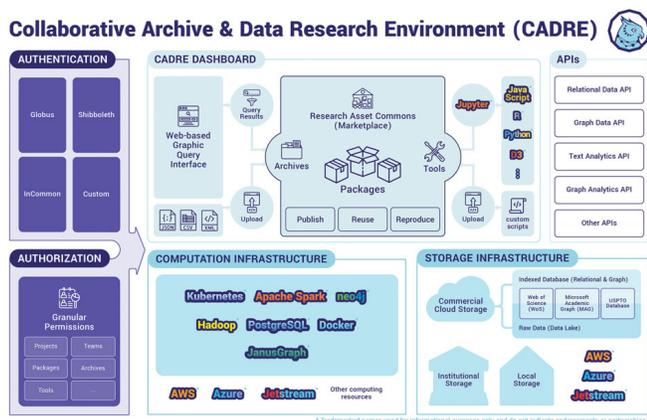
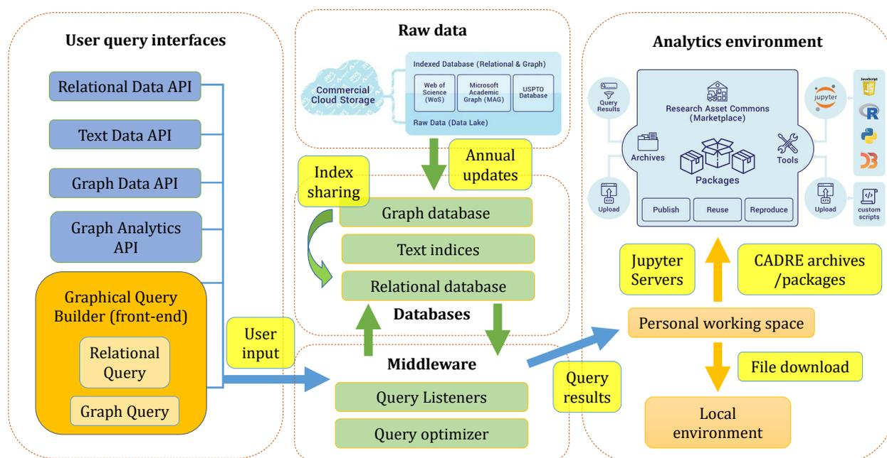
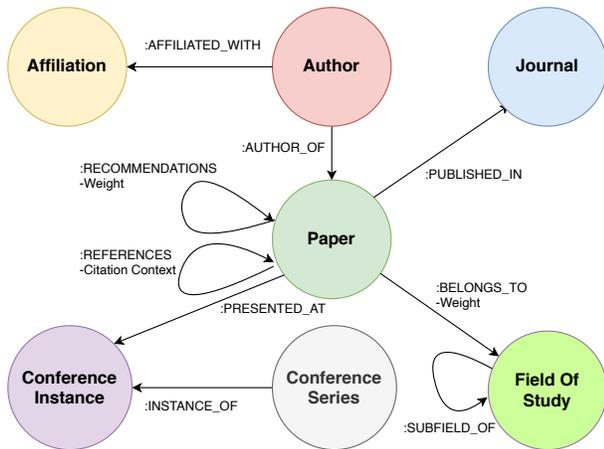

# CADRE: A Cloud-Based Data Service for Big Bibliographic Data

Xiaoran Yan  
AI Research Institute  
Zhejiang Lab  
Hangzhou, Zhejiang, China  
xiaoran.a.yan@gmail.com

Guangchen Ruan  
Research Technologies  
Indiana University  
Bloomington, Indiana, USA  
gruan@iu.edu

Dimitar Nikolov  
Research Technologies  
Indiana University  
Bloomington, Indiana, USA  
dnikolov@iu.edu

Matthew Hutchinson  
Network Science Institute  
Indiana University  
Bloomington, Indiana, USA  
maahutch@iu.edu

Chathuri Peli Kankanamalage  
Network Science Institute  
Indiana University  
Bloomington, Indiana, USA  
cpelikan@iu.edu

Ben Serrette  
Network Science Institute  
Indiana University  
Bloomington, Indiana, USA  
bserrett@iu.edu

James McCombs  
Research Technologies  
Indiana University  
Bloomington, Indiana, USA  
jmcombs@iu.edu

Alan Walsh  
Research Technologies  
Indiana University  
Bloomington, Indiana, USA  
alwalsh@iu.edu

Esen Tuna  
Research Technologies  
Indiana University  
Bloomington, Indiana, USA  
metuna@iu.edu

Valentin Pentchev  
Network Science Institute  
Indiana University  
Bloomington, Indiana, USA  
vpentche@iu.edu

## ABSTRACT

Large bibliographic data sets hold the promise of revolutionizing the scientific enterprise when combined with state-of-the-science computational capabilities. Providing high-quality data services for large network datasets such as the Microsoft Academic Graph, which contains more than two billion citation links, poses significant difficulties for universities. Data systems based on the property graph model are capable of delivering efficient graph query services for large networks. However, real-life queries often combine multiple types of data models. To satisfy the needs of different user groups, we developed and deployed a cloud-based data system consisting of scalable graph and text-indexed query engines. For non-expert users, the property graph model also presents a technological barrier. To alleviate the steep learning curve, we designed an intuitive graphical user interface for query-building. For advanced users, a scalable notebook service in our platform provides a more flexible computing environments where the query results can be further analyzed. These systems form the data-backbone of the Collaborative Archive and Data Research Environment (CADRE),

which provides efficient and high-quality bibliographic data services to eleven large public universities in North America.

## CCS CONCEPTS

• **Information systems** → **Graph-based database models**; • **Computer systems organization** → **Cloud computing**; • **Human-centered computing** → *Collaborative and social computing systems and tools.*

## KEYWORDS

Graph database, Cloud platform, Science gateway, Data sharing, Computational reproducibility.

## ACM Reference Format:

Xiaoran Yan, Guangchen Ruan, Dimitar Nikolov, Matthew Hutchinson, Chathuri Peli Kankanamalage, Ben Serrette, James McCombs, Alan Walsh, Esen Tuna, and Valentin Pentchev. 2021. CADRE: A Cloud-Based Data Service for Big Bibliographic Data. In *Proceedings of the 30th ACM International Conference on Information and Knowledge Management (CIKM '21), November 1–5, 2021, Virtual Event, QLD, Australia*. ACM, New York, NY, USA, 10 pages. <https://doi.org/10.1145/3459637.3481898>

## 1 INTRODUCTION TO THE CADRE PROJECT

Large bibliographic data sets such as Web of Science (WoS [2]), and Microsoft Academic Graph (MAG [26]) hold the promise of revolutionizing the scientific enterprise when combined with state-of-the-science computational capabilities [6]. Yet, hosting proprietary and open big data sets poses significant difficulties for libraries,

Permission to make digital or hard copies of all or part of this work for personal or classroom use is granted without fee provided that copies are not made or distributed for profit or commercial advantage and that copies bear this notice and the full citation on the first page. Copyrights for components of this work owned by others than ACM must be honored. Abstracting with credit is permitted. To copy otherwise, or republish, to post on servers or to redistribute to lists, requires prior specific permission and/or a fee. Request permissions from [permissions@acm.org](mailto:permissions@acm.org).

CIKM '21, November 1–5, 2021, Virtual Event, QLD, Australia

© 2021 Association for Computing Machinery.

ACM ISBN 978-1-4503-8446-9/21/11...\$15.00

<https://doi.org/10.1145/3459637.3481898>

both large and small. For example, MAG contains more than two-hundred and fifty million records and two billion citation links. Barriers to hosting include:

- Infrastructure cost and expertise (especially for cloud hosting).
- Proprietary access restrictions (i.e., data security).
- Data cleaning and other data custodial tasks.
- Data updates and maintenance.
- Enabling big data analytics (with appropriate security and sharing).
- Facilitating access for patrons without advanced programming abilities.

As a result, the user base for these data sets is limited to members of large and well-funded organizations with the resources and technical expertise to host big data. Moreover, the data use agreements for these data sets in some cases prohibit data and algorithm sharing, as well as collaboration among researchers. This makes it very challenging for the research community to reproduce, validate, and build upon previous results.

Supported by a U.S. Institute of Museum and Library Services National Leadership Grant, the Collaborative Archive and Data Research Environment (CADRE) is a cloud-hosted science gateway that provides sustainable, scalable, and standardized data and analytic services for open and proprietary, large bibliographic data sets. With cost-sharing partners in both academia and industry, CADRE provides an efficient and integrated solution for scholars from different disciplines and institutions, with associated analytic tools and storage. CADRE offers a free tier service for data in the public domain. Access to institutionally-licensed data is available to appropriately credentialed individuals via a federated login system. CADRE is also designed to facilitate collaboration and reproducibility by providing a Research Asset Commons, where researchers will be able to save, share, and uniquely identify their artifacts. This includes queries, data subsets, derived results, tools, and their combinations.

In this paper, we will focus on the implementation of the CADRE data system, which forms the technical backbone of this data-centric platform. CADRE is a deployed system in open Beta (publicly accessible at 1) and is actively serving eleven large public universities in North America. It also offers a limited free tier for the general public. We will begin by describing lessons learned from similar systems and our previous endeavors, which contributed to the data architecture of CADRE. We will then describe details about the data layer, where comprehensive comparisons are carried out for candidate database solutions. We will also describe the design of the front-end query interface, as well as the analytics downstream, thus completing the life-cycle of data from the user's perspective.

## 2 RELATED WORK AND BACKGROUND

### 2.1 Similar Work

Science gateways make private and public compute and storage resources available to research communities by lowering barriers of technical challenges, including the implementation of authentication and authorization schemes, and addressing scalability and

alleviating user-facing complex system administration. As a special purpose data and compute environment, CADRE implements many concepts that laid the foundation of science gateways [24]. Over the last decade, these community driven platforms [15] have supported science, engineering, education, and research.

Several existing data enclave projects and frameworks provided useful guidance for the CADRE system. In addressing the fundamental challenges of scalability and providing a robust environment with analysis tools, the HathiTrust Research Center (HTRC) defined a cloud-based model that facilitates researcher access to large scale textual data[20]. Scalable compute and storage in a cloud-based cyberinfrastructure is a cornerstone of CADRE. The HTRC Data Capsules provide a solution for the non-consumptive use of licensed data sets and address the need to compartmentalize analysis to prevent data leakage[28]. That model has been extended in CADRE, taking advantage of new capabilities such as containerization.

The NORC Data Enclave was designed to address challenges related to legal and ethical restrictions on data access. Their advocated approach incorporated incentives for the sharing of metadata to promote reproducibility[14]. The driver behind this feature was the 2005 Report of the National Science Board, which highlighted the essential importance of preserving computational models and metadata[4]. CADRE has integrated this concept to create a “Research Asset Commons” where researchers can publish, and reuse artifacts generated during their research. This approach simultaneously promotes collaboration and reproducibility.

The Cloud Kotta framework included elements that also proved to be beneficial in the development of CADRE. The first was the early work on network analysis, notably the hypergraph model based on the MEDLINE dataset[1]. Citation networks and other bibliometric analyses are a key feature of CADRE. The second component was a job management facility which provided a useful model for managing analytics tasks via a queue. CADRE utilizes a similar architecture for the implementation of its query API.

### 2.2 Lessons from Previous Implementations

As a cloud-based platform for large scale graph and text mining, CADRE hosts a selection of highly requested bibliographic data sets. The first batch of hosted data includes the Web of Science, Microsoft Academic Graph, and the United States Patent and Trademark Office (USPTO, [19]). The centralized model is crucial for solving volume challenges in big data [7]. Shared cloud storage avoids duplicate data storage and multiple versions of the same data. Combined with a fully featured data analytical environment, it adheres to a more efficient model of “Moving Computation to Data” [27], minimizing unnecessary data movements.

The initial implementation of CADRE was based around storing all of the data in a PostgreSQL database. The disparate files for each dataset were combined into a single flat file for each data source which could then be loaded into a PostgreSQL server with a table for each data set. Using PostgreSQL's vector data type it was possible to perform text-based searches across these large data sets using extensions native to the database. However, despite the rapid text searching, we were unable to replicate that performance when trying to extract citation networks. Each row of the PostgreSQL table contained data for a single publication with the id's for any

1<https://cadre.iu.edu/>

Figure 1: CADRE Architecture

cited paper being stored as an array field within that row. As a result, in order to perform first order citation queries it was necessary to first scan the table for the initial identifiers, return the array of citing identifiers for each paper, and repeat the search for the resulting set. This process of recursive querying significantly increased the time it took to retrieve the response from the database.

The first attempt to address this issue was a hybrid solution that maintained most of the data in the PostgreSQL table but extracted all the data from the citation arrays and built a separate graph database using Neo4j. The intention was that the initial search would be handled by PostgreSQL and the id's then sent to Neo4j which would return the network information. In theory, this system could then be expanded to include second order and third order citation results. While this process did increase performance for higher order network queries, there were several practical problems which made this solution infeasible in the long run. First and foremost, neither PostgreSQL nor Neo4j were designed to work in partnership in this manner, meaning there were significant technical challenges in allowing both database systems to communicate. Additionally, the two database model necessitated a substantial increase in time spent on data ingestion. In effect, the raw XML data received from the Web of Science Group and Microsoft Research had to be parsed twice: once for the Relational Database Management System (RDBMS) and once for the Graph database. Finally, this approach limited the CADRE platform to only citation network queries; more complex communications between the two databases are needed if we wish to enable author-to-author collaboration networks or Journal-to-Author-to-Journal networks.

The conclusion after these experiments with a single PostgreSQL installation and a hybrid PostgreSQL and Neo4j system was that neither system could deliver both the rapid query response combined with the ability to support complex network queries.

# 3 THE CADRE DATA ARCHITECTURE

With lessons learned from earlier in-house projects, we designed a new CADRE data architecture. Before we delve into the data system design, the overall architecture of the platform is presented in Figure 1. It consists of a federated authentication and authorization system, cloud computational and storage infrastructures, as well as the API and user interface. In this paper, we will focus on the

data pipeline, which needs to satisfy two distinct data processing scenarios:

- (1) Efficient and easy to use data query and analytical services for end users.
- (2) Bulk data ingestion with provenance for the technical team.

The former is especially challenging considering the wide spectrum of our user base. The design of CADRE is driven by actively collected user stories. In Table 1, we showcase 5 representative user stories that had led to important design choices. Our end users differ drastically in both technical capabilities and desired outputs. To provide flexible solutions capable of addressing all user needs, the data pipeline in CADRE is further broken down into five major components, as demonstrated in Figure 2.

Motivated by user stories like "US8" and "US14," we designed a set of user query interfaces, illustrated in the left panel of Figure 2. Various data APIs and the graphical query builder give users a unified interface to access all three data sets currently hosted by CADRE.

User stories like "US15" renders traditional solutions insufficient, confirming our previous experience with relational databases. While the three data sets come with very different raw formats, they can be naturally unified under the property graph data model. We designed a schema for each data set based on user stories such as "WoS02," by casting different entities and relationships as collection of nodes connected by edges. The nodes represent the entities in the dataset, such as papers and authors, and each can have attributes. The edges connect nodes to capture relationships between them, such as paper authorship (an edge between a paper and an author node), citations (an edge between two paper nodes), and other relationships in the topic domain.

To set a proper context for discussions, here we take MAG schema as an example, as illustrated in Figure 3. The raw data was received from Microsoft in a format corresponding to a relational database schema. There were separate TSV files for papers, authors, affiliated institutions, and other entities, along with corresponding join tables between the different data types. When benchmarking the different graph databases it was important that the testing schema, as closely as possible, matched the final schema to be used in the CADRE platform. Not only did the complete schema allow the research team to develop testing queries that corresponded closely to the anticipated needs of the users, but it also allowed them to better understand the technical challenges involved in building the complex schema.

User stories also made it clear that a graph database without text or relational capability will not be sufficient to meet different user scenarios. The CADRE data back-ends need to be flexible enough to tackle on variety of queries while maintaining consistent results. Additionally, all three data sets have an annual update cycle, with potentially changing raw data formats. As a result, a robust but flexible ingestion pipeline (top panel of Figure 2) is critical for data transformations with provenance across the systems.

Another advantage of a common data model is easier data sharing and version control. This enables comparison across studies, and reduces barriers to reproducibility. Moreover, a platform would add great value if it could promote community sharing and collaborations. The CADRE package systems are designed to facilitate the

| Story code | User type          | Story                                                                                                               | Why                                                                                                   |
|------------|--------------------|---------------------------------------------------------------------------------------------------------------------|-------------------------------------------------------------------------------------------------------|
| US8        | Student researcher | I want a unified query interface to both WoS and MAG at the same time.                                              | This will allow me to utilize both data sets without learning two totally different systems.          |
| US14       | Data Librarian     | Having the ability to directly query the db from the Jupyter notebooks via code.                                    | This will enable us to take an initial set of results then run additional queries without going back. |
| US15       | Researcher         | For the project there is some bibliography comparison work I want to do which would greatly benefit from a graph db | I need faster citation querying.                                                                      |
| WoS02      | Student in NLP     | I need to search by authors' affiliations, keywords. Need abstract.                                                 | I need text indexing for NLP analysis.                                                                |
| NEW11      | Researcher         | More sophisticated bibliometric tools would be great, such as extracting co-author networks from a set of results.  | I would like to use features in the tool Sci2.                                                        |

Table 1: Selected user stories

Figure 2: The flow of data on the CADRE platform

sharing of sophisticated analytical tools such as those requested by the user story "NEW11." In addition, CADRE uses globally unique Digital Object Identifiers (DOIs) as well as data archives for data provenance. With this combination of archived data sets and containerized software stacks, the CADRE package system (right panel in Figure 2) can ensure the computational reproducibility of complex analytical workflows.

# 4 DATA BACKENDS

The CADRE system aims to respond to complex graph queries in real time, and as discussed previously, this requirement runs against the limits of relational databases. To overcome this challenge, we deployed and benchmarked several well known database management systems for use with the MAG and WoS datasets. Graph databases are optimized for the property graph data model, and therefore can execute traversals more efficiently. In addition, graph

databases often provide implementations for common graph metrics and algorithms used to analyze citation networks, or languages and constructs that make the implementations of such easier for the user. Some graph databases also provide functionality commonly found in a traditional RDBMS such as indexing and efficient text search. For all of these reasons, we focused our investigation on graph databases for the CADRE project.

### 4.1 Metrics

The CADRE system has several key characteristics to be considered when creating a list of benchmarking metrics. First, the datasets are large, consisting of hundreds of millions of nodes, and billions of edges. Second, based on our usage pattern, the datasets are mostly static and will be used for analysis workflows. Once a dataset is ingested, it is only updated when a new version of the dataset is released. This time interval can span several months, for example in

**Figure 3: The Microsoft Academic Graph (MAG) schema.**

the case of a yearly dataset refresh. Thus, it is important to be able to ingest and store large datasets, but the time needed for ingestion can be considered as a lower priority metric. Third, our citation datasets contain many text fields like title and abstract, thus it is important for the database to support robust text indexing, plain string search, and full text search where text is tokenized. Fourth, because graph analytics consist of not only identifying interesting subgraphs through graph traversals, but also running graph algorithms (e.g., PageRank) against retrievals, support for classic graph algorithms and potential integration with popular big data analytics frameworks (e.g., Spark) is an important consideration. Finally, to make the CADRE project sustainable, the graph database deployment needs to be cost effective in terms of both operational (hosting) costs, as well as license costs if the chosen database is not open source.

Given these constraints, we considered the following metrics in our benchmarks and assigned them low, medium, and high priorities as follows:

- (1) Scalability (high): The capability to host gigantic graph of millions of nodes and billions of edges.
- (2) Text search (high): The capability to support both plain string and full text search against graph node and edge attributes.
- (3) Graph query performance (high): The performance of the graph database on general-purpose and graph traversal queries.
- (4) Cost effectiveness (high): Both the operational cost and software license cost to run the graph DBMS and the middleware built around it.
- (5) Graph algorithm support (medium): The availability of implementations of common graph metrics and algorithms, such as closeness centrality, largest connected component, label propagation, cycle detection, shortest path, modularity, PageRank, HITS.
- (6) Ingestion (low): The time needed to populate each dataset in the graph database.

### 4.2 Benchmark Design

We considered two benchmarking datasets summarized in Table 2. We began the benchmarking process using a subset of the MAG dataset, whose schema can be seen in Figure 3. This subset omits

| Dataset     | Nodes (M) | Edges (M) | Size on disk (GB) |
|-------------|-----------|-----------|-------------------|
| Full MAG    | 700       | 2,300     | 500               |
| Reduced MAG | 60        | 90        | 30                |

**Table 2: Benchmarking datasets.**

certain node types that were not necessary for fulfilling the benchmarking queries. From this subset of the MAG, we created a reduced dataset starting from all papers in the *Computer Science* field, and traversing all edges from those same papers. Thus, the reduced MAG dataset contains the largest connected component of fully traversing all papers from *Computer Science*, and the associated affiliations, authors, conferences, conference series, fields, and journals. We used the reduced MAG dataset for initial evaluation, and the full dataset (with all nodes and edges) for the final evaluation.

To evaluate the graph query performance of each database, we executed a set of queries summarized in Table 3. Q1 to Q6 and Q10 were informed by the user stories discussed earlier. In addition, Q7 to Q9 are included as typical performance benchmarking queries. Q5 and Q6 can both be viewed as a 1-hop query.

### 4.3 Performance Comparisons

After conducting comprehensive research on graph database offerings, six candidates were selected for comparison, as listed in Table 4. In this section we present the comparison results based on the metrics defined earlier.

Note in Table 4 that the databases we chose differ significantly in their infrastructure requirements: some databases require large amounts of RAM to store the data, while others use disk storage; some can be deployed in a cluster of nodes, while others require a single powerful node. Thus, in our evaluation we do not aim to deploy all graph databases with the same number of nodes and machine specifications. Rather, we deployed each database to achieve its best performance given its architecture and the CADRE requirements. For instance, a single node setting is chosen over cluster configuration for TigerGraph after consulting with TigerGraph’s technical staff based on the the scale of the graphs and the benchmarking queries. In addition, we consider a query to be successful only when it can respond within a reasonable time, and for this purpose we use a five minute timeout. This timeout threshold is chosen to be able to deliver a reasonable user response time.

#### 4.3.1 JanusGraph.

**Architecture.** JanusGraph [12] is distributed across multiple nodes for scalable performance. The three major components, i.e., Janus server cluster, backend database, and index engine are loosely coupled and well interfaced with each other. In addition, it offers great flexibility when choosing which backend database (e.g., HBase [10] vs. Cassandra [13]) and index engine (e.g., Solr [8] vs. ElasticSearch [5]) to use. In our evaluation, we used Cassandra as a backend database due to its peer-to-peer architecture, and ElasticSearch as the index engine as it allows indexing both as plain string and full text search string.

**Setup.** We set up JanusGraph cluster on AWS with following settings: 6-node M5.4xlarge (16 VCPUs and 64 GB RAM) Cassandra cluster and 1-node t3a.2xlarge (8 VCPUs and 32 GB RAM) Elasticsearch cluster, with 350 GB general purpose SSD (gp2) attached to each node. Janus server is not required for this evaluation.

| Query | Type            | Description                                                                          |
|-------|-----------------|--------------------------------------------------------------------------------------|
| Q1    | General-purpose | Fetches all attributes given a paper title.                                          |
| Q2    | General-purpose | Fetches all attributes for each author of a paper given its title                    |
| Q3    | General-purpose | Fetches the fields of study a journal's publications belong to given a journal title |
| Q4    | String Matching | Fetches all authors with papers matching the title criteria                          |
| Q5    | Graph           | Finds all citations for a given paper title.                                         |
| Q6    | Graph           | Finds all references for a given paper title.                                        |
| Q7    | Graph           | Fetches all 2-hop citations for a given paper title.                                 |
| Q8    | Graph           | Fetches all 3-hop citations for a given paper title.                                 |
| Q9    | Graph           | Fetches all 4-hop citations for a given paper title.                                 |
| Q10   | Graph           | Fetches the citations for all papers in a given field of study name.                 |

Table 3: Benchmarking queries.

| Database   | Store Type | Model   | Open Source | Language | Components                 |
|------------|------------|---------|-------------|----------|----------------------------|
| AgensGraph | Disk       | Single  | No          | Cypher   | PostgreSQL                 |
| JanusGraph | Disk       | Cluster | Yes         | Gremlin  | Cassandra ElasticSearch |
| MemGraph   | Memory     | Single  | No          | Cypher   | self-contained             |
| Neo4j      | Disk       | Single  | Yes         | Cypher   | self-contained             |
| RedisGraph | Memory     | Single  | No          | Cypher   | Redis                      |
| TigerGraph | Disk       | Single  | No          | GSQL     | self-contained             |

Table 4: Benchmarking graph databases. In model column ‘Single’ denotes single node setting.

*Cost.* Based on the hardware settings we choose, the operational cost of running JanusGraph is \$4.90 per hour for EC2 virtual machines (VMs) and \$245 per month for storage. The software licensing fee is zero due to its open source nature.

*Ingestion.* We measured significant differences between ingestion of graph nodes and edges. We observed on average 0.88 minutes for nodes, and 9.2 minutes for edges, per every two million nodes/edges batch. In other words, node ingestion is 10.45 times faster than edge ingestion.

*Query Performance.* The performance of JanusGraph on benchmarking queries can be found in Table 5. Performance of the string matching query (Q4) varies dramatically based on the selectivity of the string to match. For instance, when using “big data technologies a survey” as the matching string, the query returns in 1.77 ms with 15 matched “Paper” nodes. The response time increases slightly to 15.18 ms with 526 matched nodes under a more general matching string like “big data technologies”. However, for a wide open matching string such as “big data,” the query times out due to low selectivity.

Similarly, for Q10 we see varied performance as well due to the fact that the size of the resulting set differs dramatically based on the selectivity of the filter. For a narrow discipline (e.g., “geoponic”), the response time is 7.34 ms with only 78 matches. The time increases to 4.98 s for a more broad discipline like “information and computer science” with 92,659 matches. The query simply times out when using a popular field such as “computer science”.

Another set of common graph queries is related to graph traversal (Q5 to Q11). In the evaluation, we used a paper node whose title is “big data technologies a survey” as the seed node. The number of nodes in the resulting citation subgraph for 1-hop (Q5), 2-hop (Q7), 3-hop (Q8) is 91, 2,800, and 94,467, respectively, and a 4-hop query (Q9) leads to a timeout. We can see that the connectivity of

the resulting subgraph grows exponentially as the number of hops increases linearly.

*Graph Algorithm Support.* JanusGraph can be configured to leverage Apache Hadoop and Apache Spark for distributed graph processing. The implementation of classic graph algorithms is available through libraries.

#### 4.3.2 TigerGraph.

*Architecture.* TigerGraph [25] is a distributed, graph analytics platform that supports large scale data access and analytics in real time. TigerGraph is a native parallel graph and is built around both local storage and computation. The core components of TigerGraph are the Graph Storage Engine (GSE) and Graph Processing Engine (GPE), which are both implemented in C++. TigerGraph is designed to fit into existing environments based on Linux VMs. REST APIs are provided to integrate TigerGraph queries with existing middleware and workflows. TigerGraph uses its own GSQL language, which supports both SQL-like syntax as well as a MapReduce-like syntax. One of the distinguishing features of GSQL are accumulators, which allow for the collection or aggregation of either global or per-node values through the graph traversal induced by a query.

*Setup:* The platform is available on-premises, or in the Cloud. After consulting with TigerGraph’s technical staff, we deployed TigerGraph on single-node setups using two different VM sizes:

- (1) TigerGraph 1: AWS r4.4xlarge VM with 16 vCPUs, 122 GB RAM, and an external 2 TB SSD drive
- (2) TigerGraph 2: AWS r4.8xlarge VM with 32 vCPUs, 244 GB RAM, and an external 2 TB SSD drive

*Cost:* For TigerGraph 1, operational cost per month with a 2 TB attached SSD is \$975.85 (on-demand) or \$690.56 (EC2 Instance Savings Plan, 1 year). For TigerGraph 2, operational cost per month with a 2 TB attached SSD would be \$1,930.17 (on-demand) or \$1,181.12 (EC2 Instance Savings Plan, 1 year). The licensing cost for the Enterprise edition was not known at the time of benchmarking. Using the Cloud version of TigerGraph 1 would have cost \$7/hour and for TigerGraph 2, \$12/hour.

*Ingestion:* TigerGraph includes a data loader which makes it easy to load large tabular or semi-structured data while the system is online. For the MAG datasets, for example, no preprocessing is necessary and TigerGraph’s loader can import the raw files coming from Microsoft. Data ingestion in TigerGraph is fast, with the full MAG dataset taking 156 minutes and 114 minutes on the first and second deployments respectively.

*Graph algorithm support:* TigerGraph maintains a repository with a wide range of graph metrics and algorithms implemented in GSQL.

#### 4.3.3 MemGraph.

*Architecture.* MemGraph [16] is a hybrid (i.e., in-memory, on-disk) graph database that supports Cypher and Neo4j-like data import formats. In addition to the command line, MemGraph can be queried programmatically either by using the Bolt protocol, or by using the Neo4j module in a number of programming languages, including Python, Java, JavaScript and C#. MemGraph uses a subset of OpenCypher. The main language constructs are supported, however built-in functions and algorithms found in the Neo4j distribution of OpenCypher are not available in MemGraph.

*Setup:* The platform is available for on-premises (Core and Enterprise versions), or cloud use (Managed). We deployed MemGraph on a single-node setup on Jetstream with a m1.xlarge VM with 60 vCPUs and 128 GB RAM.

*Ingestion:* The MemGraph importer is not flexible enough to import the data from the native MAG format. Instead, a series of steps have to be executed to clean the data and format it with the proper header files. We were only able to ingest the reduced MAG subset. The ingestion of this dataset took five hours. MemGraph was not capable of loading the full MAG, even when applying optimizations for storing the data partially on disk. At the time of benchmarking, versions of MemGraph prior to version 0.5 had a bulk CSV import available, which is what was used for benchmarking. With version 0.5 and up, MemGraph only supports Cypher queries for inserting data, which in our testing showed to be slow and error prone.

*Graph algorithm support:* Because of the limited support for OpenCypher, existing implementations of graph algorithms in the language cannot be used with MemGraph. The existing support for built-in algorithms is likewise limited.

#### 4.3.4 Neo4j.

*Architecture.* Neo4j [17] is a native graph database implemented in Java and is currently the most popular graph database, according to [11]. Neo4j is an ACID compliant transactional database with native graph storage and processing. One limitation of Neo4j is that it can only hold one dataset per installation. In order to support the multiple datasets of CADRE this would require multiple VMs, each with an individual Neo4j installation, which makes it cost ineffective.

*Setup.* Neo4j is available for on-premises deployment on a single node. The commercial edition of the database can be extended across multiple nodes in order to provide high availability. However, in this evaluation we are only able to evaluate upon community edition. We tested Neo4j deployment on single-node setup with four different VM sizes on AWS, r5n.large (2 vCPUs and 16 GB RAM), r5n.xlarge (4 vCPUs and 32 GB RAM), r5n.4xlarge (16 vCPUs and 126 GB RAM), and r5n.16xlarge (64 vCPUs and 512 GB RAM), VMs are all attached a 300 GB EBS storage. We note that since full MAG dataset cannot be loaded into single node Neo4j, a reduced of MAG is used for its evaluation. The profile of the subset is shown in Table 2. Out of the 4 VM configurations, r5n.4xlarge yields the best query performance and we use it for cost estimation and performance reporting in subsequent sections.

*Cost.* The hourly r5n.4xlarge VM cost \$1.192. Licensing fee for enterprise edition is unknown. The monthly storage cost is \$150.

*Ingestion.* It took three hours and thirty minutes to ingest the data.

*Query Performance.* Query performance of Neo4j can be found in Table 5. As we can see, on the subset of MAG, Neo4j performs well on general purpose graph queries. For Q4, the matching string is the general “big data” and for Q10 the field “computer science” is used. However, for all queries that involve more than one hop graph traversal, Neo4j times out.

*Graph Algorithm Support.* Neo4j has an extensive graph algorithm library including centrality, path finding, community detection, and similarity algorithms. The complete list can be found at [18]

#### 4.3.5 Agensgraph.

*Architecture.* AgensGraph [3] is a multi-model graph database built on top of PostgreSQL. Consequently, the database utilizes all the features of PostgreSQL but facilitates graph modeling and queries. AgensGraph utilizes the JSONB format to store the nodes and edge lists, allowing user to execute both SQL and Cypher queries against the data.

*Setup.* Since the database is an extension of PostgreSQL it can be deployed in the same manner as PostgreSQL, i.e., in a single node setting. In other words, AgensGraph, like PostgreSQL, cannot be deployed on a cluster but can be spread across multiple storage volumes. Similar to Neo4j, for AgensGraph we tested the four VM sizes on AWS: r5n.large, r5n.xlarge, r5n.4xlarge, and r5n.16xlarge. All VMs were attached to a 300 GB EBS storage volume. Since AgensGraph also cannot load the full MAG dataset, we used the reduced dataset for its evaluation. Out of the four VM configurations, r5n.4xlarge yields the best query performance, and we use it for cost estimation and performance reporting in subsequent sections.

*Query Performance.* AgensGraph demonstrates very similar performance to Neo4j: it performs well on general purpose graph queries, but struggles with graph traversal queries that are more than a single hop.

*Graph Algorithm Support.* To our knowledge, as of the time of this writing there is no graph algorithm support from AgensGraph.

*4.3.6 RedisGraph.* We observed that RedisGraph [21] can only run on top of a single node Redis Cluster, and due to its in-memory data access requirement, graph datasets of the scale that CADRE targets cannot reasonably be loaded into RedisGraph. Because of this constraint, we decided to discontinue evaluation of RedisGraph early in the process.

### 4.4 Discussion and Results

In Section 4.3, we compared different graph databases on a set of defined metrics. JanusGraph and TigerGraph are the only two that can load the full MAG dataset while demonstrating superior query performance. TigerGraph is capable of operating under a single node setting with a self-contained software package, which greatly simplifies the deployment process. However, TigerGraph’s high licensing costs effectively negate the operational advantages. Conversely, JanusGraph has clearly separated components (JanusGraph servers, backend DB and search engines), each of which is designed

| Query | JanusGraph | TigerGraph 1 | TigerGraph 2 | MemGraph | Neo4j   | AgensGraph |
|-------|------------|--------------|--------------|----------|---------|------------|
| Q1    | 1.82       | 880          | 480          | 2.26     | 82,370  | 1.86       |
| Q2    | 3.66       | 17           | 14           | 1.88     | 6820    | 1850       |
| Q3    | 69         | 190          | 28           | 29.89    | 120     | 100        |
| Q4    | varies     | 141670       | 32960        | 24950    | 15990   | 32310      |
| Q5    | 2.09       | 17           | 13           | 3.44     | 6890    | 8160       |
| Q6    | 1.4        | 30000        | 13           | 1.48     | 6860    | 8060       |
| Q7    | 62.53      | varies       | varies       | 3.02     | timeout | timeout    |
| Q8    | 20900      | varies       | varies       | 8.05     | timeout | timeout    |
| Q9    | timeout    | varies       | varies       | 5.32     | timeout | timeout    |
| Q10   | varies     | 9620         | 100          | 3.04     | 138000  | 112910     |

**Table 5: Benchmarking Query Results. Time is in milliseconds.**

to run under a distributed configuration. This architecture makes the system highly scalable, but also adds operational cost. Thanks to its open source status, the effective cost of JanusGraph is appealing, even when hosting a gigantic graph like MAG.

Due to space limitations, in Section 4.3 we did not cover the detailed evaluation results on “metadata” types of graph queries. These queries ask for the exact number of nodes or edges for a specific node or edge type. JanusGraph cannot answer such queries for even moderately sized graphs, because the queries require JanusGraph to traverse the entire graph to obtain the necessary statistics. In contrast, the other graph databases in our comparison can perform these queries efficiently, normally with sub-second response times. We believe this to be due to implementations that rely on internal data structures for bookkeeping or other optimizations. However, global graph statistics like node and edge counts can be easily precomputed as a byproduct of the ingestion process and stored as graph metadata independent of the graph database itself. When receiving such queries, the CADRE frontend simply polls the metadata without querying the graph database. This approach is well suited to the ingestion and data access patterns described previously. Based on the observations discussed above, we selected JanusGraph as the graph database for CADRE.

## 5 FRONTEND AND MIDDLEWARE

To ease the steep learning curve of learning graph queries, we designed a graphical query builder (see the open Beta version at 2) following the traditional bibliographic search boxes used by systems such as the Web of Science. By combining multiple search conditions with logical operators, the query builder is capable of generating appropriate graph queries that gathers information across different node and edge types. In response to an user story listed earlier, we also designed dedicated network queries where multi-hop citations can be efficiently extracted.

The CADRE frontend interface and middleware are hosted on AWS Elastic Beanstalk [23] managed hosting. The frontend is written in JavaScript using the Vue.js framework. The middleware is written in Python using the Flask micro-framework. The Flask application exposes a REST API that allows the JavaScript single-page application to interface with the middleware using AJAX. The REST API allows the interface to query user data, system status information, and other system metadata. Additionally, it can launch Jupyter Notebook servers and launch long running queries against CADRE’s data sets. As demonstrated in Figure 2, the middleware

plays a central role in communicating and coordinating different parts of the platform. In particular, the middleware is critical in managing and translating user requests from the frontend.

## 5.1 Query Listeners and Meta Database

An asynchronous approach is used for the dataset queries so that the requests do not block other middleware services. Rather than running these queries directly in the middleware, queries are translated to JSON strings and submitted as messages to an AWS Simple Queue Service (SQS)[24] queue. Java-based listeners running on a separate AWS EC2 instance listen for incoming messages from this queue. In order to execute multiple user queries in parallel, a First In First Out (FIFO) queue is used with multiple running listener processes.

The Java-based listener uses JanusGraph and Apache TinkerPop [9, 22] APIs to transform the JSON formatted queue message to a format that can be understood by the JanusGraph backend. Query results are written to user notebook environments in CSV format once the query finishes. For every output file, a file checksum is generated and saved in the CADRE metadatabase to make sure the files were generated in the CADRE environment. Users can then use the query results in their packages and tools.

The query’s run status is also stored in the CADRE metadatabase. At each stage of the run process, the status is updated to inform users of successful operations and system errors. This status is available at any time to a user as a list of job statuses in the interface. Users are also presented with direct links to results files if the query was a success.

### 5.2 Query Translation and Execution

User queries are specified within the JSON message using a list of filters that are to be applied to node fields. For each node type (e.g., Paper, Author, Journal, or ConferenceInstance), a separate list of filters is given. For queries involving different node types, the set of papers meeting all the filtering criteria for each node type must be obtained. First, separate lists of nodes meeting the filter criteria for each node type are retrieved using the TinkerPop API. Next, for each list of non-Paper nodes retrieved, the Paper node linked to by each non-Paper node is obtained using a TinkerPop edge traversal and is stored in a new list of Paper nodes meeting the filtering criteria for the non-Paper node type. Finally, a set intersection is performed with each list of Paper nodes to obtain all papers meeting the filtering criteria over all node types.

2<https://cadre.iu.edu/gateway>

As an example, suppose a user wants to find all papers in the MAG database written by authors named John Smith in the year 1985 in the journal Mathematics. Three filters must be specified in the JSON message: the author name filter on the Author node type, the year filter on the Paper node type, and the journal name on the Journal node type. Three traversals are performed with the TinkerPop API using the filtering criteria to obtain three separate lists of nodes, one for each node type for which a filter has been defined. The papers linked to by the Author nodes list are obtained by performing traversals from the Author nodes meeting the author name filtering criteria: all papers that were authored by at least one author named John Smith. A similar traversal is performed to obtain the list of papers published in the journal Mathematics. A set intersection is then performed on the lists of papers meeting the author name, year, and journal name filtering criteria to obtain the list of papers meeting all filtering criteria. The resulting papers returned from the user query are written to a CSV file. Users can specify in the JSON message which fields they want printed in the CSV file for each paper, including fields from neighboring non-Paper nodes so that Author, Journal, and other node information can be included for each paper.

Users can also request the generation of either a citations graph or a references graph. A citations graph contains all of the papers matching the filtering criteria and all papers cited by those papers. A references graph contains all of the papers matching the filtering criteria and all papers that are referencing those papers. The entire set of citing-referencing or cited-referenced papers is included in the paper results CSV file. An additional CSV file is generated that contains each edge in the citations and references graph, with edges given by pairs of unique paper identifiers corresponding to papers in the papers CSV file. The paper results file and the edges file are both made available to the analytics environment.

# 6 ANALYTICS DOWNSTREAMS

## 6.1 Jupyter Notebook Servers

CADRE allocates each user their personal containerized Jupyter notebook server to analyze results from queries. Jupyter notebooks are interactive coding environments that allow users to run Python, R or other languages using CADRE compute resources. In order to manage a large number of Jupyter containers, CADRE has deployed JupyterHub on a Kubernetes cluster that automatically scales depending on the number of concurrent users.

When data queries are executed from the user interface, results are stored in an AWS Elastic File System (EFS) subdirectory assigned to each user. This directory is only available to the specific user through their Jupyter server. The mounted subdirectory allows the user to view the resulting CSV files online. The user may write Python scripts to perform further analysis on the output files. After the analysis is done, the user can save their code and output files for future use or transform them into shareable tools and packages.

The shared EFS directories are read only for users, and directly administrated by the CADRE system. Each Jupyter container also has a AWS Elastic Block Store (EBS) drive as the working space, which the user has complete control. This combination of shared EFS and dedicated EBS enables free exploration as well as convenient sharing at the same time.

### 6.2 The Package System

The CADRE Package System designed to facilitate the sharing and reproduction of data, code or their combinations. They are implemented as the data archives, tools, and packages respectively, as illustrated in Figure 2. This flexible design allows users to share an analytical tool that is built for wider use, or to bundle data and scripts for a completely reproducible pipeline.

Using a simple boilerplate, a user can build a tool from a set of code scripts developed in their notebook environment. When a user is satisfied with their code, they can choose to publish this tool for future work. A dockerfile is created to wrap this Tool and a docker image will be created and stored in our system so that it can later be executed. Query result files in the EFS directory can be archived and stored on AWS S3. A tool can then run against this data archive, producing an output such as a cleaned dataset or visualization.

Running a package will create a container from the tool's docker image, import the data from the data archive, and run the tool's scripts against the data, saving the resulting output into the user's EFS directory. If a package is made public, it will allow any user to replicate the creator's data flow and result. In the interest of transparency, the original data archive data and the tool's code are also saved to the user's EFS directory. For efficiency and scalability, the containers of the CADRE package system are orchestrated by the same Kubernetes cluster, together with the notebook servers.

## 7 CONCLUSION AND FUTURE WORK

In this paper, we detailed the data pipeline of the CADRE platform, which provides an integrated cloud environment for big bibliographic data analysis. To serve an active user group from eleven large public universities, the CADRE data system is built for large complex queries, both in terms of efficiency and ease-of-use. From user stories to architecture design, from database benchmarking to containerized packages, we hope the lessons and experience from CADRE can provide useful information for fellow data infrastructure builders, including the future technical team of CADRE.

The CADRE project is designed for long term sustainability from the beginning. Therefore we have a road map for continuous improvements of the platform. We are currently developing a public API that will enable users to form queries and directly access results from within their programming environments. We will initially develop the public API for use with the CADRE Jupyter notebooks so that users can formulate and submit queries, retrieve results, and perform analysis all in one place. Another milestone we aim to deliver is the streamlined package publication and sharing system. More convenient searching on CADRE and external DOI citation linkage will facilitate dissemination of user created artifacts.

## 8 ACKNOWLEDGEMENTS

We gratefully acknowledge that funding for CADRE is provided by the U.S. Institute for Museum and Library Services (IMLS) grant LG-70-18-0202. We also acknowledge Web of Science Group, Microsoft Research and the Midwest Big Data Innovation Hub under NSF award # 1916613 for their contributions and funding of the project. Xiaoran Yan was also supported (in part) by Zhejiang Lab (2021KE0AC02).

## REFERENCES

- [1] Yadu N. Babuji, Kyle Chard, Aaron Gerow, and Eamon Duede. 2016. Cloud Kotta: Enabling secure and scalable data analytics in the cloud. *2016 IEEE International Conference on Big Data (Big Data)* (2016), 302–310.
- [2] Caroline Birkle, David A. Pendlebury, Joshua Schnell, and Jonathan Adams. 2020. Web of Science as a data source for research on scientific and scholarly activity. *Quantitative Science Studies* 1, 1 (02 2020), 363–376. [https://doi.org/10.1162/qss\\_a\\_00018](https://doi.org/10.1162/qss_a_00018) arXiv:[https://direct.mit.edu/qss/article-pdf/1/1/363/1760864/qss\\_a\\_00018.pdf](https://direct.mit.edu/qss/article-pdf/1/1/363/1760864/qss_a_00018.pdf)
- [3] Bitnine. 2021. *AgensGraph Home Page*. Retrieved May 24, 2021 from <https://bitnine.net/agensgraph/>
- [4] National Science Board. 2005. *Long-Lived Digital Data Collections: Enabling Research and Education in the 21st Century*. Technical Report NSB-05-40. Arlington, VA, USA. <https://www.nsf.gov/pubs/2005/nsb0540/nsb0540.pdf>
- [5] Elasticsearch. 2021. *Elasticsearch Homepage*. Retrieved May 24, 2021 from <https://www.elastic.co/elasticsearch/>
- [6] Santo Fortunato, Carl T. Bergstrom, Katy Börner, James A. Evans, Dirk Helbing, Staša Milojević, Alexander M. Petersen, Filippo Radicchi, Roberta Sinatra, Brian Uzzi, Alessandro Vespignani, Ludo Waltman, Dashun Wang, and Albert-László Barabási. 2018. Science of science. *Science* 359, 6379 (2018). <https://doi.org/10.1126/science.aao0185> arXiv:<https://science.sciencemag.org/content/359/6379/eao0185.full.pdf>
- [7] Ian Foster, Yong Zhao, Ioan Raicu, and Shiyong Lu. 2008. Cloud Computing and Grid Computing 360-Degree Compared. In *2008 Grid Computing Environments Workshop*. 1–10. <https://doi.org/10.1109/GCE.2008.4738445>
- [8] Apache Software Foundation. 2021. *Apache Solr Homepage*. Retrieved May 24, 2021 from <https://solr.apache.org/>
- [9] Apache Software Foundation. 2021. *Apache TinkerPop*. Retrieved May 13, 2021 from <https://tinkerpop.apache.org>
- [10] Lars George. 2011. *HBase: the definitive guide: random access to your planet-size data*. " O'Reilly Media, Inc".
- [11] <http://solid.it.at/>. 2021. *DB-Engines Ranking - popularity ranking of database management systems*. Retrieved May 25, 2021 from <https://db-engines.com/en/ranking>
- [12] JanusGraph. 2021. *JanusGraph Homepage*. Retrieved May 24, 2021 from <https://janusgraph.org/>
- [13] Avinash Lakshman and Prashant Malik. 2010. Cassandra: a decentralized structured storage system. *ACM SIGOPS Operating Systems Review* 44, 2 (2010), 35–40.
- [14] Julia Lane and Stephanie Shipp. 2007. Using a Remote Access Data Enclave for Data Dissemination. *The International Journal of Digital Curation* 2, 1 (jul 2007), 128–134. <https://doi.org/10.2218/ijdc.v2i1.20>
- [15] Katherine A. Lawrence, Michael Zentner, Nancy Wilkins-Diehr, Julie A. Wernert, Marlon Pierce, Suresh Marru, and Scott Michael. 2015. Science gateways today and tomorrow: positive perspectives of nearly 5000 members of the research community. *Concurrency and Computation: Practice and Experience* 27, 16 (2015), 4252–4268. <https://doi.org/10.1002/cpe.3526> arXiv:<https://onlinelibrary.wiley.com/doi/pdf/10.1002/cpe.3526>
- [16] Memgraph. 2021. *Memgraph Homepage*. Retrieved May 24, 2021 from <https://memgraph.com/>
- [17] Neo4j. 2021. *Neo4j Homepage*. Retrieved May 24, 2021 from <https://neo4j.com/>
- [18] Neo4j. 2021. *Neo4j Supproted Graph Algorithms*. Retrieved May 24, 2021 from <https://neo4j.com/docs/graph-algorithms/current/introduction/>
- [19] The United States Patent and Trademark Office. 2013. *The USPTO Patent and Trademark Bulk Data*. Retrieved May 24, 2021 from <https://www.uspto.gov/learning-and-resources/bulk-data-products>
- [20] Beth Plale. 2013. Big Data Opportunities and Challenges for IR, Text Mining and NLP. In *Proceedings of the 2013 International Workshop on Mining Unstructured Big Data Using Natural Language Processing* (San Francisco, California, USA) (*UnstructureNLP '13*). Association for Computing Machinery, New York, NY, USA, 1–2. <https://doi.org/10.1145/2513549.2514739>
- [21] RedisGraph. 2021. *RedigGraph Home Page*. Retrieved May 24, 2021 from <https://oss.redislabs.com/redisgraph/>
- [22] Marko A. Rodriguez. 2015. The Gremlin Graph Traversal Machine and Language. *CoRR abs/1508.03843* (2015). arXiv:1508.03843 <http://arxiv.org/abs/1508.03843>
- [23] Amazon Web Services. 2021. *Amazon Elastic Beanstalk*. Retrieved May 18, 2021 from <https://aws.amazon.com/sqs/>
- [24] Amazon Web Services. 2021. *Amazon Simple Queue Service*. Retrieved May 13, 2021 from <https://aws.amazon.com/sqs/>
- [25] TigerGraph. 2021. *TigerGraph Homepage*. Retrieved May 24, 2021 from <https://www.tigergraph.com/>
- [26] Kuansan Wang, Zhihong Shen, Chiyuan Huang, Chieh-Han Wu, Darrin Eide, Yuxiao Dong, Junjie Qian, Anshul Kanakia, Alvin Chen, and Richard Rogahn. 2019. A Review of Microsoft Academic Services for Science of Science Studies. *Frontiers in Big Data* 2 (2019), 45. <https://doi.org/10.3389/fdata.2019.00045>
- [27] Matei Zaharia, Dhruba Borthakur, Joydeep Sen Sarma, Khaled Elmeleegy, Scott Shenker, and Ion Stoica. 2010. Delay Scheduling: A Simple Technique for Achieving Locality and Fairness in Cluster Scheduling. In *Proceedings of the 5th European Conference on Computer Systems* (Paris, France) (*EuroSys '10*). Association for Computing Machinery, New York, NY, USA, 265–278. <https://doi.org/10.1145/1755913.1755940>
- [28] Jiaan Zeng, Guangchen Ruan, Alexander Crowell, Atul Prakash, and Beth Plale. 2014. Cloud Computing Data Capsules for Non-Consumptiveuse of Texts. In *Proceedings of the 5th ACM Workshop on Scientific Cloud Computing* (Vancouver, BC, Canada) (*ScienceCloud '14*). Association for Computing Machinery, New York, NY, USA, 9–16. <https://doi.org/10.1145/2608029.2608031>