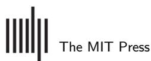
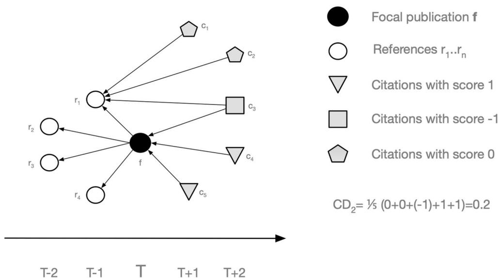
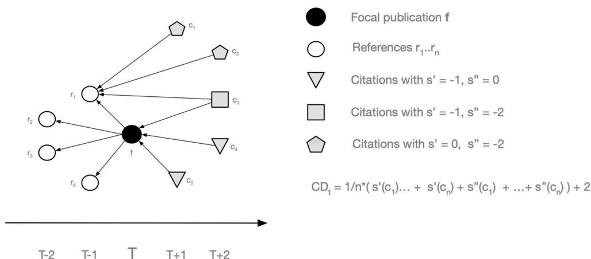
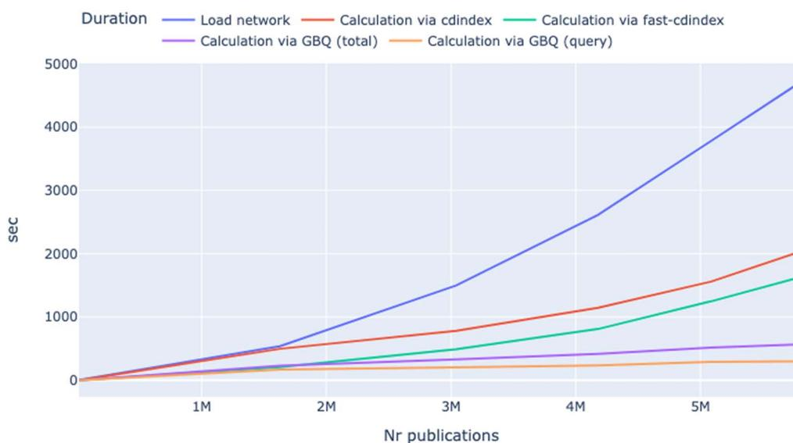
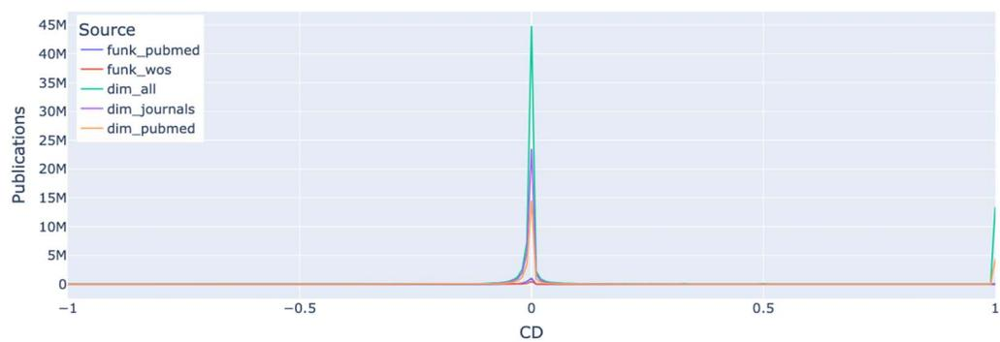
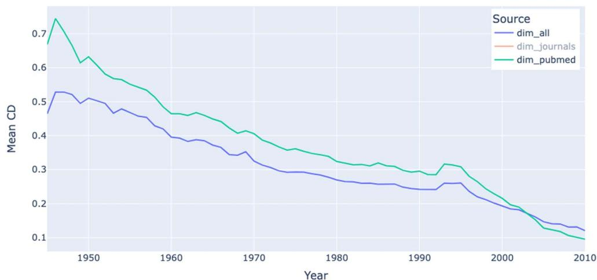

an open access  journal


Citation: Sixt, J., & Pasin, M. (2024). Dimensions: Calculating disruption indices at scale. *Quantitative Science Studies*, 5(4), 975–990. [https://doi.org/10.1162/qss\\_a\\_00328](https://doi.org/10.1162/qss_a_00328)

DOI:  
[https://doi.org/10.1162/qss\\_a\\_00328](https://doi.org/10.1162/qss_a_00328)

Peer Review:  
[https://www.webofscience.com/api/gateway/wos/peer-review/10.1162/qss\\_a\\_00328](https://www.webofscience.com/api/gateway/wos/peer-review/10.1162/qss_a_00328)

Received: 12 September 2023  
Accepted: 24 July 2024

Corresponding Author:  
Michele Pasin  
[m.pasin@digital-science.com](mailto:m.pasin@digital-science.com)

Handling Editor:  
Vincent Larivière

Copyright: © 2024 Joerg Sixt and Michele Pasin. Published under a Creative Commons Attribution 4.0 International (CC BY 4.0) license.



## RESEARCH ARTICLE

# Dimensions: Calculating disruption indices at scale

Joerg Sixt  and Michele Pasin 

Digital Science & Research Solutions Ltd., London, UK

**Keywords:** *CD* index, Dimensions database, disruption, Google BigQuery, SQL

## ABSTRACT

Assessing the disruptive nature of a line of research is a new area of academic evaluation that moves beyond standard citation-based metrics by taking into account the broader citation context of publications or patents. The “*CD* index” and a number of related indicators have been proposed in order to characterize the disruptiveness of scientific publications or patents. This research area has generated a lot of attention in recent years, yet there is no general consensus on the significance and reliability of disruption indices. More experimentation and evaluation would be desirable, but it is hampered by the fact that the calculation of these indicators is time-consuming, especially if done at scale on large citation networks. We present a novel SQL-based method to calculate disruption indices for the Dimensions publications data on Google BigQuery. This reduces the computational time taken to produce such indices by an order of magnitude, as well as making available such functionalities within an online environment that requires no setup efforts. We explain the novel algorithm and describe how its results align with preexisting implementations of disruption indicators. This method will enable researchers to develop, validate, and improve disruption models more quickly and with more precision.

## 1. INTRODUCTION

Assessing the disruptive nature of a line of research is a new area of academic evaluation that moves beyond standard citation-based metrics by taking into account the broader citation context of publications or patents. The idea of characterizing scientific innovation in terms of its “disruptive” property is not new and can be traced back to the work of Popper (1969) and Kuhn (1962) in the sociology and philosophy of science. These authors drew a fundamental distinction between contributions that improve pre-established scientific theories, and hence *consolidate* their status as accepted truths, versus contributions that propose new or alternative methods that break away from the tradition, thus *disrupting* it.

In a seminal paper, Funk and Owen-Smith (2017) first proposed a citation-based metric called “*CD* index” to detect disruptive or consolidating patents. The *CD* index quantifies the degree to which future work cites a focal work together with its predecessors (that is, the references in the bibliography of the focal work). Disruptive papers are identified based on how much subsequent research cites them without citing their references (i.e., the publications they themselves cite).

The *CD* index has attracted particular attention ever since. On the one hand, researchers have been trying to apply these metrics to specific scientific disciplines. For example, it has

been used to detect disruptive publications in subfields of clinical medicine (e.g., Abu-Omar, Kennedy et al., 2022; Grunvald, Williams et al., 2021; Hansdorfer, Horen et al., 2021; Horen, Hansdorfer et al., 2021; Khusid, Gupta et al., 2021; Sullivan, Skertich et al., 2021), nanoscience (Kong, Huang et al., 2023), and scientometrics (Bornmann & Tekles, 2019b). On the other hand, researchers working in the science of science (Fortunato, Bergstrom et al., 2018) community used the *CD* index to analyze global trends in science, arguing that research is overall becoming less disruptive (Park, Leahey, & Funk, 2023) and that small teams are more likely to produce impactful science than large teams (Wu, Wang, & Evans, 2019). Quite importantly, there have also been critics of the *CD* index and its applications (e.g., Bentley, Valverde et al., 2023; Wei, Zhao et al., 2020). Others have tried to test the metric's validity (e.g., Bornmann, Devarakonda et al., 2020; Bornmann & Tekles, 2019a) in more general terms or create derivatives (e.g., Chen, Shao, & Fan, 2021; Leydesdorff, Tekles, & Bornmann, 2021) with the aim to enhance its ability to pick truly game-changing science. For a more exhaustive review of these different research strands, see Leibel and Bornmann (2023).

Two technological advancements underlie these developments: firstly, the growth of large, programmatically accessible bibliometric databases, such as those provided by Crossref, Dimensions, Scopus, and Web of Science (Thelwall, 2018; Visser, van Eck, & Waltman, 2021); and secondly, major advances in computing capabilities that facilitate the aggregation and processing of large-scale data sets, often using off-the-shelf cloud infrastructure (Hook & Porter, 2021). These two aspects combined make it possible to calculate novel *multidimensional* metrics (Bu, Waltman, & Huang, 2019) at scale—i.e., metrics that characterize the citation impact of a publication by taking into account not just a subset of scientific documents but the entire corpus of publications or patents as a single giant citations network.

However, for individual researchers with no access to large computing infrastructure it is still very challenging to run these calculations. On a regular computer, calculating the *CD* index for a large network would take many days. Even on dedicated machines, these tasks are rather computationally intensive: For instance, in Spinellis (2023, p. 14f) the author explains how calculations of the *CD* index for large citation networks took them up to 30–50 hours using special hardware with 40–50 GByte memory. As a result, despite increased interest in the *CD* index, there are still no easily accessible data sets and means of computation that make it easier to assess its usefulness in the context of science of science analyses and literature discovery.

We present a novel method to compute the *CD* index using an ordinary computer via a short SQL query on the Dimensions publication table on Google BigQuery (Dimensions, 2023; Hook & Porter, 2021). Our approach makes it possible to calculate, for example, the *CD*<sub>5</sub> index for all journal articles with references in Dimensions in approximately 4.5 hours. Thanks to this significantly quicker turnaround time, our method makes it possible to test different variations of the *CD* index and benchmark them against each other (e.g., for other time spans or only using a subset of a publication citation network, such as only looking at journal articles and excluding books, preprints, etc.). This methodology also allows for more experimentation: For example, it makes it easier to calculate the *CD* index not only for individual publications but also per organization, or using it for patents, which also exist as Dimensions Google BigQuery tables.

The rest of the article is organized as follows: Section 2 describes the original method for calculating the *CD* index and introduces our alternative method based on SQL; Section 3 presents the results of our method, in particular by comparing its performance to the standard way of calculating the *CD* index; and finally in Section 4 we conclude by outlining the benefits of this approach and how it can be extended so to handle other *CD* index derivatives.

## 2. METHOD: CALCULATING THE CD INDEX

### 2.1. The Original Definition of the CD Index

In its original definition from Funk and Owen-Smith (2017) and subsequent work (e.g., Park et al., 2023), the *CD* index is defined as an indicator for quantifying the degree to which future work cites a focal work together with its predecessors (that is, the references in the bibliography of the focal work). There have been a number of refinements and criticisms of this approach in recent years (e.g., Bu et al., 2019; Bornmann et al., 2020; Wu & Wu, 2019) but in this article we focus primarily on the original definition from Funk and Owen-Smith (2017), as the goal is to exemplify an improved implementation strategy that, we argue, can be adapted to suit any alternate *CD* index formula.

The calculation of the index for a fixed focal publication relies on all its references and all citations to the focal publication and the references. Figure 1 shows a simple example.

In its original form, the *CD* index can be calculated as follows:

1. Fix a focal publication  $f$  (the filled circle in the diagram) published in year  $T$  for which we want to calculate  $CD_t$ .
2. Fix an integer  $t$  that determines the time frame for which we want to measure impact: We will look at citations that occur at most  $t$  years after the publication of  $f$ . In most cases  $t$  is five years.
3. Find all publications  $r_1, \dots, r_k$  that are cited by  $f$  (the empty circles in the diagram) or in other words the “predecessors” or references of  $f$ .
4. Find all  $n$  distinct publications  $c_1, \dots, c_n$  that cite at least one of the  $f, r_1, \dots, r_k$  in the years  $T+1$  until and including  $T+t$  (in other words the “successors” of  $f$  or the union of all citations to  $f, r_1, \dots, r_k$  that occurred in the  $t$  years after the publication of  $f$ ).



**Figure 1.** Example of a publication citation network around a focal publication and calculation of the  $CD_2$  index. The x-axis is the timeline and indicates when the publications represented by squares, circles, and pentagons are published. An arrow points from a citing publication to a publication it cites.

Note that the original definition does not take into account citations in year  $T$  itself but it is easy to adapt all methodologies to include those as well.

5. Assign a score  $s(c_i)$  to each  $c_i$  depending on what publication it cites:
  - (a) Set  $s(c_i) := 1$  if and only if  $c_i$  cites  $f$  but none of the references  $r_1, \dots, r_k$  (the grey triangles in the diagram). The idea here is that such a citation does not care about the references but only about the focal paper  $f$  highlighting the disruptive character of  $f$ .
  - (b) Set  $s(c_i) := -1$  if and only if  $c_i$  cites at least one of the references  $r_1, \dots, r_k$  and, in addition, also cites  $f$  (the grey square in the diagram). The idea here is that such a citation cares about the references and the focal publication  $f$  because  $f$  consolidates the literature.
  - (c) Set  $s(c_i) := 0$  if and only if  $c_i$  cites at least one of the references  $r_1, \dots, r_k$  but does not cite  $f$  (the grey pentagons in the diagram). This means that  $c_i$  covers similar topics as  $f$  (after all, it cites one or more references of  $f$ ) but it ignores  $f$  because the authors of  $c_i$  feel  $f$  is less significant.
6. The  $CD$  index is the average of all those scores, i.e.,

$$CD_t := \frac{1}{n} \sum_{i=1}^n s(c_i)$$

Clearly  $CD_t$  is a number between  $-1$  and  $1$ .

Accordingly, the 2-year index  $CD_2$  for the above diagram can be calculated as follows: the pentagon citations only cite the references and therefore receive a score of  $0$ , the triangles cite only  $f$  and therefore receive score of  $1$  and the squares cite both  $f$  and its references and receive a score of  $-1$ . All in all we have five citations and therefore  $CD_2 = \frac{1}{5}(0 + 0 + (-1) + 1 + 1) = 0.2$ . Note that  $CD_1$  would only consider the two citations taking place at  $T + 1$  and therefore  $CD_1 = \frac{1}{2}(0 + 1) = 0.5$ . (This also illustrates that the parameter  $t$  can have a significant effect on the index.)

### 2.2. The Challenge

From a purely algorithmic perspective there are no issues with this method. It can be implemented in Python (Funk, 2017) or other languages and run on data sets usually provided from third parties like Elsevier Scopus or Clarivate in the form of CSV files, etc. Calculations of the index for a few publications will be fast. However, calculations for a large set of publications can take many days (see, e.g., Spinellis, 2023, p. 14f). To our knowledge there has been no formal investigation of the performance of  $CD$  index calculations.

An alternative approach is to store the publication and citation information in a database and run the calculation via SQL. Dimensions' publication data is already available as a Google BigQuery table (Dimensions, 2023) and can be queried in SQL. Google BigQuery and SQL are very fast and can handle vast amounts of data. This led us to hope that this is a quicker way to calculate the index. The challenge here is the restrictive nature of SQL. Unlike Python, Java, etc., iterative routines and procedures are difficult to implement in SQL. Therefore the original algorithm needs to be translated into a different method compatible with SQL. The following sections explain this alternative way of calculation and the resulting SQL query.

### 2.3. An Alternative Calculation Method

The original method requires us to first collect all citations  $c_i$  to the focal paper  $f$  and all its references  $r_i$  and then in a next step check each of the  $c_i$  again if they cite  $f$  or not and if they cite one of the  $r_i$  or not. In a sense we need to either go through all citations of the focal paper and its references twice or somehow remember where the citations have come from. We have not managed to recreate this method in SQL and neither have other colleagues who tried. At this point we are not aware if this approach can be easily implemented in SQL.

In contrast, we propose a different method that does not require cross-checking citations to  $f$  and the citations to its references. Instead we run through all citations to  $f$  and assign an intermediate score to each of them. In a next step we independently run through all citations to the focal paper's references and assign another intermediate score to each of them. Summing up these scores then gives us the final  $CD$  index. As a result, this algorithm can be successfully expressed via SQL.

We walk through this alternative algorithm step by step. See Figure 2 for a visual summary of this approach.

1. Just like in the original method we fix a focal paper  $f$  published in year  $T$ , an integer  $t$ ,  $f$ 's references  $r_1, \dots, r_k$  and the citations  $c_1, \dots, c_n$  of any of the  $f, r_1, \dots, r_k$  that occurred between  $T + 1$  and  $T + t$ .
2. Assign each citation  $c$  to  $f$  (regardless of whether or not they cite any of the  $r_1, \dots, r_k$ ) a score  $s'(c) := -1$  and  $s'(x) := 0$  for all other publications  $x$ .
3. Assign each citation  $c$  to any of the  $r_1, \dots, r_k$  (regardless of whether or not they cite  $f$ ) a score  $s''(c) := -2$  and  $s''(x) := 0$  for all other publications  $x$ .
4. The  $CD$  index is then

$$CD_t = \frac{1}{n} \left( \sum_{i=1}^n s'(c_i) + \sum_{i=1}^n s''(c_i) \right) + 2$$



**Figure 2.** The same publication citation network around a focal publication as in Figure 1 but with the alternative calculation of the  $CD_2$  index.

This method is more complex but will help us to create a SQL statement in the next section. Before we look at an implementation however we need to prove that both methods lead indeed to the same result. First of all, observe that we can rewrite the formula as

$$CD_t = \frac{1}{n} \sum_{i=1}^n (s'(c_i) + s''(c_i) + 2)$$

Therefore it is enough to show that  $s(c) = s'(c) + s''(c) + 2$  for any  $c$  in  $\{c_1, \dots, c_n\}$ . This can be easily verified by running through all the cases. Each  $c$  in  $\{c_1, \dots, c_n\}$  falls in exactly one of the following categories (or refer to Table 1):

- 1. If  $c$  cites  $f$  but none of the  $r_1, \dots, r_k$  (i.e.,  $c$  is one of the grey squares in the illustration) then  $s'(c) + s''(c) + 2 = (-1) + 0 + 2 = 1$ , which is exactly  $s(c)$  from the original algorithm.
- 2. If  $c$  does not cite  $f$  but it cites at least one of the  $r_1, \dots, r_k$  (i.e.,  $c$  is one of the the grey pentagons in the illustration) then  $s'(c) + s''(c) + 2 = 0 + (-2) + 2 = 0$ , which is exactly  $s(c)$  from the original algorithm.
- 3. If  $c$  cites  $f$  and also cites at least one of the  $r_1, \dots, r_k$  (i.e.,  $c$  is one of the the empty squares in the illustration) then  $s'(c) + s''(c) + 2 = (-1) + (-2) + 2 = -1$ , which is exactly  $s(c)$  from the original algorithm.

Hence the two methods lead to the same result.

### 2.4. The SQL Statement

In this section we will translate the alternative algorithm into SQL. The starting point is a table with a row for each publication with the following fields:

- 1. **Publication ID:** a unique identifier for this publication (e.g., DOI, PubMed ID or Dimensions publication ID).
- 2. **Publication year:** the year in which the publication was published.
- 3. **Citations:** an array of all unique citations to this publication where each entry is a pair of a publication ID and citation (i.e., publication) year.
- 4. **References:** an array of all unique publication IDs cited by this publication.

Each of the IDs in citations and references needs to be an ID that is also included in the table. In the Dimensions publications Google BigQuery table this data is already structured in that way with the fields `id`, `year`, `citations`, and `reference_ids` (see Dimensions, 2023).

The listing below is a simplified SQL statement that calculates  $CD_5$  for Baltimore (1970).

- This is the focal publication  $f$

```
DECLARE focal_publication_id STRING DEFAULT "pub.1019844293";
```

Table 1. This table summarizes the calculation of the  $CD$  index using our method

| Type of citation | Weight in CD calculation | Cites focal paper | Cites references | $s'$ | $s''$ | $s' + s'' + 2$ |
|------------------|--------------------------|-------------------|------------------|------|-------|----------------|
| ▼                | 1                        | yes               | no               | -1   | 0     | 1              |
| ■                | -1                       | yes               | yes              | -1   | -2    | -1             |
| □                | 0                        | no                | yes              | 0    | -2    | 0              |

```
- This is the impact span t

DECLARE time_diff INT64 DEFAULT 5;

WITH cd_raw_data AS

(
- Calculating  $s'$  for each citation to the focal publication
- All are assigned a score  $s' = -1$ . Any other publications appearing in
- the second SELECT and aren't included here
- implicitly get a score  $s' = 0$ 
(
SELECT

DISTINCT - make sure we list unique citations otherwise we may double
count

publications.id AS focal_id, - focal publication

citation.id AS citation_id, - citing publication to focal publication

-1 AS score -  $s'$ 

- the Dimensions Google Big Query table for publications

FROM 'dimensions-ai.data_analytics.publications' AS publications

- fetch all its citing publications: id and year

LEFT JOIN UNNEST(publications.citations) AS citation

- for this experiment we only look at one publication

WHERE publications.id = focal_publication_id

- we only consider citations that appear at most time_diff years after
- the focal publication has been published

AND citation.year - publications.year BETWEEN 1 AND time_diff

)
```

```
UNION ALL

- Calculating s" for each citation to the references of

- the focal publication

- All are assigned a score s" = -2. Any other publications appearing in

- the first SELECT and aren't included here

- implicitly get a score s" = 0

(

SELECT DISTINCT

publications.id as focal_id, - focal publication

reference_citation.id as citation_id, - citing publication to

references

-2 as score - s"

FROM 'dimensions-ai.data_analytics.publications' as publications

- get all the reference publication IDs of the focal publication

LEFT JOIN UNNEST(publications.reference_ids) as reference_id

- get the references' meta data - mainly citations to it

INNER JOIN 'dimensions-ai.data_analytics.publications' as

references

ON references.id = reference_id

- get the citations to the references

LEFT JOIN UNNEST(references.citations) as reference_citation

WHERE publications.id = focal_publication_id

AND reference_citation.year - publications.year BETWEEN 1 AND

time_diff

)

)
```

- Now add up all scores, count the distinct ids of the citations
- in both SELECTs
- above and use that information to calculate the  $CD_5$ -index

```
SELECT focal_id,  
  
((SUM(score)/COUNT(DISTINCT citation_id))+2) as cd_index  
  
FROM cd_raw_data  
  
GROUP BY focal_id
```

At the time of calculation the result was  $-0.44$ , which is not so far away from  $-0.55$  listed in Park et al. (2023) (which also uses a different indexing service's publications and citation data).

It is important to point out that one issue with this method is that COUNT DISTINCT in Google BigQuery is a statistical function and may not always be exact. For our purposes, where we are looking at trends, this is sufficient. Comparisons with the calculation via a Python library give the same results up to four decimals (see Section 3.2). If absolutely exact results for each and every publication are needed one can use the computationally much more expensive EXACT\_COUNT\_DISTINCT function in Google BigQuery (Google, 2023).

## 3. RESULTS

### 3.1. Calculating the $CD$ Index for All Publications

The query that allows you to calculate the  $CD$  index for all publications can be found in Pasin and Sixt (2023). Being able to access the Dimensions Google BigQuery data is a prerequisite for running the query. Free of charge access for noncommercial scientometrics projects is available; also, it is possible to run the query on the freely available COVID data set (COVID-19: Dataset of Global Research by Dimensions, 2023) Note that it is in the nature of the  $CD$  index that changing the underlying citation network will also change the resulting index.

We have run these queries to calculate  $CD_5$  ( $t = 5$  is used most widely in the literature) for several citation networks in July 2023:

1. **All publications** (dim\_all): We computed the index for the complete list of 138 million publications. Because not all publications have references and citations in the 5-year time frame the resulting table lists only 79 million publications.
  - (a) Query: [https://github.com/digital-science/dimensions-GoogleBigQuery-lab/blob/master/archive/CD-index/CD\\_index\\_query1\\_all.sql](https://github.com/digital-science/dimensions-GoogleBigQuery-lab/blob/master/archive/CD-index/CD_index_query1_all.sql)
  - (b) Citation network: all publications
  - (c) Duration: 4 h 24 min
  - (d) Bytes processed: 69.62 Gbyte
  - (e) Number of rows/publications: 79,095,524
  - (f) Total logical bytes 2.36 Gbyte

2. **Journal articles** (`dim_journals`): To make the results more compatible with the calculation in the literature and to avoid artefacts in the metadata we also ran the algorithm for only journal articles (i.e., type is article and the journal ID is not null) with at least 10 references. The restriction of references is important because the definition of the *CD* index gives any publication with no references and at least one citation immediately an index of 1. However, lack of references is usually just a result of missing metadata for a publication.
  - (a) Query: [https://github.com/digital-science/dimensions-GoogleBigQuery-lab/blob/master/archive/CD-index/CDindex\\_query2\\_journals.sql](https://github.com/digital-science/dimensions-GoogleBigQuery-lab/blob/master/archive/CD-index/CDindex_query2_journals.sql)
  - (b) Citation network: all publications with type = article, journal.id not null, at least 10 references
  - (c) Duration: 3 h 58 min
  - (d) Bytes processed: 72.26 Gbyte
  - (e) Number of rows/publications: 38,612,179
  - (f) Total logical bytes: 1.15 Gbyte
3. **PubMed** (`dim_pubmed`): For a later comparison we also run the calculation for all publications listed in PubMed.
  - (a) Query: [https://github.com/digital-science/dimensions-GoogleBigQuery-lab/blob/master/archive/CD-index/CDindex\\_query3\\_pubmed.sql](https://github.com/digital-science/dimensions-GoogleBigQuery-lab/blob/master/archive/CD-index/CDindex_query3_pubmed.sql)
  - (b) Citation network: all publications with a pubmed ID
  - (c) Duration: 3 h 4 min
  - (d) Bytes processed: 69.96 Gbyte
  - (e) Number of rows: 28,165,474
  - (f) Total logical bytes: 859.54 Mbyte

### 3.2. Comparison With Python Libraries

As a next step we compared the speed and accuracy of these three methods to calculate  $CD_5$ :

1. Funk's original Python library `cdindex` (Funk, 2017)
2. A faster version `fast-cdindex` (Funk & Spinellis, 2023)
3. Our Google BigQuery approach (Pasin & Sixt, 2023)

We apply each method to an increasingly larger self-contained citation network (acting as a small-scale model of a full real-world citation network) and measure their performance and results:

1. **Create network:** Fix a minimum publication year (see step 1c) and create a self-contained mini citation network in Google BigQuery as follows:
  - (a) Start with the publications, references and citations in the Dimensions Google BigQuery publications table
  - (b) Limit to those publications with the second-level Fields of Research subject "Clinical Sciences." This is the the subject with the highest number of publications. This limitation allows us to better control the size of the citation network.

- (c) Fix a minimum publication year and pick only those publications published afterwards.
  - (d) Limit the references and citations of each publication to those with the same subject and publication year requirements. This makes the citation network self-contained and helps us to control its size.
2. **Load network:** Load the citation network from Google BigQuery into a Jupyter notebook, so we apply the two Python libraries.
  3. **Calculation of  $CD_5$  via `cdindex`** in a Jupyter notebook on a MacBook Pro (M1 Pro, 16 Gbyte).
  4. **Calculation of  $CD_5$  via `fast-cdindex`** in the same manner.
  5. **Calculation of  $CD_5$  via SQL** using our method on Google BigQuery.
  6. **Load Google BigQuery calculations** into the Jupyter notebook so we can compare performance and also check accuracy.

At first we looked at accuracy. We found no difference between the calculated  $CD_5$  indices by `cdindex` and the Google BigQuery approach (up to four decimals). However, in the largest citation network the  $CD_5$  index differed between `fast-cdindex` and `cdindex` for approximately 13% of the publications—even if we compare them only up to one decimal. As the distribution of the  $CD$  index is heavily concentrated around zero (see, e.g., Figure 4), small differences in the  $CD$  index can lead to misleading results.

In a second step we measured the time that each step took. The results can be found in Table 2 and are visualized in Figure 3. The Google BigQuery calculations (even if we also include the time to load the data into a Jupyter notebook) is faster than running the calculation via the Python libraries on a local machine. In general, importing large amounts of data from Google BigQuery into Jupyter takes quite some time. It is important to remember though that while for Python-based methods it is always necessary to load the data first into memory, this step can be skipped when running analysis on Google BigQuery directly: It is easy to write a list of all publications with their  $CD$  index to a table once and then query that table to, for



**Figure 3.** A comparison of the speed of calculation of  $CD_5$ . This is a visualization of Table 2.



**Figure 4.** The distribution of the  $CD_5$  index from the different sources. This is a histogram with bins of size 0.01 for the  $CD$  index. The data is also available in the file `cd_histogram.csv` in Pasin and Sixt (2023).

example, find the number of most consolidating or disruptive papers or look at the  $CD$  index by publication year or discipline.

Finally, we also mention another interesting comparison in regard to performance—although based on different data sets and different contexts. In Funk and Spinellis (2023) the authors of `fast-cdindex` write that their calculation of the index for around 91 million publications took 50 hours, and using a specialized C++ implementation 9.5 hours. In contrast, our rather simple SQL implementation for approximately 79 million publications took 4.2 hours using an ordinary computer, as mentioned in Section 3.1.

### 3.3. Comparison With Calculations by Russell Funk

It is in the nature of any citation metric and the  $CD$  index in particular that different citation networks lead to different results:

- 1. Type of publications considered will restrict to certain references and citations (e.g., PubMed covers (bio)medical and life science literature).
- 2. Time of running the query: A calculation run at time  $T$  compared to another calculation at  $T + x$  will miss out on considering citations that happened between  $T$  and  $T + x$ . Even older citations may suddenly appear or disappear (e.g., if the indexing service

**Table 2.** A comparison of the speed of calculation of  $CD_5$ : *Year* is the minimum publication year considered in that citation network. *Publications* and *Edges* are the number of nodes and edges in the citation network. *Load network* is the time it took to load the citation network from Google BigQuery into the Jupyter notebook. *cdindex* and *fast-cdindex* list the time it took those libraries to compute  $CD_5$ . *GBQ total* is the time it took to compute  $CD_5$  in Google BigQuery and then load the data into the Jupyter notebook. *GBQ query* is only the time it took to compute  $CD_5$  in Google BigQuery

| Year | Publications | Edges      | Load network | cdindex | fast-cdindex | GBQ total | GBQ query |
|------|--------------|------------|--------------|---------|--------------|-----------|-----------|
| 2024 | 15,887       | 10,650     | 4 s          | 0 s     | 0 s          | 1 s       | 0 s       |
| 2020 | 1,627,943    | 6,350,878  | 540 s        | 497 s   | 208 s        | 232 s     | 172 s     |
| 2016 | 3,041,079    | 18,414,971 | 1,499 s      | 781 s   | 490 s        | 332 s     | 205 s     |
| 2012 | 4,178,177    | 32,776,089 | 2,612 s      | 1,144 s | 810 s        | 418 s     | 233 s     |
| 2008 | 5,085,459    | 47,362,015 | 3,781 s      | 1,559 s | 1,248 s      | 518 s     | 293 s     |
| 2004 | 5,828,698    | 61,162,240 | 4,744 s      | 2,050 s | 1,646 s      | 567 s     | 299 s     |

improves data processing or if older publications are disqualified or additional older data sources get included).

3. Different indexation services use different ways to extract references and citations, which can lead to differences in how citations are recognized.

This raises the question of whether a Dimensions-Google BigQuery approach leads to similar types of results compared to approaches by other authors using other citation networks (e.g., PubMed) and Python.

To investigate this question we received two sample data sets with publication identifiers and DOIs and their *CD* index calculated by Russell Funk using Web of Science and PubMed. In Figure 4 we show the distribution of the similar calculated *CD* indices which all follow the same format. The column “source” describes the citation network:

1. `funk_pubmed`: an example data set based on PubMed provided by Funk with 2.3 million publications.
2. `funk_wos`: an example data set based on Web of Science provided by Funk with approximately 1 million publications (however, a number of them have no *CD* index). Both data sets only included PubMed ID, DOI, and the calculated *CD* indices but no citation or references.
3. `dim_all`, `dim_journals`, `dim_pubmed`: our calculations, as per Section 3.1 above.

We observe that all versions of the *CD* index behave very similarly: a distribution around 0 which is heavily concentrated around 0 (i.e., most publications are neither consolidating nor disruptive). An exception is `dim_all`, which seems to have many more publications with a high *CD* index. This is mainly due to the fact that there are 13 million publications in the `dim_all` data set that have no references because Dimensions (or other services like CrossRef, which Dimension relies on) has not received the necessary metadata or full text to extract all references and citations. A simple histogram (Figure 4) of the five versions makes this even more evident.

In Figure 5 we also reproduce the decline of disruptive papers over time, which is one of the central results of Park et al. (2023) illustrating that our approach and Dimensions’ data allows the same type of analysis that researchers carry out already.



**Figure 5.** The average  $CD_5$  index from our calculations over time. It shows the same behaviour as Figure 2 in Park et al. (2023). The data is also available in Pasin and Sixt (2023).

## 4. DISCUSSION AND CONCLUSION

In this article we presented a novel method for calculating disruption metrics based on SQL and the Dimensions data set on Google BigQuery. Compared to traditional methods using Python and other citation networks, this method allows us to significantly reduce the computation time on an ordinary computer. We validate our method against the original implementation of the *CD* index, both mathematically and by comparing the results of the calculations. The *CD* index results for the PubMed data set and the code used to generate them are available online for review.

Being able to calculate disruption metrics of publications and patents at scale, using multiple configurations and within reasonable amounts of time, makes it easier for researchers to focus on experimentation and analyses of these indicators, thus enabling the science of science community to assess and refine the usefulness of disruption indicators with increased confidence and speed.

### 4.1. Other Benefits of This Method

Apart from being significantly faster, this method also has other benefits. By leveraging the cloud-based architecture of Dimensions, this approach does not require specialized knowledge for setting up specialized computing infrastructure, buying specialized hardware, or adapting software (e.g., by reimplementing parts of the code of Python libraries) that can handle large-scale analytical tasks. Researchers can focus on fine-tuning the configuration of citation networks and analyzing the results rather than dealing with infrastructure. Moreover, as discussed in Section 3.2, this approach eliminates the time-consuming step of loading all raw data (networks or resulting calculations) into memory. As the data is in the cloud, it is readily available to be analyzed and visualized using standard tools (e.g., Looker Studio, Excel, or Tableau).

### 4.2. Other Disruption Indices

Apart from calculating the *CD* index in its original definition, it is also possible to calculate a number of disruption indices. Example code is included in the accompanying notebook “alternative\_indices”, which can be found in Pasin and Sixt (2023):

1. Selecting different citation networks, such as only certain publications of certain subjects or type (e.g., only journal articles).
2. *mCD* index as defined in Funk and Owen-Smith (2017).
3. The original definition only takes into account citations from the years *after* the publication year of the focal paper but it is easy to also include citations that happened in the publication year of the focal paper.
4. In Bornmann et al. (2020, Figure 1), other disruption indices are defined and we can easily calculate  $DI_l^{no\ k}$  with a similar method. However, we suspect  $DI_l$  will require a larger reworking of the algorithm.

## ACKNOWLEDGMENTS

We thank Russell Funk for providing us with some of his results for comparison with our own data and Daniel Hook for his advice.

## AUTHOR CONTRIBUTIONS

Joerg Sixt: Conceptualization, Data curation, Formal analysis, Investigation, Validation, Writing—original draft, Writing—review & editing. Michele Pasin: Conceptualization, Project administration, Supervision, Validation, Writing—original draft, Writing—review & editing.

## COMPETING INTERESTS

The authors are employees of Digital Science, the owner and commercial operator of Dimensions.

## FUNDING INFORMATION

This research was not funded. The Open Access fees have been covered by Digital Science.

## DATA AVAILABILITY

Jupyter notebooks and SQL queries for Dimensions on Google BigQuery are available on Github (Pasin & Sixt, 2023). Dimensions on Google BigQuery data is available for noncommercial scientometrics research projects.

## REFERENCES

- Abu-Omar, A., Kennedy, P., Yakub, M., Robbins, J., Yassin, A., ... Khosa, F. (2022). Extra credit for disruption: Trend of disruption in radiology academic journals. *Clinical Radiology*, 77(12), 893–901. <https://doi.org/10.1016/j.crad.2022.07.003>, PubMed: 36150935
- Baltimore, D. (1970). Viral RNA-dependent DNA polymerase: RNA-dependent DNA polymerase in virions of RNA tumour viruses. *Nature*, 226(5252), 1209–1211. <https://doi.org/10.1038/2261209a0>, PubMed: 4316300
- Bentley, R. A., Valverde, S., Borycz, J., Vidiella, B., Horne, B. D., ... O'Brien, M. J. (2023). Is disruption decreasing, or is it accelerating? *Advances in Complex Systems*, 26(2), 2350006. <https://doi.org/10.1142/S0219525923500066>
- Bornmann, L., & Tekles, A. (2019a). Disruption index depends on length of citation window. *El Profesional de la Información*, 28(2). <https://doi.org/10.3145/epi.2019.mar.07>
- Bornmann, L., & Tekles, A. (2019b). Disruptive papers published in *Scientometrics*. *Scientometrics*, 120(1), 331–336. <https://doi.org/10.1007/s11192-019-03113-z>
- Bornmann, L., Devarakonda, S., Tekles, A., & Chacko, G. (2020). Are disruption index indicators convergently valid? The comparison of several indicator variants with assessments by peers. *Quantitative Science Studies*, 1(3), 1242–1259. [https://doi.org/10.1162/qss\\_a\\_00068](https://doi.org/10.1162/qss_a_00068)
- Bu, Y., Waltman, L., & Huang, Y. (2019). A multi-dimensional framework for characterizing the citation impact of scientific publications. *arXiv*. <https://doi.org/10.48550/arXiv.1901.09663>
- Chen, J., Shao, D., & Fan, S. (2021). Destabilization and consolidation: Conceptualizing, measuring, and validating the dual characteristics of technology. *Research Policy*, 50(1), 104115. <https://doi.org/10.1016/j.respol.2020.104115>
- COVID-19: Dataset of global research by Dimensions. (2023). <https://console.cloud.google.com/marketplace/product/digitalscience-public/covid-19-dataset-dimensions>. Accessed June 10, 2024.
- Dimensions. (2023). *Dimensions GBQ documentation for the publications table*. Retrieved September 7, 2023, from <https://docs.dimensions.ai/bigquery/datasource-publications.html>.
- Fortunato, S., Bergstrom, C. T., Börner, K., Evans, J. A., Helbing, D., ... Barabási, A.-L. (2018). Science of science. *Science*, 359(6379), eaao0185. <https://doi.org/10.1126/science.aao0185>, PubMed: 29496846
- Funk, R. J. (2017). *cdindex*. A Python package, written in C, for computing the CD index and other dynamic measures on evolving directed graphs. Retrieved September 7, 2023 from <https://github.com/russellfunk/cdindex>.
- Funk, R. J., & Owen-Smith, J. (2017). A dynamic network measure of technological change. *Management Science*, 63(3), 791–817. <https://doi.org/10.1287/mnsc.2015.2366>
- Funk, R. J., & Spinellis, D. (2023). *fast-cdindex V1.2.0* (Also available as <https://github.com/dspinellis/fast-cdindex>). <https://doi.org/10.5281/zenodo.7585311>
- Google. (2023). *Count function*. Google BigQuery documentation. Retrieved September 7, 2023, from <https://cloud.google.com/bigquery/docs/reference/legacy-sql#countdistinct>.
- Grunvald, M. W., Williams, M. D., Rao, R. D., O'Donoghue, C. M., & Becerra, A. Z. (2021). 100 disruptive publications in breast cancer research. *Asian Pacific Journal of Cancer Prevention*, 22(8), 2385–2389. <https://doi.org/10.31557/APJCP.2021.22.8.2385>, PubMed: 34452550
- Hansdorfer, M. A., Horen, S. R., Alba, B. E., Akin, J. N., Dorafshar, A. H., & Becerra, A. Z. (2021). The 100 most-disruptive articles in plastic and reconstructive surgery and sub-specialties (1954–2014). *Plastic and Reconstructive Surgery–Global Open*, 9(3), e3446. <https://doi.org/10.1097/GOX.0000000000003446>, PubMed: 33786257
- Hook, D. W., & Porter, S. J. (2021). Scaling scientometrics: Dimensions on Google BigQuery as an infrastructure for large-scale analysis. *Frontiers in Research Metrics and Analytics*, 6, 656233. <https://doi.org/10.3389/frma.2021.656233>, PubMed: 33937619
- Horen, S. R., Hansdorfer, M. A., Kronshtal, R., Dorafshar, A. H., & Becerra, A. Z. (2021). The most disruptive publications in craniofacial surgery (1954–2014). *Journal of Craniofacial Surgery*, 32(7), 2426–2430. <https://doi.org/10.1097/SCS.0000000000007804>, PubMed: 34054087

- Khusid, J. A., Gupta, M., Sadiq, A. S., Atallah, W. M., & Becerra, A. Z. (2021). Changing the status quo: The 100 most-disruptive papers in urology? *Urology*, 153, 56–68. <https://doi.org/10.1016/j.urology.2020.10.073>, PubMed: 33412220
- Kong, Y., Huang, B., Wang, Y., & Peng, G. (2023). Study on the identification of disruptive technology, evidence from nano science. In *Proceedings of the 11th International Conference on Distributed, Ambient and Pervasive Interactions (DAPI 2023) held as part of the 25th International Conference on Human-Computer Interaction (HCI 2023)*. [https://doi.org/10.1007/978-3-031-34668-2\\_6](https://doi.org/10.1007/978-3-031-34668-2_6)
- Kuhn, T. S. (1962). *The structure of scientific revolutions*. Chicago, IL: University of Chicago Press. <https://doi.org/10.7208/chicago/9780226458106.001.0001>
- Leibel, C., & Bornmann, L. (2023). What do we know about the disruption index in scientometrics? An overview of the literature. *Scientometrics*, 129, 601–639. <https://doi.org/10.1007/s11192-023-04873-5>
- Leydesdorff, L., Tekles, A., & Bornmann, L. (2021). A proposal to revise the disruption index. *El Profesional de la Información*, 30(1). <https://doi.org/10.3145/epi.2021.ene.21>
- Park, M., Leahey, E., & Funk, R. J. (2023). Papers and patents are becoming less disruptive over time. *Nature*, 613(7942), 138–144. <https://doi.org/10.1038/s41586-022-05543-x>, PubMed: 36600070
- Pasin, M., & Sixt, J. (2023). *Calculating disruption indices at scale with Dimensions—Supplementary material*. [https://dimensions.figshare.com/articles/dataset/Calculating\\_Disruption\\_Indices\\_at\\_scale\\_with\\_Dimensions\\_-\\_Supplementary\\_Materials/24100680](https://dimensions.figshare.com/articles/dataset/Calculating_Disruption_Indices_at_scale_with_Dimensions_-_Supplementary_Materials/24100680); <https://github.com/digital-science/dimensions-gbq-lab/tree/master/archive/CD-index>. <https://doi.org/10.6084/m9.figshare.24100680>
- Popper, K. (1969). *Conjectures and refutations: The growth of scientific knowledge*. London: Routledge & Kegan Paul.
- Spinellis, D. (2023). Open reproducible scientometric research with Alexandria3k. *PLOS ONE*, 18(11), e0294946. <https://doi.org/10.1371/journal.pone.0294946>, PubMed: 38032908
- Sullivan, G. A., Skertich, N. J., Gulack, B. C., Becerra, A. Z., & Shah, A. N. (2021). Shifting paradigms: The top 100 most disruptive papers in core pediatric surgery journals. *Journal of Pediatric Surgery*, 56(8), 1263–1274. <https://doi.org/10.1016/j.jpedsurg.2021.02.002>, PubMed: 33678406
- Thelwall, M. (2018). Dimensions: A competitor to Scopus and the Web of Science? *Journal of Informetrics*, 12(2), 430–435. <https://doi.org/10.1016/j.joi.2018.03.006>
- Visser, M., van Eck, N. J., & Waltman, L. (2021). Large-scale comparison of bibliographic data sources: Scopus, Web of Science, Dimensions, Crossref, and Microsoft Academic. *Quantitative Science Studies*, 2(1), 20–41. [https://doi.org/10.1162/qss\\_a\\_00112](https://doi.org/10.1162/qss_a_00112)
- Wei, C., Zhao, Z., Shi, D., & Li, J. (2020). Nobel-Prize-winning papers are significantly more highly-cited but not more disruptive than non-prize-winning counterparts. In *Proceedings of the 15th International Conference on Information (iConference 2020)*. Borås, Sweden. Retrieved September 7, 2023, from <https://hdl.handle.net/2142/106575>.
- Wu, L., Wang, D., & Evans, J. A. (2019). Large teams develop and small teams disrupt science and technology. *Nature*, 566(7744), 378–382. <https://doi.org/10.1038/s41586-019-0941-9>, PubMed: 30760923
- Wu, S., & Wu, Q. (2019). A confusing definition of disruption. *SocArXiv*. <https://doi.org/10.31235/osf.io/d3wpk>